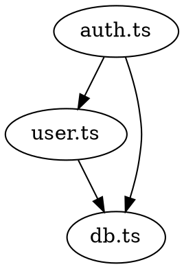
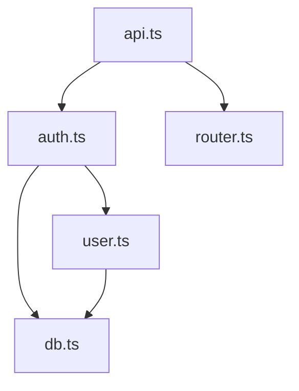

# Dependency Graph Patterns

## Overview

Patterns for building and analyzing dependency graphs in software systems.

---

## Types of Dependencies

### Direct Dependencies
```
A → B: A directly uses B
```

### Transitive Dependencies
```
A → B → C: A depends on C through B
```

### Circular Dependencies
```
A → B → C → A: Problematic cycle
```

---

## Dependency Graph Representation

### Adjacency List

```typescript
interface DependencyGraph {
  nodes: Map<string, Node>;
  edges: Map<string, Set<string>>;
}

const graph: DependencyGraph = {
  nodes: new Map([
    ['auth.ts', { type: 'module', path: 'src/auth.ts' }],
    ['user.ts', { type: 'module', path: 'src/user.ts' }],
  ]),
  edges: new Map([
    ['auth.ts', new Set(['user.ts', 'db.ts'])],
    ['user.ts', new Set(['db.ts'])],
  ])
};
```

### DOT Format (Graphviz)



---

## Analysis Algorithms

### Find All Dependencies (DFS)

```typescript
function getAllDependencies(
  graph: DependencyGraph,
  node: string,
  visited = new Set<string>()
): Set<string> {
  if (visited.has(node)) return visited;
  
  visited.add(node);
  
  const deps = graph.edges.get(node) || new Set();
  for (const dep of deps) {
    getAllDependencies(graph, dep, visited);
  }
  
  return visited;
}
```

### Find Circular Dependencies

```typescript
function findCircularDependencies(
  graph: DependencyGraph
): string[][] {
  const cycles: string[][] = [];
  const visited = new Set<string>();
  const recursionStack = new Set<string>();
  
  function dfs(node: string, path: string[]): void {
    visited.add(node);
    recursionStack.add(node);
    path.push(node);
    
    const deps = graph.edges.get(node) || new Set();
    for (const dep of deps) {
      if (!visited.has(dep)) {
        dfs(dep, [...path]);
      } else if (recursionStack.has(dep)) {
        // Cycle found
        const cycleStart = path.indexOf(dep);
        cycles.push(path.slice(cycleStart));
      }
    }
    
    path.pop();
    recursionStack.delete(node);
  }
  
  for (const node of graph.nodes.keys()) {
    if (!visited.has(node)) {
      dfs(node, []);
    }
  }
  
  return cycles;
}
```

### Topological Sort

```typescript
function topologicalSort(graph: DependencyGraph): string[] {
  const inDegree = new Map<string, number>();
  const result: string[] = [];
  const queue: string[] = [];
  
  // Initialize in-degrees
  for (const node of graph.nodes.keys()) {
    inDegree.set(node, 0);
  }
  
  for (const deps of graph.edges.values()) {
    for (const dep of deps) {
      inDegree.set(dep, (inDegree.get(dep) || 0) + 1);
    }
  }
  
  // Start with nodes that have no dependencies
  for (const [node, degree] of inDegree) {
    if (degree === 0) {
      queue.push(node);
    }
  }
  
  while (queue.length > 0) {
    const node = queue.shift()!;
    result.push(node);
    
    const deps = graph.edges.get(node) || new Set();
    for (const dep of deps) {
      inDegree.set(dep, inDegree.get(dep)! - 1);
      if (inDegree.get(dep) === 0) {
        queue.push(dep);
      }
    }
  }
  
  return result;
}
```

---

## Impact Scoring

### Afferent Coupling (Ca)
Number of modules that depend on this module.

```typescript
function getAfferentCoupling(
  graph: DependencyGraph,
  node: string
): number {
  let count = 0;
  for (const [source, deps] of graph.edges) {
    if (deps.has(node)) {
      count++;
    }
  }
  return count;
}
```

### Efferent Coupling (Ce)
Number of modules this module depends on.

```typescript
function getEfferentCoupling(
  graph: DependencyGraph,
  node: string
): number {
  return graph.edges.get(node)?.size || 0;
}
```

### Instability Metric

```
I = Ce / (Ca + Ce)
```

- I = 0: Completely stable (many dependents)
- I = 1: Completely unstable (many dependencies)

---

## Visualization

### Mermaid Diagram



### ASCII Art

```
┌─────────┐
│  api.ts │
└────┬────┘
     │
     ├─────────────┐
     ▼             ▼
┌─────────┐   ┌──────────┐
│ auth.ts │   │ router.ts │
└────┬────┘   └──────────┘
     │
     ├─────────────┐
     ▼             ▼
┌─────────┐   ┌─────────┐
│ user.ts │   │  db.ts  │
└────┬────┘   └─────────┘
     │             ▲
     └─────────────┘
```

---

## Building Dependency Graphs

### From TypeScript

```typescript
import * as ts from 'typescript';

function extractImports(filePath: string): string[] {
  const sourceFile = ts.createSourceFile(
    filePath,
    fs.readFileSync(filePath, 'utf8'),
    ts.ScriptTarget.Latest,
    true
  );
  
  const imports: string[] = [];
  
  ts.forEachChild(sourceFile, (node) => {
    if (ts.isImportDeclaration(node)) {
      const moduleSpecifier = node.moduleSpecifier;
      if (ts.isStringLiteral(moduleSpecifier)) {
        imports.push(moduleSpecifier.text);
      }
    }
  });
  
  return imports;
}
```

### From package.json

```typescript
function getDependencies(packagePath: string): string[] {
  const pkg = JSON.parse(fs.readFileSync(packagePath, 'utf8'));
  return [
    ...Object.keys(pkg.dependencies || {}),
    ...Object.keys(pkg.devDependencies || {})
  ];
}
```

---

## Change Impact from Graph

```typescript
function getImpactedModules(
  graph: DependencyGraph,
  changedModules: string[]
): Set<string> {
  const impacted = new Set<string>();
  
  // Find all modules that depend on changed modules
  for (const changed of changedModules) {
    // Reverse DFS to find dependents
    for (const [source, deps] of graph.edges) {
      if (deps.has(changed)) {
        impacted.add(source);
        // Recursively find dependents of dependents
        for (const dep of getImpactedModules(graph, [source])) {
          impacted.add(dep);
        }
      }
    }
  }
  
  return impacted;
}
```

---

## Dependency Analysis Checklist

### Build Graph
- [ ] Parse source files
- [ ] Extract import statements
- [ ] Resolve module paths
- [ ] Store in graph structure

### Analyze
- [ ] Find circular dependencies
- [ ] Calculate coupling metrics
- [ ] Identify hotspots
- [ ] Generate reports

### Visualize
- [ ] Create diagrams
- [ ] Highlight problem areas
- [ ] Show change impact
