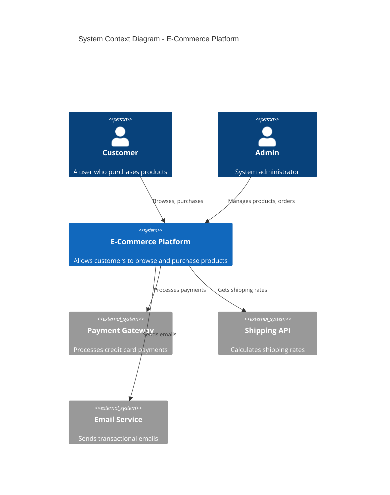
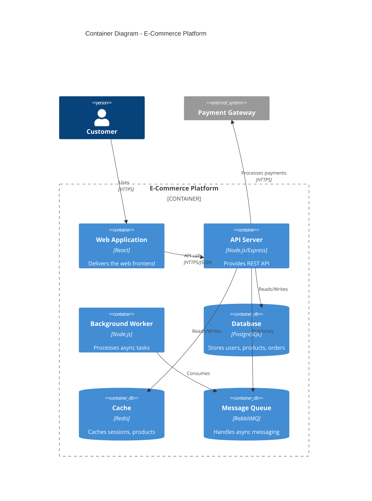
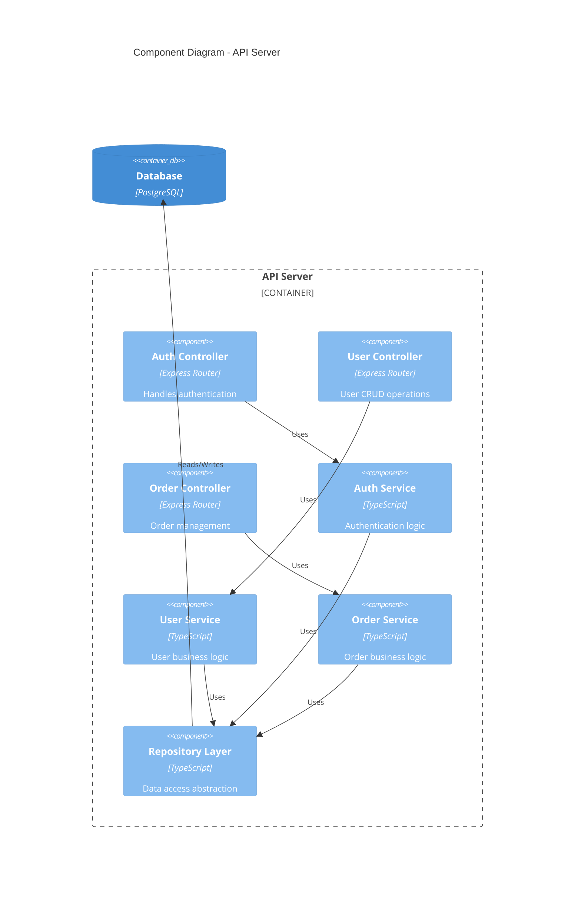
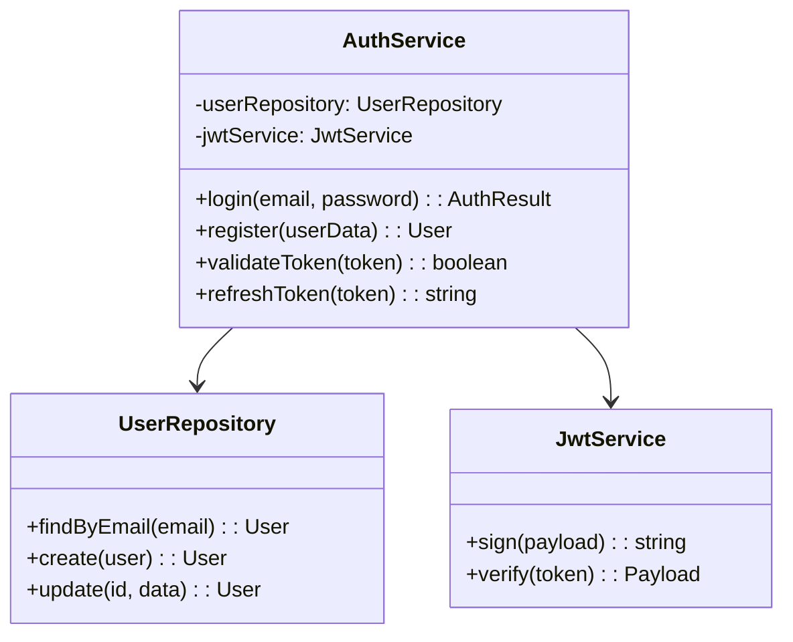

# C4 Model Guide

## Overview

The C4 model is a set of hierarchical diagrams for visualizing software architecture at different levels of abstraction. MUSUBI SDD uses C4 for all architecture documentation.

---

## C4 Diagram Levels

### Level 1: System Context Diagram

**Purpose**: Shows how the system fits into the world around it.

**Scope**: Single software system

**Primary Elements**:
- Your system (center)
- Users (people)
- External systems

**Audience**: Everyone - both technical and non-technical



**Template**:
```markdown
## Level 1: System Context

### System
- **Name**: [System Name]
- **Description**: [What the system does]

### Users
| User | Description |
|------|-------------|
| [User Type] | [User description and goals] |

### External Systems
| System | Description | Integration |
|--------|-------------|-------------|
| [External System] | [What it does] | [How we integrate] |
```

---

### Level 2: Container Diagram

**Purpose**: Shows high-level technology choices and how containers communicate.

**Scope**: Single software system

**Primary Elements**:
- Containers (applications, data stores, etc.)
- Relationships between containers

**Audience**: Technical people



**Template**:
```markdown
## Level 2: Container Diagram

### Containers

| Container | Technology | Description |
|-----------|------------|-------------|
| Web App | React | Frontend SPA |
| API Server | Node.js/Express | REST API backend |
| Database | PostgreSQL | Persistent storage |
| Cache | Redis | Session and data cache |
| Queue | RabbitMQ | Async message processing |

### Communication

| From | To | Protocol | Purpose |
|------|----|-----------| --------|
| Web App | API Server | HTTPS/REST | API calls |
| API Server | Database | TCP | Data persistence |
| API Server | Cache | TCP | Caching |
```

---

### Level 3: Component Diagram

**Purpose**: Shows how a container is made up of components.

**Scope**: Single container

**Primary Elements**:
- Components (modules, services, controllers)
- Relationships between components

**Audience**: Developers



**Template**:
```markdown
## Level 3: Component Diagram - [Container Name]

### Components

| Component | Type | Responsibility |
|-----------|------|----------------|
| Auth Controller | Controller | Handle auth endpoints |
| Auth Service | Service | Authentication logic |
| User Repository | Repository | User data access |

### Dependencies

| Component | Depends On | Purpose |
|-----------|------------|---------|
| Auth Controller | Auth Service | Business logic |
| Auth Service | User Repository | Data access |
```

---

### Level 4: Code Diagram (Optional)

**Purpose**: Shows how a component is implemented.

**Scope**: Single component

**Primary Elements**:
- Classes, interfaces, modules
- Relationships (inheritance, composition)

**Audience**: Developers

**Note**: Often generated automatically from code.



---

## C4 Diagram Notation

### Element Types

| Element | Notation | Description |
|---------|----------|-------------|
| Person |  | A user of the system |
| System |  | The system being described |
| External System |  | External dependency |
| Container |  | Deployable unit |
| Component |  | Code module |
| Database |  | Data storage |

### Relationship Arrows

```
[Source] --"description"--> [Target]

Examples:
- Customer --> Web App : "Uses"
- API --> Database : "Reads/Writes"
- Service --> External API : "Calls via HTTPS"
```

---

## Best Practices

### Do

1. **Start from Level 1**: Always create context diagram first
2. **Use consistent notation**: Follow C4 conventions
3. **Include descriptions**: Every element needs a description
4. **Show technology choices**: Especially at container/component level
5. **Keep it simple**: If diagram is too complex, zoom in

### Don't

1. **Don't mix levels**: Each diagram should be at one level
2. **Don't show too much**: 10-15 elements maximum per diagram
3. **Don't skip levels**: Create all relevant levels
4. **Don't forget relationships**: Show how elements communicate
5. **Don't use generic names**: Be specific (not "Database" but "User Database")

---

## MUSUBI C4 Template

```markdown
# Architecture Design: [Feature Name]

## Level 1: System Context

[Mermaid diagram]

### Systems and Users
| Element | Type | Description |
|---------|------|-------------|
| | | |

## Level 2: Container Diagram

[Mermaid diagram]

### Containers
| Container | Technology | Purpose |
|-----------|------------|---------|
| | | |

## Level 3: Component Diagram - [Container]

[Mermaid diagram]

### Components
| Component | Type | Responsibility |
|-----------|------|----------------|
| | | |

## Technology Decisions

See ADR-XXX for rationale.

## Requirements Traceability

| REQ ID | Addressed By |
|--------|--------------|
| REQ-001 | Auth Service |
```

---

## Tools for C4 Diagrams

| Tool | Format | Notes |
|------|--------|-------|
| Mermaid | Markdown | Recommended - works in GitHub |
| PlantUML | Text | Rich features |
| Structurizr | DSL | Official C4 tooling |
| Draw.io | Visual | Easy for non-technical |
| Lucidchart | Visual | Collaboration features |
