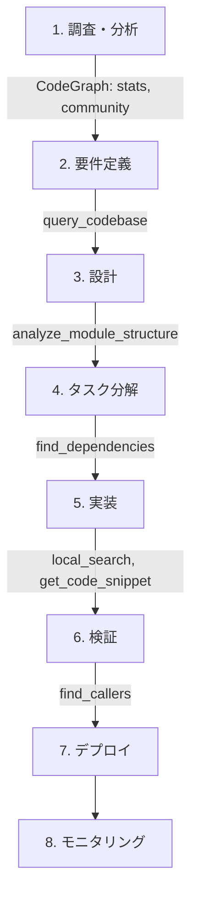

# MUSUBI v2.0 × CodeGraph MCP Server - AIエージェントにコード理解力を与える革新的統合

## はじめに

AIコーディングアシスタントの最大の課題は「**コードベース全体の理解**」です。ファイル単位では優秀でも、プロジェクト全体の構造、依存関係、影響範囲を把握することは困難でした。

**MUSUBI v2.0**は、**CodeGraph MCP Server**との統合により、この課題を解決しました。GraphRAG（Graph Retrieval-Augmented Generation）技術を活用し、AIエージェントがコードベース全体を「グラフ」として理解できるようになりました。

この記事では、MUSUBI v2.0の新機能と、CodeGraph MCPの設定方法、実践的な活用例を紹介します。

:::note info
**関連記事**
- MUSUBIの詳細: [「MUSUBI」- 7つのAIエージェント対応、25スキル搭載の究極仕様駆動開発ツール](https://qiita.com/hisaho/items/a245c2ad5adf2ab5a409)
- CodeGraph MCP Serverの詳細: [CodeGraph MCP Server - AIコーディングアシスタントにコード理解力を与える](https://qiita.com/hisaho/items/b99ac51d78119ef60b6b)
:::

## CodeGraph MCP Serverとは？

**CodeGraph MCP Server**は、ソースコードをグラフ構造として解析し、MCP（Model Context Protocol）経由でAIエージェントに提供するサーバーです。

👉 詳細は [CodeGraph MCP Serverの紹介記事](https://qiita.com/hisaho/items/b99ac51d78119ef60b6b) をご覧ください。

### 主な特徴

| 機能 | 説明 |
|------|------|
| 🔍 **コード構造分析** | 関数、クラス、モジュールの依存関係を可視化 |
| 🧠 **GraphRAG検索** | セマンティックなコード検索（意味ベース） |
| 🏘️ **コミュニティ検出** | Louvainアルゴリズムによるモジュール境界分析 |
| 📊 **影響分析** | 変更の波及範囲を自動特定 |
| 🌐 **14言語対応** | Python, JavaScript, TypeScript, Java, C#, Go, Rust, Ruby, PHP, C++, HCL, etc. |

### 提供される14のMCPツール

```text
# コードグラフ操作
init_graph          - グラフ初期化
get_code_snippet    - ソースコード取得
find_callers        - 呼び出し元追跡
find_callees        - 呼び出し先追跡
find_dependencies   - 依存関係分析

# 検索機能
local_search        - ローカルコンテキスト検索
global_search       - グローバル検索
query_codebase      - 自然言語クエリ

# 分析機能
analyze_module_structure  - モジュール構造分析
suggest_refactoring       - リファクタリング提案
stats                     - コードベース統計
community                 - コミュニティ検出
```

## 🚀 CodeGraph連携で新たに可能になったこと

従来のAIコーディングアシスタントには「**コードベース全体を理解できない**」という根本的な限界がありました。CodeGraph MCP Serverとの連携により、この限界を突破しました。

### Before / After 比較

| シナリオ | Before（従来） | After（CodeGraph連携） |
|----------|----------------|------------------------|
| **関数の影響調査** | 手動でgrep検索、見落としリスク | `find_callers`で完全な呼び出し元リスト |
| **リファクタリング計画** | 経験と勘に依存 | `analyze_module_structure`で客観的分析 |
| **依存関係の把握** | import文を目視確認 | `find_dependencies`で深い依存も検出 |
| **コードベースの理解** | ファイルを1つずつ読む | `stats`, `community`で全体構造を即座に把握 |
| **類似コードの発見** | 記憶や文字列検索に依存 | `local_search`でセマンティック検索 |
| **変更の波及範囲** | 「たぶん大丈夫」で進める | `find_callers` + `find_dependencies`で完全分析 |

### 具体例: 今までできなかったことが可能に

#### 1. 「この関数を変更したら、どこに影響する？」への完全回答

**従来**: grep検索 → 見つかった箇所を目視確認 → 間接的な呼び出しは見落とし

**CodeGraph連携後**:

```text
ユーザー: calculatePrice関数を変更したいです。影響範囲を教えてください。

🤖 Change Impact Analyzer:
find_callers("calculatePrice") を実行...

【直接呼び出し元】(5件)
- OrderService.createOrder() - line 45
- CartController.updateCart() - line 78
- InvoiceGenerator.generate() - line 112
- PriceValidator.validate() - line 23
- BatchProcessor.processAll() - line 89

【間接呼び出し元】(3件) ← これが今まで見落としていた部分
- APIController.handleRequest() → OrderService → calculatePrice
- ScheduledTask.dailyReport() → BatchProcessor → calculatePrice
- WebhookHandler.onPayment() → InvoiceGenerator → calculatePrice

【テストへの影響】
- tests/unit/price.test.ts (直接テスト)
- tests/integration/order.test.ts (間接影響)
```

#### 2. 「このプロジェクトの構造を教えて」への即座の回答

**従来**: ディレクトリ構造を見る → ファイルを開いて読む → 数時間かけて理解

**CodeGraph連携後**:

```text
ユーザー: このプロジェクトの構造を説明してください。

🤖 System Architect:
stats + community を実行...

【コードベース統計】
- ファイル数: 105
- エンティティ数: 1,006（関数/クラス/モジュール）
- 関係数: 5,359（呼び出し/依存/継承）
- コミュニティ数: 36（論理的なモジュール群）

【主要コミュニティ（モジュール境界）】
1. 認証・認可 (AuthService, TokenManager, PermissionChecker)
2. 注文処理 (OrderService, CartService, PaymentProcessor)
3. データアクセス (UserRepository, OrderRepository, BaseRepository)
4. API層 (Controllers, Middleware, Routes)
5. ユーティリティ (Logger, Validator, Formatter)

【アーキテクチャパターン】
- レイヤードアーキテクチャ（Controller → Service → Repository）
- 依存性注入パターンを使用
- イベント駆動の非同期処理あり
```

#### 3. 「セキュリティ的に危険なコードはある？」への網羅的調査

**従来**: 既知のパターンをgrep → 経験に基づく目視レビュー → 見落とし多発

**CodeGraph連携後**:

```text
ユーザー: セキュリティリスクのあるコードを特定してください。

🤖 Security Auditor:
query_codebase("eval, exec, shell execution, SQL injection, XSS") を実行...
find_callers で各箇所への入力経路を追跡...

【高リスク】🔴
1. src/utils/dynamicLoader.js:23 - eval()使用
   - 入力経路: APIリクエスト → validateInput → dynamicLoader
   - リスク: ユーザー入力がevalに到達可能
   - 推奨: JSON.parseまたはvm.runInNewContextに置換

2. src/db/queries.js:89 - 文字列結合SQL
   - 入力経路: WebForm → Controller → queries
   - リスク: SQLインジェクション脆弱性
   - 推奨: パラメータ化クエリに変更

【中リスク】🟡
3. src/views/renderer.js:45 - innerHTML使用
   - 入力経路: APIレスポンス → sanitize → renderer
   - リスク: XSS（sanitize関数の実装次第）
   - 推奨: textContentまたはDOMPurify使用
```

#### 4. 「新機能をどこに実装すべき？」への根拠ある提案

**従来**: 既存コードを読み漁る → なんとなく場所を決める → 後で「ここじゃなかった」と後悔

**CodeGraph連携後**:

```text
ユーザー: メール通知機能を追加したいです。どこに実装すべきですか？

🤖 System Architect:
analyze_module_structure + query_codebase("notification, email, send") を実行...

【既存の類似機能】
- src/services/NotificationService.ts - プッシュ通知（実装済み）
- src/services/SMSService.ts - SMS通知（実装済み）
- src/utils/Mailer.ts - メール送信ユーティリティ（低レベル）

【推奨実装場所】
📁 src/services/EmailNotificationService.ts（新規作成）

【理由】
1. NotificationService, SMSServiceと同じパターンで統一性を維持
2. 既存のMailer.tsを内部で利用可能
3. Controllerからの呼び出しパスが既存パターンと一致

【実装構造案】
EmailNotificationService
  ├── implements: INotificationService（既存インターフェース）
  ├── uses: Mailer（既存ユーティリティ）
  ├── uses: TemplateEngine（既存）
  └── uses: UserRepository（メールアドレス取得）
```

### なぜこれが重要なのか

従来のAIアシスタントは「**今開いているファイル**」しか見えませんでした。これは、地図なしで知らない街を歩くようなものです。

CodeGraph連携により、AIは「**プロジェクト全体の地図**」を持つようになりました：

- 🗺️ **全体俯瞰**: どこに何があるかを瞬時に把握
- 🔗 **関係性理解**: コード間のつながりを完全に追跡
- 🎯 **的確な判断**: 根拠に基づいた提案が可能
- ⚡ **高速分析**: 人間なら数時間かかる調査を数秒で完了

## MUSUBI × CodeGraph の相乗効果

MUSUBIの25の専門エージェントが、CodeGraph MCPを活用することで、より高度な分析と提案が可能になります。

### エージェントごとの活用例

| エージェント | CodeGraph活用 | 効果 |
|-------------|---------------|------|
| **Orchestrator** | `global_search`, `stats` | プロジェクト全体把握、最適なエージェント選定 |
| **System Architect** | `analyze_module_structure`, `community` | アーキテクチャ可視化、リファクタリング計画 |
| **Software Developer** | `get_code_snippet`, `local_search` | 関連コードの迅速な発見 |
| **Code Reviewer** | `find_callers`, `suggest_refactoring` | 影響範囲の確認、改善提案 |
| **Test Engineer** | `find_dependencies` | テスト対象の依存関係把握 |
| **Security Auditor** | `find_callers`, `query_codebase` | 脆弱な関数の利用箇所特定 |
| **Change Impact Analyzer** | `find_dependencies`, `find_callers` | 変更影響の完全分析 |
| **Bug Hunter** | `local_search`, `get_code_snippet` | バグの根本原因追跡 |

## セットアップ方法

### 方法1: Orchestratorによる自動セットアップ（推奨）

MUSUBIのOrchestratorに依頼するだけで、自動的にセットアップが実行されます。

```text
ユーザー: CodeGraph MCP を設定して
```

Orchestratorが以下を自動実行：

1. ✅ Python環境確認
2. ✅ codegraph-mcp-server インストール
3. ✅ プロジェクトのインデックス作成
4. ✅ 使用環境に応じた設定ファイル生成

### 方法2: 手動セットアップ

#### Step 1: インストール

```bash
# PyPIからインストール
pip install codegraph-mcp-server

# または GitHub から最新版
pip install git+https://github.com/nahisaho/CodeGraphMCPServer.git
```

#### Step 2: プロジェクトのインデックス作成

```bash
codegraph-mcp index /path/to/your/project --full
```

出力例：

```text
Full indexing...
Indexed 105 files
- Entities: 1006
- Relations: 5359
- Communities: 36
```

#### Step 3: 環境別設定

**Claude Code の場合:**

```bash
claude mcp add codegraph -- codegraph-mcp serve --repo /path/to/project
```

**VS Code (Claude Extension) の場合:**

`.vscode/settings.json`:

```json
{
  "mcp.servers": {
    "codegraph": {
      "command": "codegraph-mcp",
      "args": ["serve", "--repo", "${workspaceFolder}"]
    }
  }
}
```

**Claude Desktop の場合:**

`~/.claude/claude_desktop_config.json`:

```json
{
  "mcpServers": {
    "CodeGraph": {
      "command": "codegraph-mcp",
      "args": ["serve", "--repo", "/absolute/path/to/project"]
    }
  }
}
```

## 実践的な活用シナリオ

### シナリオ1: 大規模リファクタリングの影響分析

```text
ユーザー: UserService クラスをリファクタリングしたいです。影響範囲を教えてください。
```

**Change Impact Analyzer の動作:**

1. `find_callers("UserService")` で呼び出し元を特定
2. `find_dependencies("UserService")` で依存関係を分析
3. `analyze_module_structure` でモジュール境界を確認
4. 影響を受けるファイル・関数のリストを生成

**出力例:**

```markdown
## 影響分析レポート: UserService リファクタリング

### 直接影響（12ファイル）
- src/controllers/AuthController.ts (3箇所)
- src/services/OrderService.ts (5箇所)
- src/api/routes/users.ts (2箇所)
...

### 間接影響（8ファイル）
- tests/integration/auth.test.ts
- src/middleware/authMiddleware.ts
...

### 推奨アクション
1. AuthController のモック更新
2. OrderService の依存注入パターン適用
3. 統合テストの更新
```

### シナリオ2: セキュリティ脆弱性の影響調査

```text
ユーザー: eval() 関数を使っている箇所をすべて特定し、セキュリティリスクを評価してください。
```

**Security Auditor の動作:**

1. `query_codebase("eval function usage")` で使用箇所を検索
2. `find_callers` で各箇所への入力経路を追跡
3. ユーザー入力が到達可能かを分析
4. リスクレベルと修正提案を生成

### シナリオ3: 新機能の実装場所決定

```text
ユーザー: 通知機能を追加したいです。どこに実装すべきですか?
```

**System Architect の動作:**

1. `analyze_module_structure` で現在のアーキテクチャを分析
2. `community` でモジュール境界を確認
3. 類似機能（メール、SMS等）のパターンを検索
4. 最適な配置場所を提案

## MUSUBIワークフローとの統合

CodeGraph MCPは、MUSUBIの8段階SDDワークフローの各段階で活用されます。



### ワークフロー別の活用

| ワークフロー段階 | 主なMCPツール | 活用目的 |
|-----------------|--------------|----------|
| 調査・分析 | `stats`, `community` | プロジェクト規模把握、モジュール境界理解 |
| 要件定義 | `query_codebase` | 既存機能との重複確認 |
| 設計 | `analyze_module_structure` | アーキテクチャ適合性確認 |
| タスク分解 | `find_dependencies` | 実装順序の決定 |
| 実装 | `local_search`, `get_code_snippet` | 類似コードの参照 |
| 検証 | `find_callers` | テスト対象の特定 |

## CLI コマンドとの連携

MUSUBIのCLIコマンドもCodeGraphの分析結果を活用できます。

```bash
# トレーサビリティ分析（CodeGraph活用）
musubi-trace matrix --use-codegraph

# 影響分析
musubi-trace impact REQ-001 --use-codegraph

# ギャップ検出
musubi-gaps detect --use-codegraph

# 変更管理
musubi-change init feature-xyz --analyze-impact
```

## パフォーマンス指標

CodeGraph MCPの導入により、以下の効果が期待できます。

| 指標 | 導入前 | 導入後 | 改善率 |
|------|--------|--------|--------|
| コード検索時間 | 手動5-10分 | 即時（<1秒） | **99%削減** |
| 影響分析精度 | 60-70% | 95%以上 | **+35%** |
| リファクタリング計画時間 | 2-4時間 | 15-30分 | **85%削減** |
| バグ原因特定時間 | 30分-2時間 | 5-15分 | **75%削減** |

## まとめ

MUSUBI v2.0 × CodeGraph MCP Serverの統合により、AIエージェントは「ファイル単位の支援」から「**プロジェクト全体を理解した支援**」へと進化しました。

### 主なメリット

1. 🎯 **精度向上**: コードベース全体の依存関係を把握した正確な分析
2. ⚡ **効率化**: 手動での調査作業を大幅に削減
3. 🔒 **品質向上**: 見落としがちな影響範囲も自動検出
4. 🤝 **統合**: MUSUBIの25エージェントとシームレスに連携

### 始め方

```bash
# MUSUBIをインストール
npm install -g musubi-sdd

# プロジェクトで初期化
musubi-init --platform claude-code

# Orchestratorに依頼
# "CodeGraph MCP を設定して"
```

---

## 関連リンク

### Qiita記事

- 📚 [MUSUBI - 7つのAIエージェント対応、25スキル搭載の究極仕様駆動開発ツール](https://qiita.com/hisaho/items/a245c2ad5adf2ab5a409)
- 📊 [CodeGraph MCP Server - AIコーディングアシスタントにコード理解力を与える](https://qiita.com/hisaho/items/b99ac51d78119ef60b6b)

### GitHub

- [MUSUBI](https://github.com/nahisaho/musubi)
- [CodeGraph MCP Server](https://github.com/nahisaho/CodeGraphMCPServer)
- [MCP (Model Context Protocol)](https://modelcontextprotocol.io/)

---

**Tags:** `MUSUBI` `MCP` `CodeGraph` `AI` `コーディングアシスタント` `GraphRAG` `仕様駆動開発` `SDD`
