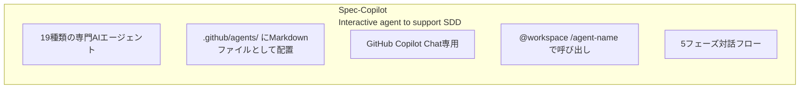
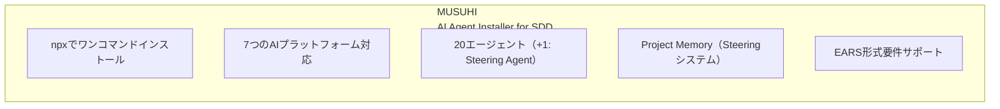
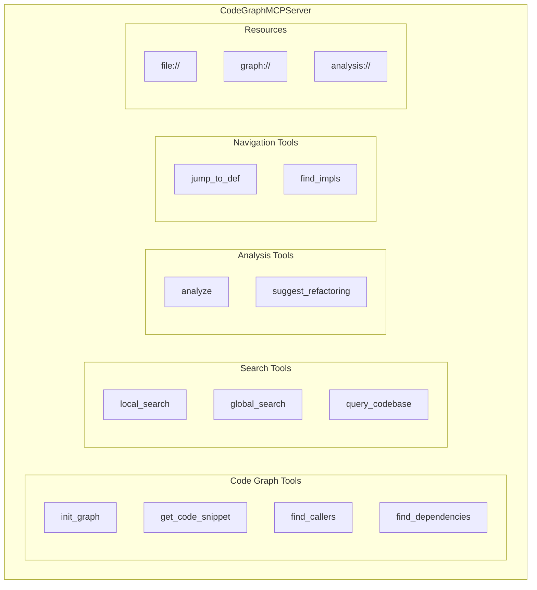
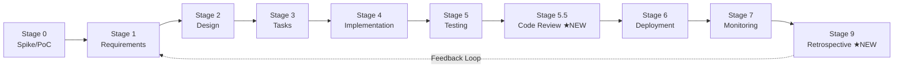
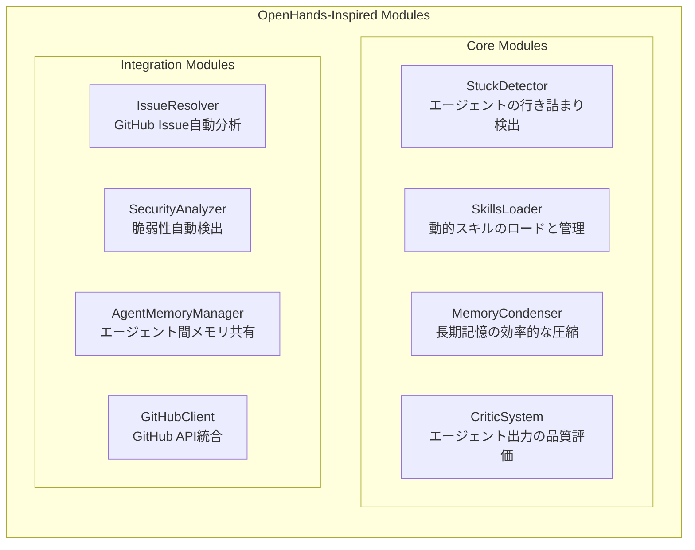
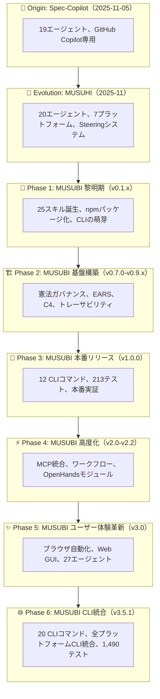

title: MUSUBIの軌跡：Spec-CopilotからMUSUHI、そしてMUSUBIへの完全進化ガイド

# MUSUBIの軌跡：Spec-CopilotからMUSUHI、そしてMUSUBIへの完全進化ガイド

## はじめに

**MUSUBI（Specification Driven Development）** は、AIエージェントを活用した仕様駆動開発フレームワークです。しかし、MUSUBIは突然生まれたわけではありません。**Spec-Copilot** → **MUSUHI** → **MUSUBI** という3つのプロジェクトを経て、現在の形に進化してきました。

本記事では、2025年11月の最初のプロジェクトから現在のv3.5.1までの完全な変遷を振り返り、各段階で何が追加され、どのような開発体験が可能になったかを詳説します。

**対象読者:**
- MUSUBIを使用中/検討中の開発者
- AI支援開発ツールの進化に興味のある方
- 仕様駆動開発の効率化を目指すチーム

**この記事で分かること:**
- Spec-Copilot: 19エージェントのプロンプト集
- MUSUHI: npmパッケージ化と20エージェント
- MUSUBI v0.1.x: 25スキルと7プラットフォーム対応
- MUSUBI v0.7.0-v1.0.0: 憲法ガバナンスとCLI基盤
- MUSUBI v2.x-v3.0.0: MCP統合、ワークフロー、ブラウザ自動化
- MUSUBI v3.3.0-v3.5.1: モニタリング、Steering高度化、CLI統合

---

# 第0章 前史：Spec-Copilot（2025年11月初旬）

## 0.1 Spec-Copilotとは

**リポジトリ:** [github.com/nahisaho/spec-copilot](https://github.com/nahisaho/spec-copilot)

Spec-Copilotは、MUSUBIの**原型**となったプロジェクトです。GitHub Copilotと連携し、仕様駆動開発を支援する**19種類の専門AIエージェントのプロンプト集**として誕生しました。



## 0.2 19のエージェント

| カテゴリ | エージェント |
|---------|------------|
| オーケストレーション | Orchestrator AI |
| 要件・計画 | Requirements Analyst, Project Manager, Agile Coach |
| 設計 | System Architect, API Designer, Database Schema Designer, UI/UX Designer |
| 実装 | Software Developer, Code Reviewer, Bug Hunter |
| テスト・品質 | Test Engineer, Quality Assurance, Performance Optimizer |
| セキュリティ | Security Auditor |
| インフラ | DevOps Engineer, Cloud Architect, Observability Engineer |
| ドキュメント | Technical Writer |

## 0.3 使用方法

```bash
# GitHub Copilot Chatでの使用
@workspace /orchestrator ToDoを管理するWebアプリケーションを開発。要件定義から開始。

# 個別エージェント
@workspace /api-designer ユーザー登録をおこなうAPIの設計をして
```

## 0.4 Spec-Copilotの限界

- ❌ **GitHub Copilot専用**: 他のAIツールでは使用不可
- ❌ **手動コピー必要**: プロジェクトごとにファイルをコピー
- ❌ **バージョン管理困難**: エージェント更新時の配布が煩雑
- ❌ **プロジェクトコンテキストなし**: 各エージェントが独立

---

# 第1章 MUSUHI：パッケージ化と進化（2025年11月中旬）

## 1.1 MUSUHIとは

**リポジトリ:** [github.com/nahisaho/musuhi](https://github.com/nahisaho/musuhi)

MUSUHIは、Spec-Copilotの課題を解決するために生まれた**npmパッケージ**です。「結び」という名前は、開発者とAIエージェントを「結ぶ」という意味が込められています。



## 1.2 主要な新機能

### npmパッケージ化

```bash
# ワンコマンドインストール
npx musuhi

# プラットフォーム指定
npx musuhi install --tool claude-code
npx musuhi install --tool github-copilot
npx musuhi install --tool cursor
```

### 7プラットフォーム対応

| プラットフォーム | 設定ファイル | エージェント配置 |
|----------------|-------------|----------------|
| Claude Code | CLAUDE.md | .claude/agents/ |
| GitHub Copilot | copilot-instructions.md | .github/agents/ |
| Cursor | .cursorrules | .cursor/agents/ |
| Windsurf | .windsurfrules | .windsurf/agents/ |
| Gemini CLI | gemini-config.md | .gemini/agents/ |
| Codex CLI | codex-config.md | .codex/agents/ |
| Qwen Code | qwen-config.md | .qwen/agents/ |

### Project Memory（Steeringシステム）

```
steering/
├── structure.md    # アーキテクチャパターン、ディレクトリ構成
├── tech.md         # 技術スタック、フレームワーク
├── product.md      # ビジネスコンテキスト、製品目的
├── rules/          # 開発ガイドライン
│   ├── ears-format.md
│   └── workflow.md
└── templates/      # ドキュメントテンプレート
```

### EARS形式要件

```
# 5つのEARSパターン
1. Event-Driven: WHEN [event], the [system] SHALL [response]
2. State-Driven: WHILE [state], the [system] SHALL [response]
3. Unwanted:     IF [error], THEN the [system] SHALL [response]
4. Optional:     WHERE [feature], the [system] SHALL [response]
5. Ubiquitous:   The [system] SHALL [response]
```

## 1.3 MUSUHIのバージョン履歴

| バージョン | 主要機能 |
|-----------|---------|
| v0.3.0 | Project Memory（Steering）システム導入 |
| v0.3.1 | EARS形式サポート |
| v0.3.2 | SDDワークフローテンプレート |
| v0.4.0 | 7プラットフォーム対応 |
| v0.4.4 | 自動コンテキスト参照 |
| v0.4.5 | インクリメンタルドキュメント生成 |
| v0.4.9 | Steering自動更新機能 |

## 1.4 MUSUHIからMUSUBIへ

MUSUHIは優れたエージェントインストーラーでしたが、以下の機能が不足していました：

- ❌ **CLIコマンドなし**: 要件生成、設計、タスク管理がエージェント頼み
- ❌ **検証機能なし**: 憲法準拠の自動検証ができない
- ❌ **トレーサビリティなし**: 要件→設計→実装の追跡機能がない
- ❌ **テストなし**: 品質保証のための自動テストがない

これらを解決するため、**MUSUBI**が誕生しました。

---

# 第2章 MUSUBI黎明期：v0.1.0 - v0.1.4（2025年11月）

## 2.1 v0.1.0 - 最初の一歩

**リリース日:** 2025-11-08

MUSUBIの最初のバージョンは、Proof of Concept（概念実証）として誕生しました。

```
v0.1.0 初期機能
├── 基本的なスキル構造
├── プロジェクトスキャフォールディング
└── Claude Code専用設計
```

## 2.2 v0.1.2 - 25スキルの誕生

**リリース日:** 2025-11-15

**MUSUBIの核心機能が形になった重要なリリース:**

| カテゴリ | スキル数 | 内容 |
|---------|---------|------|
| オーケストレーション | 2 | Orchestrator, Steering |
| 要件・設計 | 4 | Requirements Analyst, System Architect等 |
| 開発 | 5 | Software Developer, Code Reviewer等 |
| 品質・テスト | 4 | Test Engineer, Bug Hunter等 |
| セキュリティ | 2 | Security Auditor, Penetration Tester |
| インフラ | 4 | DevOps Engineer, SRE等 |
| ドキュメント | 4 | Technical Writer, API Designer等 |

### 主要機能

- ✅ **9つの憲法条項（Constitutional Articles）**: 開発ルールの明文化
- ✅ **EARS形式サポート**: 曖昧さのない要件記述
- ✅ **Steeringシステム**: プロジェクトメモリの管理
- ✅ **8ステージSDDワークフロー**: 開発プロセスの標準化
- ✅ **トレーサビリティマトリクス**: 要件から実装への追跡

## 2.3 v0.1.3 - マルチプラットフォーム革命

**リリース日:** 2025-11-17

**業界初：7つのAIプラットフォームで25エージェントを統一サポート**

**Multi-Platform Support（業界初）**

| Platform | Agent Format | Location |
|----------|-------------|----------|
| Claude Code | Skills API | `.claude/skills/` |
| GitHub Copilot | AGENTS.md | `.github/AGENTS.md` |
| Cursor | AGENTS.md | `.cursor/AGENTS.md` |
| Gemini CLI | GEMINI.md | `GEMINI.md` |
| Windsurf | AGENTS.md | `.windsurf/AGENTS.md` |
| Codex | AGENTS.md | `.codex/AGENTS.md` |
| Qwen Code | AGENTS.md | `.qwen/AGENTS.md` |

この時点で、MUSUBIは「Claude Code専用ツール」から「ユニバーサルSDD フレームワーク」へと進化しました。

---

# 第3章 基盤構築期：v0.7.0 - v0.9.x（2025年11月）

## 3.1 v0.7.0 - 憲法ガバナンスシステム

**リリース日:** 2025-11-23

**開発プロセスを統治する9つの不変条項を導入:**

```bash
# 憲法バリデーション
musubi-validate constitution    # 全9条項の検証
musubi-validate article 3       # 特定条項の検証
musubi-validate gates           # Phase -1 ゲート検証
musubi-validate complexity      # 複雑度制限検証
musubi-validate all             # 包括的検証
```

### 9つの憲法条項

| 条項 | 名称 | 内容 |
|------|------|------|
| I | Library-First | ライブラリ優先原則 |
| II | CLI Interface Mandate | CLIインターフェース義務 |
| III | Test-First Imperative | テストファースト（Red-Green-Blue） |
| IV | EARS Requirements Format | EARS形式要件 |
| V | Traceability Mandate | トレーサビリティ義務 |
| VI | Project Memory | Steeringシステム |
| VII | Simplicity Gate | シンプルさの門（≤3サブプロジェクト） |
| VIII | Anti-Abstraction Gate | 抽象化禁止の門 |
| IX | Integration-First Testing | 統合テスト優先 |

## 3.2 v0.8.0 - EARS要件ジェネレーター

**リリース日:** 2025-11-23

**曖昧さのない要件仕様を自動生成:**

```bash
# EARS要件管理
musubi-requirements init <feature>   # 要件ドキュメント初期化
musubi-requirements add              # 対話的に要件追加
musubi-requirements list             # 要件一覧表示
musubi-requirements validate         # EARS形式検証
musubi-requirements trace            # トレーサビリティマトリクス
```

### 5つのEARSパターン

| パターン | 構文 | 用途 |
|---------|------|------|
| Ubiquitous | `The [system] SHALL [requirement]` | 常時適用 |
| Event-Driven | `WHEN [event], THEN [system] SHALL [response]` | イベント駆動 |
| State-Driven | `WHILE [state], [system] SHALL [response]` | 状態駆動 |
| Unwanted Behavior | `IF [error], THEN [system] SHALL [response]` | 異常系 |
| Optional Feature | `WHERE [feature], [system] SHALL [response]` | オプション機能 |

## 3.3 v0.8.2 - 設計ドキュメントジェネレーター

**C4モデルとADR（Architecture Decision Record）の自動生成:**

```bash
# 設計ドキュメント管理
musubi-design init <feature>           # 設計ドキュメント初期化
musubi-design add-c4 <level>           # C4図追加（context|container|component|code）
musubi-design add-adr <decision>       # ADR追加
musubi-design validate                 # 設計の完全性検証
musubi-design trace                    # 要件→設計トレーサビリティ
```

## 3.4 v0.8.4 - タスク分解システム

**設計からアクション可能なタスクへ分解:**

```bash
# タスク管理
musubi-tasks init <feature>           # タスクドキュメント初期化
musubi-tasks add <title>              # タスク追加
musubi-tasks list                     # タスク一覧
musubi-tasks update <id> <status>     # ステータス更新
musubi-tasks graph                    # 依存関係グラフ生成
```

### 優先度システム

| 優先度 | 名称 | 用途 |
|--------|------|------|
| P0 | Critical | ローンチブロッカー |
| P1 | High | コア機能 |
| P2 | Medium | Nice-to-have |
| P3 | Low | 将来機能 |

## 3.5 v0.8.5-v0.8.8 - トレーサビリティ＆変更管理

**Phase 2完成：ブラウンフィールドプロジェクト対応**

```bash
# トレーサビリティ
musubi-trace matrix                   # 完全トレーサビリティマトリクス
musubi-trace coverage                 # カバレッジ統計
musubi-trace gaps                     # ギャップ検出
musubi-trace impact <req-id>          # 影響分析

# 変更管理
musubi-change init <change-id>        # 変更提案作成
musubi-change apply <change-id>       # 変更適用
musubi-change archive <change-id>     # 変更アーカイブ

# ギャップ検出
musubi-gaps detect                    # 全ギャップ検出
musubi-gaps coverage                  # カバレッジ統計
```

## 3.6 v0.9.x - 品質向上と機能強化

| バージョン | 追加機能 |
|-----------|---------|
| v0.9.0 | Phase -1 ゲートプロセス、80%テストカバレッジ強制 |
| v0.9.1 | CLIバージョン同期、憲法条項参照 |
| v0.9.2 | --dry-run、--verbose、--json オプション |
| v0.9.3 | EARS厳格検証、品質メトリクスコマンド |
| v0.9.4 | 双方向トレーサビリティ、影響分析、統計 |
| v0.9.5 | オーケストレーター強化（25エージェント対応） |
| v0.9.6-7 | トレーサビリティバグ修正、要件IDパターン拡張 |

---

# 第4章 本番リリース：v1.0.0（2025年11月23日）

## 4.1 プロダクションレディ

**テスト数:** 213 | **CLIコマンド:** 12 | **プラットフォーム:** 7

**MUSUBI v1.0.0 - Production Ready**

| 項目 | ステータス |
|------|----------|
| Core Framework | ✅ Complete |
| CLI Infrastructure | ✅ 12 commands operational |
| Traceability System | ✅ 100% functional |
| Multi-Platform Support | ✅ 7 platforms verified |
| Testing | ✅ 213/213 tests passing |
| Documentation | ✅ Comprehensive guides |

### 12のCLIコマンド

| コマンド | 機能 |
|---------|------|
| `musubi-init` | マルチプラットフォーム初期化 |
| `musubi-requirements` | EARS要件生成 |
| `musubi-design` | C4 + ADR設計ドキュメント |
| `musubi-tasks` | タスク分解 |
| `musubi-trace` | トレーサビリティシステム |
| `musubi-change` | 変更管理 |
| `musubi-gaps` | ギャップ検出 |
| `musubi-validate` | 憲法準拠検証 |
| `musubi-onboard` | プロジェクト自動分析 |
| `musubi-sync` | Steering同期 |
| `musubi-analyze` | コード品質分析 |
| `musubi-share` | チーム協働・メモリ共有 |

### v1.0.0で可能になったこと

- ✅ **完全なSDDワークフロー**: 要件→設計→タスク→実装→テスト
- ✅ **100%トレーサビリティ**: 孤立した成果物がゼロ
- ✅ **7プラットフォーム対応**: どのAI環境でも同じ体験
- ✅ **CI/CD統合**: 終了コードによる自動化対応

---

# 第5章 v2.0.0 - MCP Server Integration

## 5.1 概要

**リリース日:** 2025-12-03

v2.0.0は、**CodeGraphMCPServer統合**を導入した大規模アップデートです。Model Context Protocol（MCP）を通じて、14種類の高度なコード解析ツールが利用可能になりました。

## 5.2 主要な新機能

### CodeGraphMCPServer統合



### 11の強化されたエージェント

| エージェント | 使用MCPツール | 用途 |
|------------|--------------|------|
| `@change-impact-analyzer` | `find_dependencies`, `find_callers` | 変更影響分析 |
| `@traceability-auditor` | `query_codebase`, `find_callers` | トレーサビリティ検証 |
| `@system-architect` | `analyze_module_structure`, `global_search` | アーキテクチャ分析 |
| `@code-reviewer` | `suggest_refactoring`, `get_code_snippet` | コードレビュー |
| `@security-auditor` | `find_callers`, `query_codebase` | セキュリティ脆弱性検出 |
| `@orchestrator` | `query_codebase`, `global_search` | プロジェクト統括 |
| `@test-engineer` | `find_callers`, `get_code_snippet` | テスト設計 |
| `@bug-hunter` | `find_callers`, `local_search` | バグ調査 |
| `@software-developer` | `get_code_snippet`, `local_search` | 実装支援 |
| `@steering` | `query_codebase`, `analyze_module_structure` | プロジェクトメモリ管理 |
| `@constitution-enforcer` | `find_dependencies`, `analyze_module_structure` | 憲法準拠検証 |

### GraphRAG対応

- **Louvain community detection**: コード構造のコミュニティ分析
- **12言語サポート**: Python, TypeScript, JavaScript, Java, Go, Rust, C++など
- **セマンティック検索**: コードの意味を理解した検索

## 5.3 セットアップ例

```bash
# Claude Code
claude mcp add codegraph -- codegraph-mcp serve --repo .

# VS Code (.vscode/mcp.json)
{
  "servers": {
    "codegraph": {
      "type": "stdio",
      "command": "codegraph-mcp",
      "args": ["serve", "--repo", "${workspaceFolder}"]
    }
  }
}
```

## 5.4 v2.0.0で可能になったこと

- ✅ **コード依存関係の可視化**: 変更前に影響範囲を正確に把握
- ✅ **セマンティック検索**: 「認証処理」などの概念でコードを検索
- ✅ **リファクタリング提案**: コード品質改善の自動提案
- ✅ **アーキテクチャ分析**: モジュール構造の自動把握

---

# 第6章 v2.1.0 - Workflow Engine

## 6.1 概要

**リリース日:** 2025-12-05

v2.1.0は、**ワークフローエンジン**を導入し、SDD開発プロセスの状態管理とメトリクス追跡を実現しました。

## 6.2 新CLI: musubi-workflow

```bash
# ワークフロー初期化
musubi-workflow init <feature-name>

# 現在のステータス確認
musubi-workflow status

# 次のステージへ遷移
musubi-workflow next design

# フィードバックループ記録
musubi-workflow feedback review implementation -r "リファクタリング必要"

# ワークフロー完了
musubi-workflow complete

# 履歴とメトリクス表示
musubi-workflow history
musubi-workflow metrics
```

## 6.3 新しいSDDステージ



| Stage | 名称 | 説明 |
|-------|------|------|
| 0 | Spike/PoC | 要件前のリサーチとプロトタイピング |
| 1 | Requirements | 要件定義 |
| 2 | Design | 設計 |
| 3 | Tasks | タスク分解 |
| 4 | Implementation | 実装 |
| 5 | Testing | テスト |
| 5.5 | Code Review | ★NEW: 構造化コードレビュー |
| 6 | Deployment | デプロイ |
| 7 | Monitoring | 監視 |
| 9 | Retrospective | ★NEW: 継続的改善 |

## 6.4 ワークフロー機能

| 機能 | 説明 |
|------|------|
| **状態管理** | `storage/workflow-state.yml`でフィーチャーごとのステージを追跡 |
| **メトリクス収集** | ステージごとの所要時間、イテレーション回数、フィードバックループ |
| **遷移バリデーション** | 有効なステージ遷移の強制とフィードバックループサポート |
| **ステージ検証ガイド** | 各ステージ遷移のチェックリスト |

## 6.5 v2.1.0で可能になったこと

- ✅ **プロセス可視化**: 開発プロセスの進捗を明確に追跡
- ✅ **メトリクス駆動改善**: 各ステージの所要時間を分析
- ✅ **フィードバックループ**: イテレーションを正式に記録
- ✅ **Spike/PoCステージ**: 要件前の調査を正式にサポート
- ✅ **Retrospective**: 振り返りによる継続的改善

---

# 第7章 v2.2.0 - OpenHands由来モジュール

## 7.1 概要

**リリース日:** 2025-12-07

v2.2.0は、**OpenHandsプロジェクト**にインスパイアされた8つの高度なモジュールを統合しました。テスト数は483に増加し、より堅牢なフレームワークになりました。

## 7.2 8つの新モジュール



### 3.2.1 StuckDetector

エージェントが同じ操作を繰り返したり、進捗がない状態を自動検出します。

```javascript
// 行き詰まり検出のパターン
- 同じコマンドの繰り返し実行
- エラーループ（同じエラーが連続）
- 進捗なしの長時間待機
```

### 3.2.2 SkillsLoader

必要に応じてスキル（エージェント）を動的にロードします。

```javascript
// 動的スキルロード
const skill = await skillsLoader.load('code-reviewer');
```

### 3.2.3 MemoryCondenser

長期コンテキストを効率的に圧縮し、重要な情報を保持します。

### 3.2.4 CriticSystem

エージェントの出力を評価し、品質スコアを算出します。

```javascript
// 品質評価
const critique = await criticSystem.evaluate(agentOutput);
// { score: 0.85, feedback: [...], improvements: [...] }
```

### 3.2.5 IssueResolver

GitHub Issueを分析し、解決に必要なタスクを自動生成します。

### 3.2.6 SecurityAnalyzer

コードのセキュリティ脆弱性を自動検出します。

```javascript
// セキュリティ分析
const vulnerabilities = await securityAnalyzer.scan(codebase);
// [{ type: 'SQL Injection', severity: 'high', location: '...' }]
```

### 3.2.7 AgentMemoryManager

複数エージェント間でメモリを共有・同期します。

### 3.2.8 GitHubClient

GitHub APIとの統合により、Issue/PR操作を自動化します。

## 7.3 v2.2.0で可能になったこと

- ✅ **自己回復**: 行き詰まったエージェントの自動リカバリー
- ✅ **動的拡張**: 必要なスキルのオンデマンドロード
- ✅ **品質保証**: エージェント出力の自動評価
- ✅ **Issue自動解決**: GitHubIssueからタスク自動生成
- ✅ **セキュリティ**: コードの脆弱性自動検出
- ✅ **メモリ効率化**: 長期コンテキストの圧縮管理

---

# 第8章 v3.0.0 - Browser Automation & Web GUI

## 8.1 概要

**リリース日:** 2025-12-07

v3.0.0は、**Browser Automation Agent**と**Web GUI Dashboard**を追加した、MUSUBIの大型メジャーアップデートです。テスト数は673に増加し、27のAIエージェントを搭載しています。

## 8.2 Browser Automation Agent

### 自然言語でブラウザを操作

```bash
# ブラウザエージェント起動
musubi-browser

# 使用例
> "Googleで'MUSUBI SDD'を検索して結果を取得"
> "ログインページにアクセスしてスクリーンショットを撮影"
> "フォームに入力してSubmitボタンをクリック"
```

### 主要機能

| 機能 | 説明 |
|------|------|
| **自然言語操作** | 日本語/英語でブラウザを操作 |
| **スクリーンショット** | ページの自動キャプチャ |
| **フォーム操作** | 入力、選択、クリック |
| **ナビゲーション** | URL移動、戻る、進む |
| **データ抽出** | ページからテキスト/リンク抽出 |

### 技術スタック

```
Browser Agent
├── Playwright (ブラウザ自動化)
├── Natural Language Parser (自然言語解析)
└── Action Executor (操作実行)
```

## 8.3 Web GUI Dashboard

### リアルタイムダッシュボード

```bash
# GUIサーバー起動
musubi-gui

# ブラウザで開く
http://localhost:3000
```

### ダッシュボード機能

**MUSUBI Web Dashboard**

| セクション | 指標 | ステータス |
|----------|------|----------|
| 📊 **Project Overview** | | |
| Requirements Status | ██████████░░░░ | 75% |
| Design Progress | ████████████░░ | 85% |
| Task Completion | ██████░░░░░░░░ | 45% |
| Test Coverage | ████████████░░ | 92% |
| 🔄 **Workflow State** | | |
| Current Stage | Implementation | - |
| Time in Stage | 2h 15m | - |
| Feedback Loops | 3 | - |
| 📈 **Traceability Matrix** | | |
| Forward Coverage | 95% | - |
| Backward Coverage | 88% | - |
| Orphaned Items | 2 | - |

## 8.4 その他の改善

### Spec Kit互換

GitHub Copilot Spec Kitとの相互変換をサポート。

```bash
# Spec KitからMUSUBI形式へ変換
musubi-convert from-speckit ./specs

# MUSUBI形式からSpec Kitへ変換
musubi-convert to-speckit ./storage
```

### エージェント数の増加

- **v2.2.0**: 19エージェント
- **v3.0.0**: **27エージェント**（+8）

### テストカバレッジ

- **v2.2.0**: 483テスト
- **v3.0.0**: **673テスト**（+190）

## 8.5 v3.0.0で可能になったこと

- ✅ **ブラウザ自動化**: E2Eテスト、スクレイピング、フォーム自動入力
- ✅ **視覚的プロジェクト管理**: Webダッシュボードでリアルタイム監視
- ✅ **Spec Kit相互運用**: 既存のSpec Kitプロジェクトと連携
- ✅ **27エージェント**: 専門AIによる包括的な開発支援

---

# 第9章 v3.3.0-v3.5.1 - モニタリング、Steering高度化、CLI統合

## 9.1 v3.3.0 - Phase 4 モニタリング＆運用

**リリース日:** 2025-06-14

Phase 4でSRE機能とモニタリング機能を完備しました。

### 新モジュール

| モジュール | 説明 |
|-----------|------|
| **Observability** | ログ、メトリクス、トレースの統合監視 |
| **IncidentManager** | インシデント管理と対応フロー |
| **ReleaseManager** | リリース管理とデプロイメント |

## 9.2 v3.4.0 - Phase 5 Steering高度化

**リリース日:** 2025-06-14

Phase 5でSteeringシステムの高度な機能を追加しました。

### 新モジュール（233テスト追加）

| スプリント | モジュール | 説明 |
|-----------|-----------|------|
| Sprint 5.1 | **Steering Auto-Update** | ファイル変更を検知してsteering自動更新 |
| Sprint 5.2 | **Template Constraints** | LLM制約構文、不確実性マーカー |
| Sprint 5.3 | **Quality Metrics Dashboard** | A-Fグレード品質スコア算出 |
| Sprint 5.4 | **Advanced Validation** | クロスアーティファクト整合性検証 |

### 詳細機能

```javascript
// Steering Auto-Update
ChangeDetector       // ファイル変更検知
SteeringUpdater      // structure/tech/product自動更新
ProjectYmlSync       // package.jsonとの同期

// Template Constraints
Constraint           // カスタムバリデーション制約
UncertaintyParser    // {?unknown?}, {~estimate~}, {!todo!} マーカー
TemplateDefinition   // セクション定義とチェックリスト

// Quality Metrics Dashboard
Metric               // 計測メトリクス
HealthIndicator      // ヘルスステータス
TrendAnalyzer        // トレンド分析（up/down/stable）
QualityScoreCalculator // A-Fグレード算出

// Advanced Validation
ConsistencyChecker   // クロスアーティファクト整合性
GapDetector          // 要件/設計/テスト間ギャップ
CompletenessChecker  // 必須フィールド検証
DependencyValidator  // 循環依存検出
ReferenceValidator   // REQ-xxx, DES-xxx参照検証
```

## 9.3 v3.5.0 - 20 CLIコマンド完備

**リリース日:** 2025-12-08

全てのCLIコマンドが完備され、実用レベルに到達しました。

### 新CLIコマンド（6個追加）

| コマンド | 機能 | 例 |
|---------|------|-----|
| `musubi-orchestrate` | マルチスキルワークフロー | `musubi-orchestrate auto <task>` |
| `musubi-browser` | ブラウザ自動化・E2Eテスト | `musubi-browser run "click login"` |
| `musubi-gui` | Web GUIダッシュボード | `musubi-gui start` |
| `musubi-remember` | エージェントメモリ管理 | `musubi-remember extract` |
| `musubi-resolve` | GitHub Issue自動解決 | `musubi-resolve <issue-number>` |
| `musubi-convert` | フォーマット変換 | `musubi-convert to-speckit` |

### 20 CLIコマンド一覧

| カテゴリ | コマンド |
|---------|---------|
| **コアワークフロー** | `musubi`, `musubi-init`, `musubi-workflow` |
| **ドキュメント生成** | `musubi-requirements`, `musubi-design`, `musubi-tasks` |
| **トレーサビリティ** | `musubi-trace`, `musubi-gaps`, `musubi-change` |
| **検証・分析** | `musubi-validate`, `musubi-analyze` |
| **統合・共有** | `musubi-sync`, `musubi-share`, `musubi-onboard` |
| **高度な機能** | `musubi-orchestrate`, `musubi-browser`, `musubi-gui`, `musubi-remember`, `musubi-resolve`, `musubi-convert` |

## 9.4 v3.5.1 - 全プラットフォームCLI統合

**リリース日:** 2025-12-08

全7プラットフォームからCLIコマンドにアクセス可能になりました。

### 変更内容

**Claude Codeスキル更新（8スキル）:**

| スキル | 追加CLI |
|--------|---------|
| `orchestrator` | 全20 CLIコマンドの詳細オプション |
| `issue-resolver` | `musubi-resolve` クイックスタート |
| `agent-assistant` | `musubi-remember` メモリ管理 |
| `test-engineer` | `musubi-browser` E2Eテスト |
| `ui-ux-designer` | `musubi-browser` UIテスト |
| `site-reliability-engineer` | `musubi-gui` ダッシュボード |
| `steering` | `musubi-remember` メモリCLI |
| `project-manager` | `musubi-orchestrate` 統合 |

**他プラットフォーム対応（6プラットフォーム）:**

| プラットフォーム | ファイル | CLI参照数 |
|-----------------|---------|----------|
| GitHub Copilot | `AGENTS.md` | 24 |
| Cursor | `AGENTS.md` | 14 |
| Codex | `AGENTS.md` | 14 |
| Windsurf | `AGENTS.md` | 14 |
| Gemini CLI | `GEMINI.md` | 14 |
| Qwen Code | `QWEN.md` | 14 |

### v3.5.1で可能になったこと

- ✅ **全プラットフォームからCLI利用**: どのAI環境でも同じCLI体験
- ✅ **スキル内CLI統合**: 各スキルから関連CLIコマンドに直接アクセス
- ✅ **詳細ドキュメント参照**: Learn Moreセクションから完全CLI参照へ誘導

---

# 第10章 バージョン比較まとめ

## 10.1 機能進化の概要

| プロジェクト/バージョン | リリース日 | 主要機能 | テスト数 | エージェント数 |
|----------------------|-----------|---------|---------|--------------|
| **Spec-Copilot** | 2025-11-05 | プロンプト集 | - | 19 |
| **MUSUHI** v0.4.9 | 2025-11-07 | npmパッケージ化、Steering | - | 20 |
| **MUSUBI** v0.1.0 | 2025-11-08 | 初期PoC | - | - |
| **MUSUBI** v0.1.2 | 2025-11-15 | 25スキル、9憲法条項 | - | 25 |
| **MUSUBI** v0.1.3 | 2025-11-17 | 7プラットフォーム対応 | 53 | 25 |
| **MUSUBI** v0.7.0 | 2025-11-23 | 憲法ガバナンスシステム | - | 25 |
| **MUSUBI** v0.8.0 | 2025-11-23 | EARS要件ジェネレーター | 25 | 25 |
| **MUSUBI** v0.8.2 | 2025-11-23 | C4 + ADR設計ジェネレーター | - | 25 |
| **MUSUBI** v0.8.4 | 2025-11-22 | タスク分解システム | 159 | 25 |
| **MUSUBI** v0.8.5-8 | 2025-11-23 | トレーサビリティ＆変更管理 | 199 | 25 |
| **MUSUBI** v0.9.0-7 | 2025-11-23 | 品質強化、双方向トレース | 213 | 25 |
| **MUSUBI** v1.0.0 | 2025-11-23 | 本番リリース（12 CLI） | 213 | 25 |
| **MUSUBI** v2.0.0 | 2025-12-03 | MCP Server統合 | 213 | 25 |
| **MUSUBI** v2.1.0 | 2025-12-05 | Workflow Engine | 213 | 25 |
| **MUSUBI** v2.2.0 | 2025-12-07 | OpenHands 8モジュール | 483 | 19 |
| **MUSUBI** v3.0.0 | 2025-12-07 | Browser Agent + Web GUI | 673 | 27 |
| **MUSUBI** v3.3.0 | 2025-06-14 | Phase 4 モニタリング | 1,024 | 27 |
| **MUSUBI** v3.4.0 | 2025-06-14 | Phase 5 Steering高度化 | 1,490 | 27 |
| **MUSUBI** v3.5.0 | 2025-12-08 | 20 CLIコマンド完備 | 1,490 | 27 |
| **MUSUBI** v3.5.1 | 2025-12-08 | 全プラットフォームCLI統合 | 1,490 | 27 |

## 10.2 各バージョンの「できること」

### Spec-Copilot

| 機能 | ステータス |
|------|----------|
| 19の専門AIエージェント（プロンプト集） | ✅ |
| 5フェーズ対話フロー | ✅ |
| GitHub Copilot Chat連携 | ✅ |
| 他プラットフォーム対応、手動コピー不要 | ❌ |

### MUSUHI

| 機能 | ステータス |
|------|----------|
| npmパッケージ化（npxでインストール） | ✅ |
| 7つのAIプラットフォーム対応 | ✅ |
| 20エージェント（+Steering Agent） | ✅ |
| Project Memory（Steeringシステム） | ✅ |
| EARS形式要件、SDDワークフローテンプレート | ✅ |
| CLIコマンド、検証機能 | ❌ |

### MUSUBI v0.1.x

| 機能 | ステータス |
|------|----------|
| 25の専門スキル（Claude Code） | ✅ |
| 9つの憲法条項による開発ガバナンス | ✅ |
| 7つのAIプラットフォーム対応（業界初） | ✅ |
| AGENTS.md形式の統一エージェント定義 | ✅ |

### MUSUBI v0.7.0-v0.9.x

| 機能 | ステータス |
|------|----------|
| 憲法準拠バリデーション（9条項） | ✅ |
| EARS形式要件の自動生成・検証 | ✅ |
| C4モデル・ADR設計ドキュメント生成 | ✅ |
| タスク分解と依存関係グラフ | ✅ |
| トレーサビリティマトリクス | ✅ |
| 変更管理（ブラウンフィールド対応） | ✅ |
| ギャップ検出・カバレッジ計算 | ✅ |

### MUSUBI v1.0.0

| 機能 | ステータス |
|------|----------|
| 12のCLIコマンド完全稼働 | ✅ |
| 100%トレーサビリティ検証 | ✅ |
| CI/CD統合（終了コード対応） | ✅ |
| 本番プロジェクトでの実証 | ✅ |

### MUSUBI v2.0.0

| 機能 | ステータス |
|------|----------|
| コード依存関係の可視化 | ✅ |
| セマンティックコード検索 | ✅ |
| リファクタリング自動提案 | ✅ |
| GraphRAGによる構造分析 | ✅ |

### MUSUBI v2.1.0

| 機能 | ステータス |
|------|----------|
| 開発プロセスの状態管理 | ✅ |
| ステージごとのメトリクス追跡 | ✅ |
| Spike/PoC、Retrospectiveステージ | ✅ |
| フィードバックループの正式サポート | ✅ |

### MUSUBI v2.2.0

| 機能 | ステータス |
|------|----------|
| 行き詰まりエージェントの自動検出 | ✅ |
| 動的スキルローディング | ✅ |
| エージェント出力の品質評価 | ✅ |
| セキュリティ脆弱性の自動検出 | ✅ |
| Issue自動分析と解決提案 | ✅ |

### MUSUBI v3.0.0

| 機能 | ステータス |
|------|----------|
| 自然言語でブラウザ自動操作 | ✅ |
| Web GUIダッシュボード | ✅ |
| Spec Kit相互変換 | ✅ |
| 27の専門AIエージェント | ✅ |

### MUSUBI v3.3.0-v3.4.0

| 機能 | ステータス |
|------|----------|
| SRE機能とモニタリング | ✅ |
| インシデント管理 | ✅ |
| Steering自動更新 | ✅ |
| テンプレート制約と不確実性マーカー | ✅ |
| 品質メトリクスダッシュボード（A-Fグレード） | ✅ |
| 高度なバリデーション（クロスアーティファクト整合性） | ✅ |
| 1,490テスト | ✅ |

### MUSUBI v3.5.0-v3.5.1

| 機能 | ステータス |
|------|----------|
| 20 CLIコマンド完備 | ✅ |
| マルチスキルオーケストレーション | ✅ |
| ブラウザ自動化CLI | ✅ |
| エージェントメモリ管理CLI | ✅ |
| GitHub Issue自動解決CLI | ✅ |
| 全7プラットフォームからCLI利用可能 | ✅ |
| スキル内CLI統合 | ✅ |

---

# 第11章 アップグレード方法

## 11.1 新規インストール

```bash
# 常に最新版を使用（推奨）
npx musubi-sdd@latest init

# プラットフォーム指定
npx musubi-sdd@latest init --claude-code  # Claude Code
npx musubi-sdd@latest init --copilot      # GitHub Copilot
npx musubi-sdd@latest init --cursor       # Cursor IDE
```

## 11.2 既存プロジェクトのアップグレード

```bash
# 同じコマンドで最新版に更新
npx musubi-sdd@latest init

# Skills、エージェント、CLIコマンドが自動更新されます
```

## 11.3 CodeGraph MCP Server（v2.0.0機能）

```bash
# pipxでインストール
pipx install --force codegraph-mcp-server

# プロジェクトをインデックス
codegraph-mcp index /path/to/project --full
```

---

# まとめ

MUSUBIは、2025年11月5日に公開されたSpec-Copilotを起源とし、MUSUHI、そしてMUSUBIへと進化を遂げたプロジェクトです。約1ヶ月強でv0.1.0からv3.5.1まで劇的な成長を遂げました。



**Key Milestones:**

| マイルストーン | プロジェクト/バージョン | 意義 |
|--------------|------------------------|------|
| プロジェクト誕生 | Spec-Copilot | 19エージェントでSDD構想実現 |
| マルチプラットフォーム | MUSUHI | 7プラットフォーム対応 |
| 25スキル誕生 | MUSUBI v0.1.2 | SDD専門エージェントの確立 |
| 7プラットフォーム対応 | MUSUBI v0.1.3 | 業界初のユニバーサルSDD |
| 憲法ガバナンス | MUSUBI v0.7.0 | 開発プロセスの法制化 |
| 本番リリース | MUSUBI v1.0.0 | 実用レベルの品質達成 |
| MCP統合 | MUSUBI v2.0.0 | 高度なコード解析能力 |
| 673テスト | MUSUBI v3.0.0 | 堅牢な品質保証 |
| Steering高度化 | MUSUBI v3.4.0 | 1,490テスト、Phase 5完了 |
| 全プラットフォームCLI | MUSUBI v3.5.1 | 20 CLI、7プラットフォーム統合 |

Spec-CopilotからMUSUHI、そしてMUSUBIへ。この進化の旅を通じて、MUSUBIは単なる仕様管理ツールから、**包括的なAI支援開発プラットフォーム**へと成長しました。v3.5.1では、20のCLIコマンドと7つのAIプラットフォームの完全統合を達成し、どの環境でも同じSDD体験を提供できるようになりました。

---

## 関連リンク

- [MUSUBI GitHub](https://github.com/nahisaho/musubi)
- [MUSUHI GitHub](https://github.com/nahisaho/musuhi)（前身プロジェクト）
- [Spec-Copilot GitHub](https://github.com/nahisaho/spec-copilot)（起源プロジェクト）
- [MUSUBI v3.0.0 完全ガイド](https://qiita.com/nahisaho/items/musubi-v3-agents)
- [MUSUBI v3.5.1 CLI統合ガイド](https://qiita.com/nahisaho/items/musubi-cli-integration)
- [MUSUBI初心者ガイド](https://qiita.com/nahisaho/items/musubi-beginners-guide)

## タグ

`#MUSUBI` `#MUSUHI` `#Spec-Copilot` `#SDD` `#仕様駆動開発` `#AIエージェント` `#ClaudeCode` `#GitHubCopilot` `#MCP`
