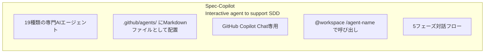
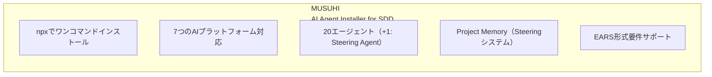
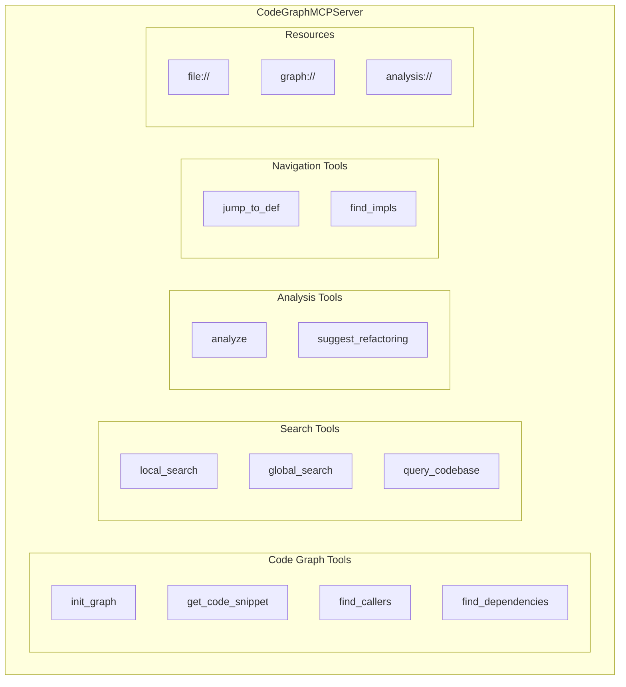
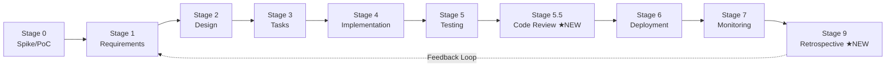
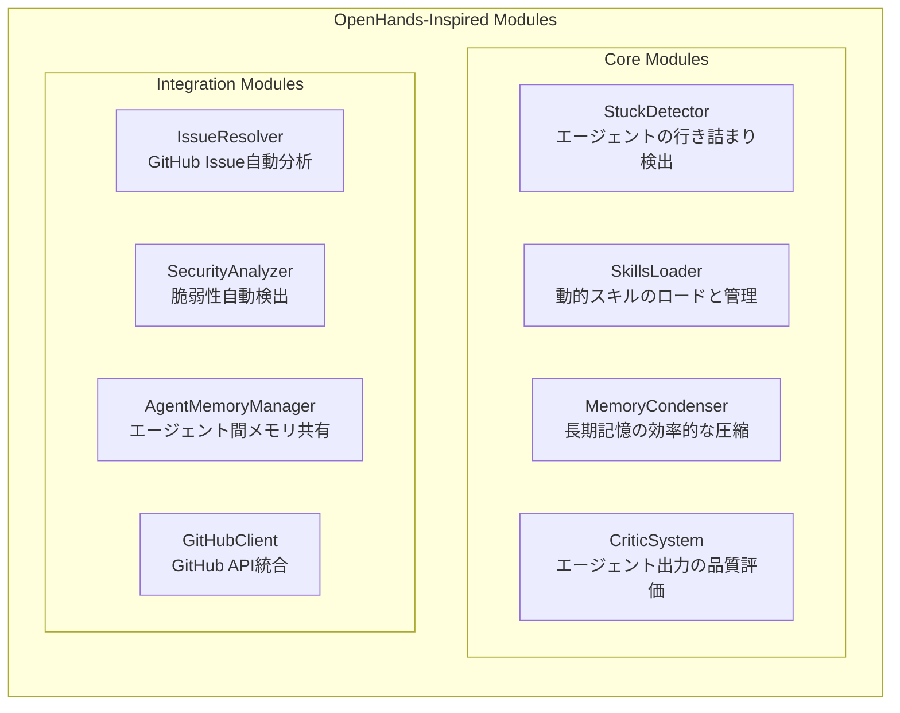
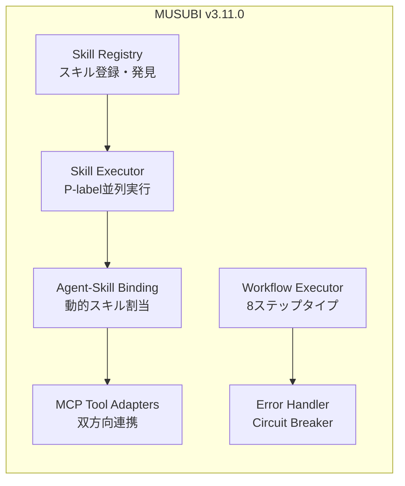
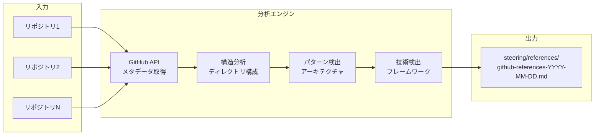

title: MUSUBIの軌跡：Spec-CopilotからMUSUHI、そしてMUSUBIへの完全進化ガイド

# MUSUBIの軌跡：Spec-CopilotからMUSUHI、そしてMUSUBIへの完全進化ガイド

## はじめに

**MUSUBI（Specification Driven Development）** は、AIエージェントを活用した仕様駆動開発フレームワークです。しかし、MUSUBIは突然生まれたわけではありません。**Spec-Copilot** → **MUSUHI** → **MUSUBI** という3つのプロジェクトを経て、現在の形に進化してきました。

本記事では、2025年11月の最初のプロジェクトから現在のv5.9.0までの完全な変遷を振り返り、各段階で何が追加され、どのような開発体験が可能になったかを詳説します。

**対象読者:**
- MUSUBIを使用中/検討中の開発者
- AI支援開発ツールの進化に興味のある方
- 仕様駆動開発の効率化を目指すチーム

**この記事で分かること:**
- Spec-Copilot: 19エージェントのプロンプト集
- MUSUHI: npmパッケージ化と20エージェント
- MUSUBI v0.1.x: 25スキルと7プラットフォーム対応
- MUSUBI v0.7.0-v1.0.0: 憲法ガバナンスとCLI基盤
- MUSUBI v2.x-v3.0.0: MCP統合、ワークフロー、ブラウザ自動化
- MUSUBI v3.3.0-v3.5.1: モニタリング、Steering高度化、CLI統合
- MUSUBI v3.6.0-v3.6.1: Dynamic Replanning Engine、目標管理、パス最適化
- MUSUBI v3.7.0: 多言語テンプレート、Ollama統合、コスト追跡、チェックポイント
- MUSUBI v3.8.0-v3.10.0: Swarm Enhancement、Guardrails、Documentation
- MUSUBI v3.11.0: Skill System Architecture、Advanced Workflows
- MUSUBI v4.0.0: Agent Loop、Codebase Intelligence、Agentic Reasoning
- MUSUBI v5.0.0: Advanced Features、Steering Auto-Update、Quality Dashboard
- MUSUBI v5.2.0-v5.3.0: マルチ言語対応、言語推薦エンジン
- MUSUBI v5.4.0: GitHubリポジトリ参照、パターン分析、改善提案
- MUSUBI v5.5.0-v5.6.0: エンタープライズスケール分析、Rustマイグレーション支援
- MUSUBI v5.7.0-v5.8.0: Performance Optimization、CodeGraph MCP v0.8.0統合
- MUSUBI v5.9.0: Phase 1-4エンタープライズ機能（ワークフローモード、モノレポ対応、憲法レベル管理）

---

# 第0章 前史：Spec-Copilot（2025年11月初旬）

## 0.1 Spec-Copilotとは

**リポジトリ:** [github.com/nahisaho/spec-copilot](https://github.com/nahisaho/spec-copilot)

Spec-Copilotは、MUSUBIの**原型**となったプロジェクトです。GitHub Copilotと連携し、仕様駆動開発を支援する**19種類の専門AIエージェントのプロンプト集**として誕生しました。



## 0.2 19のエージェント

| カテゴリ | エージェント |
|---------|------------|
| オーケストレーション | Orchestrator AI |
| 要件・計画 | Requirements Analyst, Project Manager, Agile Coach |
| 設計 | System Architect, API Designer, Database Schema Designer, UI/UX Designer |
| 実装 | Software Developer, Code Reviewer, Bug Hunter |
| テスト・品質 | Test Engineer, Quality Assurance, Performance Optimizer |
| セキュリティ | Security Auditor |
| インフラ | DevOps Engineer, Cloud Architect, Observability Engineer |
| ドキュメント | Technical Writer |

## 0.3 使用方法

```bash
# GitHub Copilot Chatでの使用
@workspace /orchestrator ToDoを管理するWebアプリケーションを開発。要件定義から開始。

# 個別エージェント
@workspace /api-designer ユーザー登録をおこなうAPIの設計をして
```

## 0.4 Spec-Copilotの限界

- ❌ **GitHub Copilot専用**: 他のAIツールでは使用不可
- ❌ **手動コピー必要**: プロジェクトごとにファイルをコピー
- ❌ **バージョン管理困難**: エージェント更新時の配布が煩雑
- ❌ **プロジェクトコンテキストなし**: 各エージェントが独立

---

# 第1章 MUSUHI：パッケージ化と進化（2025年11月中旬）

## 1.1 MUSUHIとは

**リポジトリ:** [github.com/nahisaho/musuhi](https://github.com/nahisaho/musuhi)

MUSUHIは、Spec-Copilotの課題を解決するために生まれた**npmパッケージ**です。「結び」という名前は、開発者とAIエージェントを「結ぶ」という意味が込められています。



## 1.2 主要な新機能

### npmパッケージ化

```bash
# ワンコマンドインストール
npx musuhi

# プラットフォーム指定
npx musuhi install --tool claude-code
npx musuhi install --tool github-copilot
npx musuhi install --tool cursor
```

### 7プラットフォーム対応

| プラットフォーム | 設定ファイル | エージェント配置 |
|----------------|-------------|----------------|
| Claude Code | CLAUDE.md | .claude/agents/ |
| GitHub Copilot | copilot-instructions.md | .github/agents/ |
| Cursor | .cursorrules | .cursor/agents/ |
| Windsurf | .windsurfrules | .windsurf/agents/ |
| Gemini CLI | gemini-config.md | .gemini/agents/ |
| Codex CLI | codex-config.md | .codex/agents/ |
| Qwen Code | qwen-config.md | .qwen/agents/ |

### Project Memory（Steeringシステム）

```
steering/
├── structure.md    # アーキテクチャパターン、ディレクトリ構成
├── tech.md         # 技術スタック、フレームワーク
├── product.md      # ビジネスコンテキスト、製品目的
├── rules/          # 開発ガイドライン
│   ├── ears-format.md
│   └── workflow.md
└── templates/      # ドキュメントテンプレート
```

### EARS形式要件

```
# 5つのEARSパターン
1. Event-Driven: WHEN [event], the [system] SHALL [response]
2. State-Driven: WHILE [state], the [system] SHALL [response]
3. Unwanted:     IF [error], THEN the [system] SHALL [response]
4. Optional:     WHERE [feature], the [system] SHALL [response]
5. Ubiquitous:   The [system] SHALL [response]
```

## 1.3 MUSUHIのバージョン履歴

| バージョン | 主要機能 |
|-----------|---------|
| v0.3.0 | Project Memory（Steering）システム導入 |
| v0.3.1 | EARS形式サポート |
| v0.3.2 | SDDワークフローテンプレート |
| v0.4.0 | 7プラットフォーム対応 |
| v0.4.4 | 自動コンテキスト参照 |
| v0.4.5 | インクリメンタルドキュメント生成 |
| v0.4.9 | Steering自動更新機能 |

## 1.4 MUSUHIからMUSUBIへ

MUSUHIは優れたエージェントインストーラーでしたが、以下の機能が不足していました：

- ❌ **CLIコマンドなし**: 要件生成、設計、タスク管理がエージェント頼み
- ❌ **検証機能なし**: 憲法準拠の自動検証ができない
- ❌ **トレーサビリティなし**: 要件→設計→実装の追跡機能がない
- ❌ **テストなし**: 品質保証のための自動テストがない

これらを解決するため、**MUSUBI**が誕生しました。

---

# 第2章 MUSUBI黎明期：v0.1.0 - v0.1.4（2025年11月）

## 2.1 v0.1.0 - 最初の一歩

**リリース日:** 2025-11-08

MUSUBIの最初のバージョンは、Proof of Concept（概念実証）として誕生しました。

```
v0.1.0 初期機能
├── 基本的なスキル構造
├── プロジェクトスキャフォールディング
└── Claude Code専用設計
```

## 2.2 v0.1.2 - 25スキルの誕生

**リリース日:** 2025-11-15

**MUSUBIの核心機能が形になった重要なリリース:**

| カテゴリ | スキル数 | 内容 |
|---------|---------|------|
| オーケストレーション | 2 | Orchestrator, Steering |
| 要件・設計 | 4 | Requirements Analyst, System Architect等 |
| 開発 | 5 | Software Developer, Code Reviewer等 |
| 品質・テスト | 4 | Test Engineer, Bug Hunter等 |
| セキュリティ | 2 | Security Auditor, Penetration Tester |
| インフラ | 4 | DevOps Engineer, SRE等 |
| ドキュメント | 4 | Technical Writer, API Designer等 |

### 主要機能

- ✅ **9つの憲法条項（Constitutional Articles）**: 開発ルールの明文化
- ✅ **EARS形式サポート**: 曖昧さのない要件記述
- ✅ **Steeringシステム**: プロジェクトメモリの管理
- ✅ **8ステージSDDワークフロー**: 開発プロセスの標準化
- ✅ **トレーサビリティマトリクス**: 要件から実装への追跡

## 2.3 v0.1.3 - マルチプラットフォーム革命

**リリース日:** 2025-11-17

**業界初：7つのAIプラットフォームで25エージェントを統一サポート**

**Multi-Platform Support（業界初）**

| Platform | Agent Format | Location |
|----------|-------------|----------|
| Claude Code | Skills API | `.claude/skills/` |
| GitHub Copilot | AGENTS.md | `.github/AGENTS.md` |
| Cursor | AGENTS.md | `.cursor/AGENTS.md` |
| Gemini CLI | GEMINI.md | `GEMINI.md` |
| Windsurf | AGENTS.md | `.windsurf/AGENTS.md` |
| Codex | AGENTS.md | `.codex/AGENTS.md` |
| Qwen Code | AGENTS.md | `.qwen/AGENTS.md` |

この時点で、MUSUBIは「Claude Code専用ツール」から「ユニバーサルSDD フレームワーク」へと進化しました。

---

# 第3章 基盤構築期：v0.7.0 - v0.9.x（2025年11月）

## 3.1 v0.7.0 - 憲法ガバナンスシステム

**リリース日:** 2025-11-23

**開発プロセスを統治する9つの不変条項を導入:**

```bash
# 憲法バリデーション
musubi-validate constitution    # 全9条項の検証
musubi-validate article 3       # 特定条項の検証
musubi-validate gates           # Phase -1 ゲート検証
musubi-validate complexity      # 複雑度制限検証
musubi-validate all             # 包括的検証
```

### 9つの憲法条項

| 条項 | 名称 | 内容 |
|------|------|------|
| I | Library-First | ライブラリ優先原則 |
| II | CLI Interface Mandate | CLIインターフェース義務 |
| III | Test-First Imperative | テストファースト（Red-Green-Blue） |
| IV | EARS Requirements Format | EARS形式要件 |
| V | Traceability Mandate | トレーサビリティ義務 |
| VI | Project Memory | Steeringシステム |
| VII | Simplicity Gate | シンプルさの門（≤3サブプロジェクト） |
| VIII | Anti-Abstraction Gate | 抽象化禁止の門 |
| IX | Integration-First Testing | 統合テスト優先 |

## 3.2 v0.8.0 - EARS要件ジェネレーター

**リリース日:** 2025-11-23

**曖昧さのない要件仕様を自動生成:**

```bash
# EARS要件管理
musubi-requirements init <feature>   # 要件ドキュメント初期化
musubi-requirements add              # 対話的に要件追加
musubi-requirements list             # 要件一覧表示
musubi-requirements validate         # EARS形式検証
musubi-requirements trace            # トレーサビリティマトリクス
```

### 5つのEARSパターン

| パターン | 構文 | 用途 |
|---------|------|------|
| Ubiquitous | `The [system] SHALL [requirement]` | 常時適用 |
| Event-Driven | `WHEN [event], THEN [system] SHALL [response]` | イベント駆動 |
| State-Driven | `WHILE [state], [system] SHALL [response]` | 状態駆動 |
| Unwanted Behavior | `IF [error], THEN [system] SHALL [response]` | 異常系 |
| Optional Feature | `WHERE [feature], [system] SHALL [response]` | オプション機能 |

## 3.3 v0.8.2 - 設計ドキュメントジェネレーター

**C4モデルとADR（Architecture Decision Record）の自動生成:**

```bash
# 設計ドキュメント管理
musubi-design init <feature>           # 設計ドキュメント初期化
musubi-design add-c4 <level>           # C4図追加（context|container|component|code）
musubi-design add-adr <decision>       # ADR追加
musubi-design validate                 # 設計の完全性検証
musubi-design trace                    # 要件→設計トレーサビリティ
```

## 3.4 v0.8.4 - タスク分解システム

**設計からアクション可能なタスクへ分解:**

```bash
# タスク管理
musubi-tasks init <feature>           # タスクドキュメント初期化
musubi-tasks add <title>              # タスク追加
musubi-tasks list                     # タスク一覧
musubi-tasks update <id> <status>     # ステータス更新
musubi-tasks graph                    # 依存関係グラフ生成
```

### 優先度システム

| 優先度 | 名称 | 用途 |
|--------|------|------|
| P0 | Critical | ローンチブロッカー |
| P1 | High | コア機能 |
| P2 | Medium | Nice-to-have |
| P3 | Low | 将来機能 |

## 3.5 v0.8.5-v0.8.8 - トレーサビリティ＆変更管理

**Phase 2完成：ブラウンフィールドプロジェクト対応**

```bash
# トレーサビリティ
musubi-trace matrix                   # 完全トレーサビリティマトリクス
musubi-trace coverage                 # カバレッジ統計
musubi-trace gaps                     # ギャップ検出
musubi-trace impact <req-id>          # 影響分析

# 変更管理
musubi-change init <change-id>        # 変更提案作成
musubi-change apply <change-id>       # 変更適用
musubi-change archive <change-id>     # 変更アーカイブ

# ギャップ検出
musubi-gaps detect                    # 全ギャップ検出
musubi-gaps coverage                  # カバレッジ統計
```

## 3.6 v0.9.x - 品質向上と機能強化

| バージョン | 追加機能 |
|-----------|---------|
| v0.9.0 | Phase -1 ゲートプロセス、80%テストカバレッジ強制 |
| v0.9.1 | CLIバージョン同期、憲法条項参照 |
| v0.9.2 | --dry-run、--verbose、--json オプション |
| v0.9.3 | EARS厳格検証、品質メトリクスコマンド |
| v0.9.4 | 双方向トレーサビリティ、影響分析、統計 |
| v0.9.5 | オーケストレーター強化（25エージェント対応） |
| v0.9.6-7 | トレーサビリティバグ修正、要件IDパターン拡張 |

---

# 第4章 本番リリース：v1.0.0（2025年11月23日）

## 4.1 プロダクションレディ

**テスト数:** 213 | **CLIコマンド:** 12 | **プラットフォーム:** 7

**MUSUBI v1.0.0 - Production Ready**

| 項目 | ステータス |
|------|----------|
| Core Framework | ✅ Complete |
| CLI Infrastructure | ✅ 12 commands operational |
| Traceability System | ✅ 100% functional |
| Multi-Platform Support | ✅ 7 platforms verified |
| Testing | ✅ 213/213 tests passing |
| Documentation | ✅ Comprehensive guides |

### 12のCLIコマンド

| コマンド | 機能 |
|---------|------|
| `musubi-init` | マルチプラットフォーム初期化 |
| `musubi-requirements` | EARS要件生成 |
| `musubi-design` | C4 + ADR設計ドキュメント |
| `musubi-tasks` | タスク分解 |
| `musubi-trace` | トレーサビリティシステム |
| `musubi-change` | 変更管理 |
| `musubi-gaps` | ギャップ検出 |
| `musubi-validate` | 憲法準拠検証 |
| `musubi-onboard` | プロジェクト自動分析 |
| `musubi-sync` | Steering同期 |
| `musubi-analyze` | コード品質分析 |
| `musubi-share` | チーム協働・メモリ共有 |

### v1.0.0で可能になったこと

- ✅ **完全なSDDワークフロー**: 要件→設計→タスク→実装→テスト
- ✅ **100%トレーサビリティ**: 孤立した成果物がゼロ
- ✅ **7プラットフォーム対応**: どのAI環境でも同じ体験
- ✅ **CI/CD統合**: 終了コードによる自動化対応

---

# 第5章 v2.0.0 - MCP Server Integration

## 5.1 概要

**リリース日:** 2025-12-03

v2.0.0は、**CodeGraphMCPServer統合**を導入した大規模アップデートです。Model Context Protocol（MCP）を通じて、14種類の高度なコード解析ツールが利用可能になりました。

## 5.2 主要な新機能

### CodeGraphMCPServer統合



### 11の強化されたエージェント

| エージェント | 使用MCPツール | 用途 |
|------------|--------------|------|
| `@change-impact-analyzer` | `find_dependencies`, `find_callers` | 変更影響分析 |
| `@traceability-auditor` | `query_codebase`, `find_callers` | トレーサビリティ検証 |
| `@system-architect` | `analyze_module_structure`, `global_search` | アーキテクチャ分析 |
| `@code-reviewer` | `suggest_refactoring`, `get_code_snippet` | コードレビュー |
| `@security-auditor` | `find_callers`, `query_codebase` | セキュリティ脆弱性検出 |
| `@orchestrator` | `query_codebase`, `global_search` | プロジェクト統括 |
| `@test-engineer` | `find_callers`, `get_code_snippet` | テスト設計 |
| `@bug-hunter` | `find_callers`, `local_search` | バグ調査 |
| `@software-developer` | `get_code_snippet`, `local_search` | 実装支援 |
| `@steering` | `query_codebase`, `analyze_module_structure` | プロジェクトメモリ管理 |
| `@constitution-enforcer` | `find_dependencies`, `analyze_module_structure` | 憲法準拠検証 |

### GraphRAG対応

- **Louvain community detection**: コード構造のコミュニティ分析
- **12言語サポート**: Python, TypeScript, JavaScript, Java, Go, Rust, C++など
- **セマンティック検索**: コードの意味を理解した検索

## 5.3 セットアップ例

```bash
# Claude Code
claude mcp add codegraph -- codegraph-mcp serve --repo .

# VS Code (.vscode/mcp.json)
{
  "servers": {
    "codegraph": {
      "type": "stdio",
      "command": "codegraph-mcp",
      "args": ["serve", "--repo", "${workspaceFolder}"]
    }
  }
}
```

## 5.4 v2.0.0で可能になったこと

- ✅ **コード依存関係の可視化**: 変更前に影響範囲を正確に把握
- ✅ **セマンティック検索**: 「認証処理」などの概念でコードを検索
- ✅ **リファクタリング提案**: コード品質改善の自動提案
- ✅ **アーキテクチャ分析**: モジュール構造の自動把握

---

# 第6章 v2.1.0 - Workflow Engine

## 6.1 概要

**リリース日:** 2025-12-05

v2.1.0は、**ワークフローエンジン**を導入し、SDD開発プロセスの状態管理とメトリクス追跡を実現しました。

## 6.2 新CLI: musubi-workflow

```bash
# ワークフロー初期化
musubi-workflow init <feature-name>

# 現在のステータス確認
musubi-workflow status

# 次のステージへ遷移
musubi-workflow next design

# フィードバックループ記録
musubi-workflow feedback review implementation -r "リファクタリング必要"

# ワークフロー完了
musubi-workflow complete

# 履歴とメトリクス表示
musubi-workflow history
musubi-workflow metrics
```

## 6.3 新しいSDDステージ



| Stage | 名称 | 説明 |
|-------|------|------|
| 0 | Spike/PoC | 要件前のリサーチとプロトタイピング |
| 1 | Requirements | 要件定義 |
| 2 | Design | 設計 |
| 3 | Tasks | タスク分解 |
| 4 | Implementation | 実装 |
| 5 | Testing | テスト |
| 5.5 | Code Review | ★NEW: 構造化コードレビュー |
| 6 | Deployment | デプロイ |
| 7 | Monitoring | 監視 |
| 9 | Retrospective | ★NEW: 継続的改善 |

## 6.4 ワークフロー機能

| 機能 | 説明 |
|------|------|
| **状態管理** | `storage/workflow-state.yml`でフィーチャーごとのステージを追跡 |
| **メトリクス収集** | ステージごとの所要時間、イテレーション回数、フィードバックループ |
| **遷移バリデーション** | 有効なステージ遷移の強制とフィードバックループサポート |
| **ステージ検証ガイド** | 各ステージ遷移のチェックリスト |

## 6.5 v2.1.0で可能になったこと

- ✅ **プロセス可視化**: 開発プロセスの進捗を明確に追跡
- ✅ **メトリクス駆動改善**: 各ステージの所要時間を分析
- ✅ **フィードバックループ**: イテレーションを正式に記録
- ✅ **Spike/PoCステージ**: 要件前の調査を正式にサポート
- ✅ **Retrospective**: 振り返りによる継続的改善

---

# 第7章 v2.2.0 - OpenHands由来モジュール

## 7.1 概要

**リリース日:** 2025-12-07

v2.2.0は、**OpenHandsプロジェクト**にインスパイアされた8つの高度なモジュールを統合しました。テスト数は483に増加し、より堅牢なフレームワークになりました。

## 7.2 8つの新モジュール



### 3.2.1 StuckDetector

エージェントが同じ操作を繰り返したり、進捗がない状態を自動検出します。

```javascript
// 行き詰まり検出のパターン
- 同じコマンドの繰り返し実行
- エラーループ（同じエラーが連続）
- 進捗なしの長時間待機
```

### 3.2.2 SkillsLoader

必要に応じてスキル（エージェント）を動的にロードします。

```javascript
// 動的スキルロード
const skill = await skillsLoader.load('code-reviewer');
```

### 3.2.3 MemoryCondenser

長期コンテキストを効率的に圧縮し、重要な情報を保持します。

### 3.2.4 CriticSystem

エージェントの出力を評価し、品質スコアを算出します。

```javascript
// 品質評価
const critique = await criticSystem.evaluate(agentOutput);
// { score: 0.85, feedback: [...], improvements: [...] }
```

### 3.2.5 IssueResolver

GitHub Issueを分析し、解決に必要なタスクを自動生成します。

### 3.2.6 SecurityAnalyzer

コードのセキュリティ脆弱性を自動検出します。

```javascript
// セキュリティ分析
const vulnerabilities = await securityAnalyzer.scan(codebase);
// [{ type: 'SQL Injection', severity: 'high', location: '...' }]
```

### 3.2.7 AgentMemoryManager

複数エージェント間でメモリを共有・同期します。

### 3.2.8 GitHubClient

GitHub APIとの統合により、Issue/PR操作を自動化します。

## 7.3 v2.2.0で可能になったこと

- ✅ **自己回復**: 行き詰まったエージェントの自動リカバリー
- ✅ **動的拡張**: 必要なスキルのオンデマンドロード
- ✅ **品質保証**: エージェント出力の自動評価
- ✅ **Issue自動解決**: GitHubIssueからタスク自動生成
- ✅ **セキュリティ**: コードの脆弱性自動検出
- ✅ **メモリ効率化**: 長期コンテキストの圧縮管理

---

# 第8章 v3.0.0 - Browser Automation & Web GUI

## 8.1 概要

**リリース日:** 2025-12-07

v3.0.0は、**Browser Automation Agent**と**Web GUI Dashboard**を追加した、MUSUBIの大型メジャーアップデートです。テスト数は673に増加し、27のAIエージェントを搭載しています。

## 8.2 Browser Automation Agent

### 自然言語でブラウザを操作

```bash
# ブラウザエージェント起動
musubi-browser

# 使用例
> "Googleで'MUSUBI SDD'を検索して結果を取得"
> "ログインページにアクセスしてスクリーンショットを撮影"
> "フォームに入力してSubmitボタンをクリック"
```

### 主要機能

| 機能 | 説明 |
|------|------|
| **自然言語操作** | 日本語/英語でブラウザを操作 |
| **スクリーンショット** | ページの自動キャプチャ |
| **フォーム操作** | 入力、選択、クリック |
| **ナビゲーション** | URL移動、戻る、進む |
| **データ抽出** | ページからテキスト/リンク抽出 |

### 技術スタック

```
Browser Agent
├── Playwright (ブラウザ自動化)
├── Natural Language Parser (自然言語解析)
└── Action Executor (操作実行)
```

## 8.3 Web GUI Dashboard

### リアルタイムダッシュボード

```bash
# GUIサーバー起動
musubi-gui

# ブラウザで開く
http://localhost:3000
```

### ダッシュボード機能

**MUSUBI Web Dashboard**

| セクション | 指標 | ステータス |
|----------|------|----------|
| 📊 **Project Overview** | | |
| Requirements Status | ██████████░░░░ | 75% |
| Design Progress | ████████████░░ | 85% |
| Task Completion | ██████░░░░░░░░ | 45% |
| Test Coverage | ████████████░░ | 92% |
| 🔄 **Workflow State** | | |
| Current Stage | Implementation | - |
| Time in Stage | 2h 15m | - |
| Feedback Loops | 3 | - |
| 📈 **Traceability Matrix** | | |
| Forward Coverage | 95% | - |
| Backward Coverage | 88% | - |
| Orphaned Items | 2 | - |

## 8.4 その他の改善

### Spec Kit互換

GitHub Copilot Spec Kitとの相互変換をサポート。

```bash
# Spec KitからMUSUBI形式へ変換
musubi-convert from-speckit ./specs

# MUSUBI形式からSpec Kitへ変換
musubi-convert to-speckit ./storage
```

### エージェント数の増加

- **v2.2.0**: 19エージェント
- **v3.0.0**: **27エージェント**（+8）

### テストカバレッジ

- **v2.2.0**: 483テスト
- **v3.0.0**: **673テスト**（+190）

## 8.5 v3.0.0で可能になったこと

- ✅ **ブラウザ自動化**: E2Eテスト、スクレイピング、フォーム自動入力
- ✅ **視覚的プロジェクト管理**: Webダッシュボードでリアルタイム監視
- ✅ **Spec Kit相互運用**: 既存のSpec Kitプロジェクトと連携
- ✅ **27エージェント**: 専門AIによる包括的な開発支援

---

# 第9章 v3.3.0-v3.5.1 - モニタリング、Steering高度化、CLI統合

## 9.1 v3.3.0 - Phase 4 モニタリング＆運用

**リリース日:** 2025-06-14

Phase 4でSRE機能とモニタリング機能を完備しました。

### 新モジュール

| モジュール | 説明 |
|-----------|------|
| **Observability** | ログ、メトリクス、トレースの統合監視 |
| **IncidentManager** | インシデント管理と対応フロー |
| **ReleaseManager** | リリース管理とデプロイメント |

## 9.2 v3.4.0 - Phase 5 Steering高度化

**リリース日:** 2025-06-14

Phase 5でSteeringシステムの高度な機能を追加しました。

### 新モジュール（233テスト追加）

| スプリント | モジュール | 説明 |
|-----------|-----------|------|
| Sprint 5.1 | **Steering Auto-Update** | ファイル変更を検知してsteering自動更新 |
| Sprint 5.2 | **Template Constraints** | LLM制約構文、不確実性マーカー |
| Sprint 5.3 | **Quality Metrics Dashboard** | A-Fグレード品質スコア算出 |
| Sprint 5.4 | **Advanced Validation** | クロスアーティファクト整合性検証 |

### 詳細機能

```javascript
// Steering Auto-Update
ChangeDetector       // ファイル変更検知
SteeringUpdater      // structure/tech/product自動更新
ProjectYmlSync       // package.jsonとの同期

// Template Constraints
Constraint           // カスタムバリデーション制約
UncertaintyParser    // {?unknown?}, {~estimate~}, {!todo!} マーカー
TemplateDefinition   // セクション定義とチェックリスト

// Quality Metrics Dashboard
Metric               // 計測メトリクス
HealthIndicator      // ヘルスステータス
TrendAnalyzer        // トレンド分析（up/down/stable）
QualityScoreCalculator // A-Fグレード算出

// Advanced Validation
ConsistencyChecker   // クロスアーティファクト整合性
GapDetector          // 要件/設計/テスト間ギャップ
CompletenessChecker  // 必須フィールド検証
DependencyValidator  // 循環依存検出
ReferenceValidator   // REQ-xxx, DES-xxx参照検証
```

## 9.3 v3.5.0 - 20 CLIコマンド完備

**リリース日:** 2025-12-08

全てのCLIコマンドが完備され、実用レベルに到達しました。

### 新CLIコマンド（6個追加）

| コマンド | 機能 | 例 |
|---------|------|-----|
| `musubi-orchestrate` | マルチスキルワークフロー | `musubi-orchestrate auto <task>` |
| `musubi-browser` | ブラウザ自動化・E2Eテスト | `musubi-browser run "click login"` |
| `musubi-gui` | Web GUIダッシュボード | `musubi-gui start` |
| `musubi-remember` | エージェントメモリ管理 | `musubi-remember extract` |
| `musubi-resolve` | GitHub Issue自動解決 | `musubi-resolve <issue-number>` |
| `musubi-convert` | フォーマット変換 | `musubi-convert to-speckit` |

### 20 CLIコマンド一覧

| カテゴリ | コマンド |
|---------|---------|
| **コアワークフロー** | `musubi`, `musubi-init`, `musubi-workflow` |
| **ドキュメント生成** | `musubi-requirements`, `musubi-design`, `musubi-tasks` |
| **トレーサビリティ** | `musubi-trace`, `musubi-gaps`, `musubi-change` |
| **検証・分析** | `musubi-validate`, `musubi-analyze` |
| **統合・共有** | `musubi-sync`, `musubi-share`, `musubi-onboard` |
| **高度な機能** | `musubi-orchestrate`, `musubi-browser`, `musubi-gui`, `musubi-remember`, `musubi-resolve`, `musubi-convert` |

## 9.4 v3.5.1 - 全プラットフォームCLI統合

**リリース日:** 2025-12-08

全7プラットフォームからCLIコマンドにアクセス可能になりました。

### 変更内容

**Claude Codeスキル更新（8スキル）:**

| スキル | 追加CLI |
|--------|---------|
| `orchestrator` | 全20 CLIコマンドの詳細オプション |
| `issue-resolver` | `musubi-resolve` クイックスタート |
| `agent-assistant` | `musubi-remember` メモリ管理 |
| `test-engineer` | `musubi-browser` E2Eテスト |
| `ui-ux-designer` | `musubi-browser` UIテスト |
| `site-reliability-engineer` | `musubi-gui` ダッシュボード |
| `steering` | `musubi-remember` メモリCLI |
| `project-manager` | `musubi-orchestrate` 統合 |

**他プラットフォーム対応（6プラットフォーム）:**

| プラットフォーム | ファイル | CLI参照数 |
|-----------------|---------|----------|
| GitHub Copilot | `AGENTS.md` | 24 |
| Cursor | `AGENTS.md` | 14 |
| Codex | `AGENTS.md` | 14 |
| Windsurf | `AGENTS.md` | 14 |
| Gemini CLI | `GEMINI.md` | 14 |
| Qwen Code | `QWEN.md` | 14 |

### v3.5.1で可能になったこと

- ✅ **全プラットフォームからCLI利用**: どのAI環境でも同じCLI体験
- ✅ **スキル内CLI統合**: 各スキルから関連CLIコマンドに直接アクセス
- ✅ **詳細ドキュメント参照**: Learn Moreセクションから完全CLI参照へ誘導

---

# 第10章 v3.6.0-v3.6.1 - Dynamic Replanning Engine

## 10.1 v3.6.0 - Dynamic Replanning Engine

**リリース日:** 2025-12-09

AIエージェントがタスク失敗、タイムアウト、障害発生時に動的に実行計画を調整できる知的リプランニングシステムを追加しました。

### 新機能

**LLM Provider Abstraction (`src/llm-providers/`)**

| コンポーネント | 説明 |
|--------------|------|
| `BaseLLMProvider` | 全LLMプロバイダーの抽象基底クラス |
| `CopilotProvider` | GitHub Copilot LM API統合（優先プロバイダー） |
| `AnthropicProvider` | Anthropic Claude API統合 |
| `OpenAIProvider` | OpenAI GPT API統合 |
| `LLMProviderFactory` | プロバイダーの自動検出とインスタンス化 |

**Replanning Core (`src/orchestration/replanning/`)**

| コンポーネント | 説明 |
|--------------|------|
| `ReplanningEngine` | 動的リプランニングのコアエンジン |
| `PlanMonitor` | リアルタイム実行監視とイベント発行 |
| `PlanEvaluator` | 進捗評価、効率メトリクス、推奨事項 |
| `AlternativeGenerator` | LLMによる代替パス生成 |
| `ReplanHistory` | JSONL永続化による監査ログ |
| `ReplanTrigger` | トリガータイプ（failure, timeout, quality, manual, dependency） |
| `ReplanDecision` | 決定タイプ（continue, retry, alternative, abort, human） |

### v3.6.0で可能になったこと

- ✅ **動的リプランニング**: タスク失敗時の自動代替プラン生成
- ✅ **マルチLLMサポート**: Copilot、Anthropic、OpenAIの自動切替
- ✅ **リアルタイム監視**: 失敗、タイムアウト、品質低下の検知
- ✅ **信頼度ベース判断**: 閾値0.7で人間の承認を要求
- ✅ **監査ログ**: 完全な監査証跡とエクスポート機能

---

## 10.2 v3.6.1 - 高度リプランニングコンポーネント

**リリース日:** 2025-12-09

v3.6.0のDynamic Replanning Engineをベースに、プロアクティブ最適化と目標管理のための3つの強力なコンポーネントを追加しました。

### 新コンポーネント

**ProactivePathOptimizer**
- 成功実行中でも継続的なパス最適化
- リソース利用分析とボトルネック検出
- 並列実行機会の特定
- 信頼度スコア付き最適化提案

**GoalProgressTracker**
- パーセンテージ追跡によるリアルタイム目標進捗監視
- 自動進捗計算付きマイルストーン管理
- 目標依存関係追跡とブロッキング検出
- 進捗速度とETA推定

**AdaptiveGoalModifier**
- 実行コンテキストに基づく動的目標調整
- 達成不可能な目標の制約緩和
- 複雑な目標の分割
- 依存関係に基づく優先度再計算

### 新CLIコマンド

| コマンド | 用途 |
|---------|------|
| `musubi-orchestrate replan <context-id>` | 動的リプランニング実行 |
| `musubi-orchestrate goal register` | 新規目標登録 |
| `musubi-orchestrate goal update <goal-id>` | 目標進捗更新 |
| `musubi-orchestrate goal status` | 目標状態表示 |
| `musubi-orchestrate optimize run <path-id>` | パス最適化実行 |
| `musubi-orchestrate optimize suggest <path-id>` | 最適化提案取得 |
| `musubi-orchestrate path analyze <path-id>` | パス分析 |
| `musubi-orchestrate path optimize <path-id>` | パス最適化 |

### v3.6.1で可能になったこと

- ✅ **プロアクティブ最適化**: 成功時も継続的に最適パスを探索
- ✅ **目標管理**: リアルタイム目標進捗トラッキング
- ✅ **動的調整**: 状況に応じた目標の自動調整
- ✅ **8つの新CLIコマンド**: リプランニング操作の完全CLI化
- ✅ **全7プラットフォーム対応**: 全エージェントテンプレート更新
- ✅ **1,841テスト**: 122リプランニングテスト追加

---

# 第11章 v3.7.0 - Advanced Integration & Monitoring

## 11.1 v3.7.0 - 統合強化とモニタリング

**リリース日:** 2025-12-09

v3.7.0では8つの重要な機能を追加し、多言語サポート、ローカルLLM統合、コスト追跡、チェックポイント管理など、開発ワークフロー全体を強化しました。

### 新機能一覧

| カテゴリ | 機能 | 説明 |
|---------|------|------|
| **GUI** | WebSocket Replanning | GUIでリアルタイムリプランニング更新 |
| **Browser** | musubi-browser完成 | 包括的なブラウザ自動化テスト |
| **CI/CD** | GitHub Actions | musubi-action再利用可能ワークフロー |
| **変換** | OpenAPI/Swagger変換 | REST APIからMUSUBI変換 |
| **国際化** | 多言語テンプレート | 8言語対応テンプレートシステム |
| **LLM** | Ollama Provider | ローカルLLM統合 |
| **モニタリング** | Cost Tracker | LLM API使用コスト追跡 |
| **状態管理** | Checkpoint Manager | 開発状態スナップショット |

---

## 11.2 WebSocket Replanning Updates

GUIダッシュボードにWebSocketベースのリアルタイム更新機能を追加しました。

### 機能

```javascript
// WebSocket接続
const socket = new WebSocket('ws://localhost:3001');

// リプランニングイベント
socket.on('replan:started', (data) => {
  console.log('Replanning started:', data.contextId);
});

socket.on('replan:completed', (data) => {
  console.log('Plan updated:', data.newPlan);
});

socket.on('goal:progress', (data) => {
  console.log('Goal progress:', data.progress);
});
```

### 対応イベント

| イベント | 説明 |
|---------|------|
| `replan:started` | リプランニング開始 |
| `replan:completed` | リプランニング完了 |
| `replan:failed` | リプランニング失敗 |
| `goal:progress` | 目標進捗更新 |
| `task:status` | タスクステータス変更 |

---

## 11.3 musubi-browser 完成

ブラウザ自動化エージェントの包括的なテストスイートを完備しました。

### テストカバレッジ

| カテゴリ | テスト数 | 説明 |
|---------|---------|------|
| ナビゲーション | 8 | ページ遷移、URL検証 |
| 要素操作 | 10 | クリック、入力、選択 |
| データ抽出 | 6 | テキスト、属性、テーブル |
| スクリーンショット | 4 | 画面キャプチャ |
| 待機 | 5 | 要素表示、非表示待ち |
| エラーハンドリング | 7 | タイムアウト、要素不在 |

---

## 11.4 GitHub Actions (musubi-action)

MUSUBIをCI/CDパイプラインに統合するための再利用可能なGitHub Actionsを追加しました。

### 使用方法

```yaml
# .github/workflows/musubi.yml
name: MUSUBI Validation

on:
  pull_request:
    branches: [main]

jobs:
  validate:
    runs-on: ubuntu-latest
    steps:
      - uses: actions/checkout@v4
      
      - name: Run MUSUBI Validation
        uses: nahisaho/musubi-action@v1
        with:
          command: validate
          report-format: sarif
          
      - name: Check Traceability
        uses: nahisaho/musubi-action@v1
        with:
          command: trace
          fail-on-gaps: true
```

### 対応コマンド

| コマンド | 用途 |
|---------|------|
| `init` | プロジェクト初期化 |
| `validate` | 仕様検証 |
| `trace` | トレーサビリティ確認 |
| `gaps` | ギャップ検出 |
| `analyze` | 品質分析 |

---

## 11.5 OpenAPI/Swagger変換

OpenAPI/Swagger定義からMUSUBI仕様への自動変換機能を追加しました。

### 使用方法

```bash
# OpenAPI JSONから変換
musubi-convert from-openapi openapi.json -o specs/

# OpenAPI YAMLから変換
musubi-convert from-openapi swagger.yaml -o specs/

# URLから直接変換
musubi-convert from-openapi https://api.example.com/openapi.json -o specs/
```

### 変換マッピング

| OpenAPI | MUSUBI |
|---------|--------|
| `paths` | 要件ドキュメント |
| `schemas` | 設計ドキュメント |
| `securitySchemes` | セキュリティ要件 |
| `tags` | カテゴリ分類 |

### 生成ファイル

```
specs/
├── requirements/
│   └── api-requirements.md    # エンドポイント要件
├── design/
│   └── api-design.md          # スキーマ設計
└── specs/
    └── api-spec.yml           # API仕様
```

---

## 11.6 多言語テンプレート (LocaleManager)

8言語に対応したテンプレートローカライゼーションシステムを追加しました。

### 対応言語

| 言語コード | 言語 | 完成度 |
|-----------|------|--------|
| `en` | English | 100% |
| `ja` | 日本語 | 100% |
| `zh` | 中文 | 100% |
| `ko` | 한국어 | 100% |
| `de` | Deutsch | 100% |
| `fr` | Français | 100% |
| `es` | Español | 100% |
| `id` | Bahasa Indonesia | 100% |

### 使用方法

```javascript
const { LocaleManager } = require('musubi');

// 言語設定
const locale = new LocaleManager('ja');

// テンプレート取得
const template = locale.getTemplate('requirements');
console.log(template.sections.overview); // "概要"

// 動的切替
locale.setLocale('zh');
console.log(template.sections.overview); // "概述"
```

### 翻訳カテゴリ

| カテゴリ | 項目数 |
|---------|--------|
| セクション名 | 15 |
| ラベル | 25 |
| ステータス | 8 |
| エラーメッセージ | 20 |

---

## 11.7 Ollama Provider (ローカルLLM)

Ollamaを使用したローカルLLM統合を追加しました。プライバシー重視やオフライン環境での開発をサポートします。

### 対応機能

| 機能 | 説明 |
|------|------|
| テキスト生成 | ローカルLLMによる補完 |
| ストリーミング | リアルタイム応答 |
| 埋め込み | ベクトル埋め込み生成 |
| マルチモデル | 複数モデル切替 |

### 使用方法

```javascript
const { OllamaProvider } = require('musubi/llm-providers');

const ollama = new OllamaProvider({
  baseUrl: 'http://localhost:11434',
  model: 'qwen2.5:7b'
});

// テキスト生成
const response = await ollama.complete('Explain MUSUBI in one sentence');

// ストリーミング
await ollama.stream('Generate a user story', {
  onToken: (token) => process.stdout.write(token)
});

// 埋め込み
const embeddings = await ollama.embed('MUSUBI specification');
// 768次元ベクトル（nomic-embed-text使用時）
```

### 動作確認済みモデル

| モデル | パラメータ | 用途 |
|--------|-----------|------|
| `qwen2.5:7b` | 7.6B | 汎用（推奨） |
| `codellama:7b` | 7B | コード生成 |
| `mistral:7b` | 7B | 高速推論 |
| `nomic-embed-text` | - | 埋め込み |

---

## 11.8 Cost Tracker (LLMコスト追跡)

LLM API使用料金のリアルタイム追跡機能を追加しました。

### 機能

```javascript
const { CostTracker } = require('musubi/monitoring');

const tracker = new CostTracker();

// 使用量記録
tracker.recordUsage('gpt-4', {
  inputTokens: 1500,
  outputTokens: 500,
  latencyMs: 2300
});

// コスト取得
const costs = tracker.getCosts();
console.log(costs);
// {
//   total: 0.075,
//   byModel: { 'gpt-4': 0.075 },
//   byDay: { '2025-12-09': 0.075 }
// }

// 予算アラート
tracker.setBudget(10.0); // $10 上限
tracker.on('budget:warning', (data) => {
  console.log(`Budget ${data.percentage}% used`);
});
```

### 対応プロバイダー

| プロバイダー | モデル | 入力単価 | 出力単価 |
|-------------|--------|---------|---------|
| OpenAI | gpt-4 | $0.03/1K | $0.06/1K |
| OpenAI | gpt-4-turbo | $0.01/1K | $0.03/1K |
| OpenAI | gpt-3.5-turbo | $0.0015/1K | $0.002/1K |
| Anthropic | claude-3-opus | $0.015/1K | $0.075/1K |
| Anthropic | claude-3-sonnet | $0.003/1K | $0.015/1K |

### レポート出力

```bash
# コストレポート生成
musubi-analyze costs --period week --format markdown

# 予算状況確認
musubi-analyze budget --threshold 80
```

---

## 11.9 Checkpoint Manager (状態スナップショット)

開発状態のスナップショット機能を追加しました。長時間作業の中間保存やロールバックをサポートします。

### 機能

| 機能 | 説明 |
|------|------|
| 作成 | 現在の状態をスナップショット |
| 復元 | 過去の状態に復元 |
| 比較 | 2つのチェックポイント間の差分 |
| アーカイブ | 古いチェックポイントの圧縮保存 |
| タグ付け | チェックポイントの分類 |

### 使用方法

```javascript
const { CheckpointManager } = require('musubi/managers');

const manager = new CheckpointManager({
  storageDir: '.musubi/checkpoints',
  maxCheckpoints: 50,
  autoCheckpointInterval: 1800000 // 30分
});

// チェックポイント作成
const checkpoint = await manager.create({
  name: 'before-refactoring',
  description: 'Pre-refactoring state',
  tags: ['milestone', 'refactoring']
});

// 一覧取得
const checkpoints = await manager.list();

// 復元
await manager.restore(checkpoint.id);

// 比較
const diff = await manager.compare(checkpoint1.id, checkpoint2.id);
console.log(diff.filesAdded);
console.log(diff.filesModified);
console.log(diff.filesDeleted);

// アーカイブ
await manager.archive({ olderThan: '7d' });
```

### CLI

```bash
# チェックポイント作成
musubi-checkpoint create "milestone-1" --tags feature,tested

# 一覧表示
musubi-checkpoint list

# 復元
musubi-checkpoint restore <checkpoint-id>

# 比較
musubi-checkpoint compare <id1> <id2>

# アーカイブ
musubi-checkpoint archive --older-than 7d
```

---

## 11.10 v3.7.0で可能になったこと

- ✅ **リアルタイムGUI更新**: WebSocketでリプランニング状態をライブ表示
- ✅ **CI/CD統合**: GitHub Actionsで自動仕様検証
- ✅ **REST API移行**: OpenAPI/Swaggerから自動変換
- ✅ **8言語対応**: 日本語、英語、中国語、インドネシア語など8言語でドキュメント生成
- ✅ **ローカルLLM**: Ollamaでプライベート/オフラインAI開発
- ✅ **コスト可視化**: LLM API使用料金のリアルタイム追跡
- ✅ **状態管理**: チェックポイントで安全な開発作業
- ✅ **181テスト追加**: 合計2,022テスト達成

---

# 第12章 v3.8.0 - Swarm Enhancement Phase 1

> **リリース日**: 2025-12-10
> **テスト追加**: 73 → 合計2,095テスト

v3.8.0では、OpenAI Swarmフレームワークに触発されたエージェント間連携パターンを導入しました。

## 12.1 HandoffPattern（タスク委譲）

エージェント間でタスクをシームレスに引き継ぐパターンを実装しました。

### 機能

| 機能 | 説明 |
|------|------|
| タスク委譲 | エージェント間のスムーズな引き継ぎ |
| コンテキスト保持 | 引き継ぎ時の状態・履歴の維持 |
| 条件付きハンドオフ | 条件に基づく動的ルーティング |
| エスカレーション | 失敗時の上位エージェントへの委譲 |

### 使用方法

```javascript
const { HandoffPattern } = require('musubi/orchestration');

const handoff = new HandoffPattern({
  agents: {
    frontline: frontlineAgent,
    specialist: specialistAgent,
    escalation: managerAgent
  },
  rules: [
    { condition: 'complexity > 0.7', target: 'specialist' },
    { condition: 'priority === "critical"', target: 'escalation' }
  ]
});

// タスク委譲実行
const result = await handoff.execute(task, {
  initialAgent: 'frontline',
  context: { userId: 'user-123', history: conversationHistory }
});
```

## 12.2 TriagePattern（リクエスト分類）

受信リクエストを適切なエージェントに自動ルーティングするパターンを実装しました。

### 機能

| 機能 | 説明 |
|------|------|
| インテント分類 | リクエスト意図の自動判定 |
| 優先度判定 | 緊急度に基づくキューイング |
| ロードバランシング | エージェント負荷の分散 |
| フォールバック | 分類不能時のデフォルトルート |

### 使用方法

```javascript
const { TriagePattern } = require('musubi/orchestration');

const triage = new TriagePattern({
  classifiers: [
    { intent: 'billing', agents: ['billing-agent'] },
    { intent: 'technical', agents: ['tech-support-1', 'tech-support-2'] },
    { intent: 'sales', agents: ['sales-agent'] }
  ],
  fallback: 'general-agent',
  loadBalancing: 'round-robin'
});

// リクエスト分類・ルーティング
const assignment = await triage.classify(request);
console.log(assignment.selectedAgent);
console.log(assignment.confidence);
console.log(assignment.reasoning);
```

## 12.3 v3.8.0で可能になったこと

- ✅ **自動タスク委譲**: 複雑なタスクを専門エージェントに自動引き継ぎ
- ✅ **インテリジェントルーティング**: リクエスト内容に応じた最適エージェント選択
- ✅ **コンテキスト保持**: 引き継ぎ時の会話履歴・状態の維持
- ✅ **スケーラブルなエージェント構成**: ロードバランシングによる負荷分散
- ✅ **73テスト追加**: 合計2,095テスト達成

---

# 第13章 v3.9.0 - Guardrails System

> **リリース日**: 2025-12-10
> **テスト追加**: 183 → 合計2,278テスト

v3.9.0では、OpenAI Agents SDKのGuardrails概念を参考に、入力・出力・安全性の3層検証システムを実装しました。

## 13.1 BaseGuardrail & GuardrailChain

Guardrailsの基盤クラスと連鎖実行機能を提供します。

### アーキテクチャ

```
┌─────────────────┐   ┌─────────────────┐   ┌─────────────────┐
│  InputGuardrail │→→→│ OutputGuardrail │→→→│ SafetyGuardrail │
└─────────────────┘   └─────────────────┘   └─────────────────┘
         ↓                    ↓                     ↓
    入力検証              出力サニタイズ        憲法準拠チェック
```

### 使用方法

```javascript
const { GuardrailChain, InputGuardrail, OutputGuardrail } = require('musubi/guardrails');

const chain = new GuardrailChain([
  new InputGuardrail({ level: 'strict' }),
  new OutputGuardrail({ redact: true }),
  new SafetyCheckGuardrail({ constitutional: true })
]);

try {
  const result = await chain.run(content);
  console.log(result.sanitizedContent);
} catch (error) {
  if (error instanceof GuardrailTripwireException) {
    console.error('Guardrail triggered:', error.violations);
  }
}
```

## 13.2 InputGuardrail（入力検証）

ユーザー入力の検証とサニタイズを行います。

### 機能

| 機能 | 説明 |
|------|------|
| PII検出 | 個人識別情報の検出・マスキング |
| インジェクション防止 | プロンプトインジェクション攻撃の検出 |
| 長さ制限 | 入力長の検証 |
| 禁止パターン | カスタム禁止ワード/パターンの検出 |

### 使用方法

```javascript
const { InputGuardrail } = require('musubi/guardrails');

const guardrail = new InputGuardrail({
  level: 'strict',
  piiDetection: true,
  maxLength: 10000,
  forbiddenPatterns: [/ignore previous instructions/i]
});

const result = await guardrail.validate(userInput);
if (!result.valid) {
  console.error('Input rejected:', result.violations);
}
```

## 13.3 OutputGuardrail（出力検証）

エージェント出力のサニタイズと品質保証を行います。

### 機能

| 機能 | 説明 |
|------|------|
| 機密データ墨消し | API keys、パスワードなどの自動墨消し |
| フォーマット検証 | 出力形式の検証 |
| 長さ制限 | 出力長の制限 |
| コンテンツフィルタ | 不適切コンテンツの除去 |

### 使用方法

```javascript
const { OutputGuardrail } = require('musubi/guardrails');

const guardrail = new OutputGuardrail({
  redact: true,
  redactPatterns: [
    /sk-[a-zA-Z0-9]{48}/g,      // OpenAI API key
    /ghp_[a-zA-Z0-9]{36}/g,     // GitHub PAT
    /password\s*[:=]\s*\S+/gi   // Passwords
  ],
  maxLength: 50000
});

const sanitized = await guardrail.sanitize(agentOutput);
console.log(sanitized.content);  // 墨消し済み出力
console.log(sanitized.redactions);  // 墨消し箇所のログ
```

## 13.4 SafetyCheckGuardrail（安全性チェック）

憲法（Constitution）に基づくコンテンツ安全性検証を行います。

### 機能

| 機能 | 説明 |
|------|------|
| 憲法準拠チェック | 9条項への準拠検証 |
| リスクスコアリング | コンテンツのリスクレベル評価 |
| エスカレーション | 高リスク時の自動エスカレーション |
| 監査ログ | 検証結果の記録 |

### 使用方法

```javascript
const { SafetyCheckGuardrail } = require('musubi/guardrails');

const guardrail = new SafetyCheckGuardrail({
  constitutional: true,
  articles: ['article-1', 'article-2', 'article-3'],
  riskThreshold: 0.3,
  escalateOnViolation: true
});

const result = await guardrail.check(content);
console.log(result.riskScore);      // 0.0-1.0
console.log(result.violations);     // 違反条項リスト
console.log(result.recommendations); // 修正推奨
```

## 13.5 GuardrailRules DSL

ルールベースのGuardrail設定をコードで定義できるDSLを提供します。

### RuleBuilder

```javascript
const { RuleBuilder } = require('musubi/guardrails');

const rules = new RuleBuilder()
  .addRule('no-pii')
    .pattern(/\b\d{3}-\d{2}-\d{4}\b/)  // SSN
    .action('redact')
    .message('PII detected and redacted')
  .addRule('no-api-keys')
    .pattern(/sk-[a-zA-Z0-9]{48}/)
    .action('block')
    .severity('critical')
  .addRule('max-tokens')
    .condition((content) => content.length > 100000)
    .action('truncate')
  .build();
```

### SecurityPatterns

```javascript
const { SecurityPatterns } = require('musubi/guardrails');

// 事前定義されたセキュリティパターン
const patterns = SecurityPatterns.getAll();
console.log(patterns.API_KEYS);      // APIキーパターン
console.log(patterns.CREDENTIALS);   // 認証情報パターン
console.log(patterns.PII);           // 個人情報パターン
console.log(patterns.INJECTION);     // インジェクションパターン
```

## 13.6 CLI統合

GuardrailsをCLIから直接実行できます。

### コマンド

```bash
# 単一Guardrail実行
musubi-validate guardrails "検証したいコンテンツ" --type input --level strict

# PIIチェック
musubi-validate guardrails "電話番号: 090-1234-5678" --type input --pii

# 出力墨消し
musubi-validate guardrails "API Key: sk-abc123..." --type output --redact

# 憲法準拠チェック
musubi-validate guardrails "生成されたコンテンツ" --type safety --constitutional

# Guardrailチェーン実行
musubi-validate guardrails-chain "コンテンツ" --chain input,output,safety

# ファイルからの検証
musubi-validate guardrails-chain --file output.txt --chain input,output,safety
```

### オプション

| オプション | 説明 |
|-----------|------|
| `--type` | guardrailタイプ（input, output, safety） |
| `--level` | 検証レベル（lenient, standard, strict） |
| `--pii` | PII検出を有効化 |
| `--redact` | 機密データ墨消しを有効化 |
| `--constitutional` | 憲法準拠チェックを有効化 |
| `--chain` | 複数Guardrailの連鎖実行 |

## 13.7 v3.9.0で可能になったこと

- ✅ **入力検証**: PII検出、インジェクション防止
- ✅ **出力サニタイズ**: 機密データの自動墨消し
- ✅ **憲法準拠チェック**: 9条項への自動準拠検証
- ✅ **DSL定義**: コードでルールを柔軟に定義
- ✅ **CLI統合**: コマンドラインからGuardrail実行
- ✅ **183テスト追加**: 合計2,278テスト達成

---

# 第14章 v3.10.0 - Phase 3 Documentation

> **リリース日**: 2025-12-10
> **テスト追加**: 54 → 合計2,332テスト

v3.10.0では、Multi-Skill Orchestration機能の包括的なドキュメントを作成しました。

## 14.1 Orchestration Patterns Guide

9つのオーケストレーションパターンを完全網羅したガイドを作成しました。

### 対応パターン

| パターン | 説明 | ユースケース |
|----------|------|-------------|
| auto | 自動モード選択 | 汎用タスク |
| sequential | 順次実行 | 依存関係のあるタスク |
| parallel | 並列実行 | 独立タスクの高速処理 |
| nested | ネスト実行 | 階層的タスク構造 |
| group-chat | グループチャット | 複数エージェント議論 |
| swarm | スワーム協調 | 自律的タスク分散 |
| human-in-loop | 人間介入 | 承認が必要なタスク |
| handoff | タスク委譲 | エージェント間引き継ぎ |
| triage | 分類・ルーティング | リクエスト振り分け |

### ガイド内容

- 各パターンの概念説明
- JavaScript/CLI使用例
- ベストプラクティス
- エラーハンドリング
- パフォーマンス最適化

## 14.2 P-Label Parallelization Tutorial

優先度ラベル（P0-P3）を使用した並列実行のチュートリアルを作成しました。

### 優先度レベル

| レベル | 説明 | 実行戦略 |
|--------|------|----------|
| P0 | Critical | 即時実行、他をブロック |
| P1 | High | 優先実行、P2-P3に先行 |
| P2 | Medium | 通常実行 |
| P3 | Low | リソース余剰時に実行 |

### 内容

- 優先度の設計指針
- 依存関係の定義方法
- 並列実行の最適化
- デッドロック回避
- 実行順序の制御

## 14.3 Guardrails Guide

Guardrailsシステムの包括的なガイドを作成しました。

### ガイド内容

- Guardrailsアーキテクチャ
- 各Guardrailタイプの詳細
- カスタムルール定義
- CLI完全リファレンス
- トラブルシューティング
- セキュリティベストプラクティス

## 14.4 作成ドキュメント

| ドキュメント | 行数 | 内容 |
|-------------|------|------|
| `docs/guides/orchestration-patterns.md` | 507 | 9パターン完全ガイド |
| `docs/guides/p-label-parallelization.md` | 406 | P0-P3並列化チュートリアル |
| `docs/guides/guardrails-guide.md` | 473 | Guardrailsシステムガイド |

## 14.5 v3.10.0で可能になったこと

- ✅ **9パターン理解**: オーケストレーションパターンの選択指針
- ✅ **優先度設計**: P-Labelによる効率的なタスク並列化
- ✅ **Guardrails活用**: セキュリティ検証の包括的な理解
- ✅ **実装ガイド**: 具体的なコード例と使用方法
- ✅ **54テスト追加**: 合計2,332テスト達成

---

# 第14.5章 v3.11.0 - Skill System Architecture & Advanced Workflows

> **リリース日**: 2025-12-10
> **テスト追加**: 242 → 合計2,574テスト

## 14.5.1 概要

v3.11.0は、**Phase 3の完全実装版**です。OpenAI Agents SDKにインスパイアされたSkill System Architectureと、高度なワークフロー実行エンジンを追加しました。



## 14.5.2 Skill System Architecture

### Skill Registry
スキルの集中管理と発見機能を提供：

```javascript
const { SkillRegistry } = require('musubi-sdd');
const registry = new SkillRegistry();

// スキル登録
registry.registerSkill({
  id: 'analyze-requirements',
  name: 'Requirements Analyzer',
  category: 'analysis',
  tags: ['requirements', 'ears'],
  inputs: [{ name: 'spec', type: 'string', required: true }],
  outputs: [{ name: 'requirements', type: 'array' }]
});

// カテゴリ・タグで検索
const analysisSkills = registry.findByCategory('analysis');
const earsSkills = registry.findByTags(['ears']);
```

### Skill Executor
P-label優先度による並列実行：

```javascript
const { SkillExecutor } = require('musubi-sdd');
const executor = new SkillExecutor(registry);

// P0: 最高優先度（単独実行）
// P1: 高優先度（P0完了後）
// P2: 中優先度（P1完了後）
// P3: 低優先度（バックグラウンド）

const result = await executor.executeParallel([
  { skillId: 'analyze', priority: 'P0' },
  { skillId: 'design', priority: 'P1' },
  { skillId: 'implement', priority: 'P2' }
]);
```

### Agent-Skill Binding
エージェントの能力に基づく動的スキル割当：

```javascript
const { AgentSkillBinding } = require('musubi-sdd');
const binding = new AgentSkillBinding(registry);

// エージェント登録
binding.registerAgent({
  id: 'architect-agent',
  capabilities: ['design', 'c4-diagram', 'adr'],
  maxConcurrentTasks: 3
});

// 最適なエージェント選択
const agent = binding.findBestAgentForSkill('create-c4-diagram');
```

### MCP Tool Adapters
MCP（Model Context Protocol）との双方向連携：

```javascript
const { MCPToSkillAdapter, SkillToMCPAdapter } = require('musubi-sdd');

// 外部MCPツールをスキルとして利用
const mcpAdapter = new MCPToSkillAdapter(mcpClient);
const skill = mcpAdapter.adaptTool(mcpTool);

// MUSUBIスキルをMCPツールとして公開
const skillAdapter = new SkillToMCPAdapter(registry);
const mcpTool = skillAdapter.adaptSkill('analyze-requirements');
```

## 14.5.3 Advanced Workflows

### Workflow Executor
8種類のステップタイプをサポート：

| ステップタイプ | 説明 |
|--------------|------|
| `task` | 単一タスク実行 |
| `parallel` | 並列タスク実行 |
| `conditional` | 条件分岐 |
| `loop` | ループ処理 |
| `human-approval` | 人間の承認待ち |
| `error-handler` | エラーハンドリング |
| `transform` | データ変換 |
| `aggregate` | 結果集約 |

```javascript
const { WorkflowExecutor, WorkflowDefinition } = require('musubi-sdd');

const workflow = new WorkflowDefinition('feature-dev', 'Feature Development', [
  { id: 'analyze', type: 'task', skillId: 'analyze-requirements' },
  { 
    id: 'design-impl', 
    type: 'parallel',
    steps: [
      { id: 'design', type: 'task', skillId: 'create-design' },
      { id: 'impl', type: 'task', skillId: 'implement-code' }
    ]
  },
  { 
    id: 'review', 
    type: 'conditional',
    when: { $eq: ['${analyze.complexity}', 'high'] },
    then: { id: 'manual-review', type: 'human-approval' }
  }
]);

const executor = new WorkflowExecutor();
const result = await executor.execute(workflow);
```

### Error Handler
Circuit BreakerとGraceful Degradation：

```javascript
const { ErrorHandler } = require('musubi-sdd');
const handler = new ErrorHandler();

// エラー分類
handler.handle(error); // 自動分類（network, timeout, validation等）

// Circuit Breaker
const breaker = handler.getCircuitBreaker('external-api');
// closed → open（障害時）→ half-open（回復テスト）→ closed

// リトライ with Exponential Backoff
const result = await handler.executeWithRetry(
  () => callExternalAPI(),
  { maxRetries: 3, backoffMs: 1000, backoffMultiplier: 2 }
);
```

## 14.5.4 Workflow Templates

5つの実世界ワークフローテンプレートを提供：

| テンプレート | 説明 | ステップ数 |
|------------|------|-----------|
| `feature-development` | 機能開発フロー | 8 |
| `cicd-pipeline` | CI/CDパイプライン | 6 |
| `code-review` | コードレビュー | 5 |
| `incident-response` | インシデント対応 | 7 |
| `documentation` | ドキュメント作成 | 4 |

```javascript
const { WorkflowExamples } = require('musubi-sdd');

// テンプレート取得
const featureWorkflow = WorkflowExamples.getFeatureDevelopmentWorkflow();
const cicdWorkflow = WorkflowExamples.getCICDPipelineWorkflow();
```

## 14.5.5 新規ファイル

| ファイル | 行数 | 説明 |
|---------|-----|------|
| `src/orchestration/skill-registry.js` | 450 | スキル登録・発見 |
| `src/orchestration/skill-executor.js` | 520 | P-label並列実行 |
| `src/orchestration/agent-skill-binding.js` | 380 | 動的スキル割当 |
| `src/orchestration/mcp-tool-adapters.js` | 420 | MCP双方向連携 |
| `src/orchestration/workflow-executor.js` | 780 | ワークフロー実行 |
| `src/orchestration/error-handler.js` | 830 | エラーハンドリング |
| `src/orchestration/workflow-examples.js` | 350 | テンプレート集 |
| `docs/guides/incremental-adoption.md` | 300 | 移行ガイド |

## 14.5.6 v3.11.0で可能になったこと

- ✅ **スキル管理**: 集中管理と動的発見
- ✅ **P-label実行**: 優先度ベースの並列処理
- ✅ **動的バインディング**: 能力ベースのエージェント選択
- ✅ **MCP連携**: 外部ツールとの双方向統合
- ✅ **ワークフロー実行**: 8ステップタイプのフロー制御
- ✅ **エラー耐性**: Circuit BreakerとGraceful Degradation
- ✅ **テンプレート**: 5つの実世界ワークフロー
- ✅ **242テスト追加**: 合計2,574テスト達成

---

# 第15章 バージョン比較まとめ

## 15.1 機能進化の概要

| プロジェクト/バージョン | リリース日 | 主要機能 | テスト数 | エージェント数 |
|----------------------|-----------|---------|---------|--------------|
| **Spec-Copilot** | 2025-11-05 | プロンプト集 | - | 19 |
| **MUSUHI** v0.4.9 | 2025-11-07 | npmパッケージ化、Steering | - | 20 |
| **MUSUBI** v0.1.0 | 2025-11-08 | 初期PoC | - | - |
| **MUSUBI** v0.1.2 | 2025-11-15 | 25スキル、9憲法条項 | - | 25 |
| **MUSUBI** v0.1.3 | 2025-11-17 | 7プラットフォーム対応 | 53 | 25 |
| **MUSUBI** v0.7.0 | 2025-11-23 | 憲法ガバナンスシステム | - | 25 |
| **MUSUBI** v0.8.0 | 2025-11-23 | EARS要件ジェネレーター | 25 | 25 |
| **MUSUBI** v0.8.2 | 2025-11-23 | C4 + ADR設計ジェネレーター | - | 25 |
| **MUSUBI** v0.8.4 | 2025-11-22 | タスク分解システム | 159 | 25 |
| **MUSUBI** v0.8.5-8 | 2025-11-23 | トレーサビリティ＆変更管理 | 199 | 25 |
| **MUSUBI** v0.9.0-7 | 2025-11-23 | 品質強化、双方向トレース | 213 | 25 |
| **MUSUBI** v1.0.0 | 2025-11-23 | 本番リリース（12 CLI） | 213 | 25 |
| **MUSUBI** v2.0.0 | 2025-12-03 | MCP Server統合 | 213 | 25 |
| **MUSUBI** v2.1.0 | 2025-12-05 | Workflow Engine | 213 | 25 |
| **MUSUBI** v2.2.0 | 2025-12-07 | OpenHands 8モジュール | 483 | 19 |
| **MUSUBI** v3.0.0 | 2025-12-07 | Browser Agent + Web GUI | 673 | 27 |
| **MUSUBI** v3.3.0 | 2025-06-14 | Phase 4 モニタリング | 1,024 | 27 |
| **MUSUBI** v3.4.0 | 2025-06-14 | Phase 5 Steering高度化 | 1,490 | 27 |
| **MUSUBI** v3.5.0 | 2025-12-08 | 20 CLIコマンド完備 | 1,490 | 27 |
| **MUSUBI** v3.5.1 | 2025-12-08 | 全プラットフォームCLI統合 | 1,490 | 27 |
| **MUSUBI** v3.6.0 | 2025-12-09 | Dynamic Replanning Engine | 1,797 | 27 |
| **MUSUBI** v3.6.1 | 2025-12-09 | 高度リプランニングコンポーネント | 1,841 | 27 |
| **MUSUBI** v3.7.0 | 2025-12-09 | 多言語、Ollama、コスト追跡、チェックポイント | 2,022 | 27 |
| **MUSUBI** v3.8.0 | 2025-12-10 | Swarm Enhancement Phase 1（Handoff/Triage） | 2,095 | 27 |
| **MUSUBI** v3.9.0 | 2025-12-10 | Guardrails System（入力/出力/安全性チェック） | 2,278 | 27 |
| **MUSUBI** v3.10.0 | 2025-12-10 | Phase 3 Documentation（9パターンガイド） | 2,332 | 27 |
| **MUSUBI** v3.11.0 | 2025-12-10 | Skill System & Advanced Workflows | 2,574 | 27 |

## 15.2 各バージョンの「できること」

### Spec-Copilot

| 機能 | ステータス |
|------|----------|
| 19の専門AIエージェント（プロンプト集） | ✅ |
| 5フェーズ対話フロー | ✅ |
| GitHub Copilot Chat連携 | ✅ |
| 他プラットフォーム対応、手動コピー不要 | ❌ |

### MUSUHI

| 機能 | ステータス |
|------|----------|
| npmパッケージ化（npxでインストール） | ✅ |
| 7つのAIプラットフォーム対応 | ✅ |
| 20エージェント（+Steering Agent） | ✅ |
| Project Memory（Steeringシステム） | ✅ |
| EARS形式要件、SDDワークフローテンプレート | ✅ |
| CLIコマンド、検証機能 | ❌ |

### MUSUBI v0.1.x

| 機能 | ステータス |
|------|----------|
| 25の専門スキル（Claude Code） | ✅ |
| 9つの憲法条項による開発ガバナンス | ✅ |
| 7つのAIプラットフォーム対応（業界初） | ✅ |
| AGENTS.md形式の統一エージェント定義 | ✅ |

### MUSUBI v0.7.0-v0.9.x

| 機能 | ステータス |
|------|----------|
| 憲法準拠バリデーション（9条項） | ✅ |
| EARS形式要件の自動生成・検証 | ✅ |
| C4モデル・ADR設計ドキュメント生成 | ✅ |
| タスク分解と依存関係グラフ | ✅ |
| トレーサビリティマトリクス | ✅ |
| 変更管理（ブラウンフィールド対応） | ✅ |
| ギャップ検出・カバレッジ計算 | ✅ |

### MUSUBI v1.0.0

| 機能 | ステータス |
|------|----------|
| 12のCLIコマンド完全稼働 | ✅ |
| 100%トレーサビリティ検証 | ✅ |
| CI/CD統合（終了コード対応） | ✅ |
| 本番プロジェクトでの実証 | ✅ |

### MUSUBI v2.0.0

| 機能 | ステータス |
|------|----------|
| コード依存関係の可視化 | ✅ |
| セマンティックコード検索 | ✅ |
| リファクタリング自動提案 | ✅ |
| GraphRAGによる構造分析 | ✅ |

### MUSUBI v2.1.0

| 機能 | ステータス |
|------|----------|
| 開発プロセスの状態管理 | ✅ |
| ステージごとのメトリクス追跡 | ✅ |
| Spike/PoC、Retrospectiveステージ | ✅ |
| フィードバックループの正式サポート | ✅ |

### MUSUBI v2.2.0

| 機能 | ステータス |
|------|----------|
| 行き詰まりエージェントの自動検出 | ✅ |
| 動的スキルローディング | ✅ |
| エージェント出力の品質評価 | ✅ |
| セキュリティ脆弱性の自動検出 | ✅ |
| Issue自動分析と解決提案 | ✅ |

### MUSUBI v3.0.0

| 機能 | ステータス |
|------|----------|
| 自然言語でブラウザ自動操作 | ✅ |
| Web GUIダッシュボード | ✅ |
| Spec Kit相互変換 | ✅ |
| 27の専門AIエージェント | ✅ |

### MUSUBI v3.3.0-v3.4.0

| 機能 | ステータス |
|------|----------|
| SRE機能とモニタリング | ✅ |
| インシデント管理 | ✅ |
| Steering自動更新 | ✅ |
| テンプレート制約と不確実性マーカー | ✅ |
| 品質メトリクスダッシュボード（A-Fグレード） | ✅ |
| 高度なバリデーション（クロスアーティファクト整合性） | ✅ |
| 1,490テスト | ✅ |

### MUSUBI v3.5.0-v3.5.1

| 機能 | ステータス |
|------|----------|
| 20 CLIコマンド完備 | ✅ |
| マルチスキルオーケストレーション | ✅ |
| ブラウザ自動化CLI | ✅ |
| エージェントメモリ管理CLI | ✅ |
| GitHub Issue自動解決CLI | ✅ |
| 全7プラットフォームからCLI利用可能 | ✅ |
| スキル内CLI統合 | ✅ |

### MUSUBI v3.6.0-v3.6.1

| 機能 | ステータス |
|------|----------|
| Dynamic Replanning Engine | ✅ |
| マルチLLMプロバイダー（Copilot、Anthropic、OpenAI） | ✅ |
| リアルタイムプラン監視 | ✅ |
| LLMによる代替パス生成 | ✅ |
| ProactivePathOptimizer（プロアクティブ最適化） | ✅ |
| GoalProgressTracker（目標進捗トラッキング） | ✅ |
| AdaptiveGoalModifier（動的目標調整） | ✅ |
| 8つのリプランニングCLIコマンド | ✅ |
| 1,841テスト（122リプランニングテスト） | ✅ |

### MUSUBI v3.7.0

| 機能 | ステータス |
|------|----------|
| WebSocketリアルタイムGUI更新 | ✅ |
| musubi-browser完成（40テスト） | ✅ |
| GitHub Actions（musubi-action） | ✅ |
| OpenAPI/Swagger変換（29テスト） | ✅ |
| 多言語テンプレート（8言語対応、31テスト） | ✅ |
| Ollama Provider（ローカルLLM、38テスト） | ✅ |
| Cost Tracker（LLMコスト追跡、39テスト） | ✅ |
| Checkpoint Manager（状態スナップショット、44テスト） | ✅ |
| 2,022テスト（181テスト追加） | ✅ |

### MUSUBI v3.8.0

| 機能 | ステータス |
|------|----------|
| Swarm Enhancement Phase 1（Handoff/Triage） | ✅ |
| HandoffPatternによるエージェント間タスク委譲 | ✅ |
| TriagePatternによるリクエスト分類・ルーティング | ✅ |
| Handoff統合テスト（73テスト追加） | ✅ |
| 2,095テスト達成 | ✅ |

### MUSUBI v3.9.0

| 機能 | ステータス |
|------|----------|
| Guardrails System（Phase 2完成） | ✅ |
| InputGuardrail（入力検証、PII検出） | ✅ |
| OutputGuardrail（出力サニタイズ、墨消し） | ✅ |
| SafetyCheckGuardrail（Constitutional連携） | ✅ |
| GuardrailRules DSL（RuleBuilder、SecurityPatterns） | ✅ |
| CLI統合（guardrails、guardrails-chain） | ✅ |
| 183テスト追加、合計2,278テスト | ✅ |

### MUSUBI v3.10.0

| 機能 | ステータス |
|------|----------|
| Phase 3 Multi-Skill Orchestration Documentation | ✅ |
| 9オーケストレーションパターン完全ガイド | ✅ |
| P0-P3並列化チュートリアル | ✅ |
| Guardrailsシステム完全ガイド | ✅ |
| 54テスト追加、合計2,332テスト | ✅ |

### MUSUBI v3.11.0

| 機能 | ステータス |
|------|----------|
| Skill Registry（スキル登録・発見） | ✅ |
| Skill Executor（P-label並列実行） | ✅ |
| Agent-Skill Binding（動的スキル割当） | ✅ |
| MCP Tool Adapters（双方向連携） | ✅ |
| Workflow Executor（8ステップタイプ） | ✅ |
| Error Handler（Circuit Breaker） | ✅ |
| 5 Workflow Templates | ✅ |
| 242テスト追加、合計2,574テスト | ✅ |

### MUSUBI v4.0.0

| 機能 | ステータス |
|------|----------|
| Agent Loop（エージェントループ統合） | ✅ |
| RepositoryMap（リポジトリ構造解析） | ✅ |
| ASTExtractor（AST抽出・解析） | ✅ |
| ContextOptimizer（コンテキスト最適化） | ✅ |
| ReasoningEngine（推論エンジン） | ✅ |
| PlanningEngine（計画エンジン） | ✅ |
| SelfCorrection（自己修正機能） | ✅ |
| CodeGenerator（コード生成） | ✅ |
| CodeReviewer（コードレビュー） | ✅ |
| createIntegratedAgent（統合エージェント） | ✅ |

### MUSUBI v5.0.0

| 機能 | ステータス |
|------|----------|
| SteeringAutoUpdate（自動同期） | ✅ |
| SteeringValidator（検証エンジン） | ✅ |
| TemplateConstraints（テンプレート制約） | ✅ |
| ThinkingChecklist（思考チェックリスト） | ✅ |
| QualityDashboard（A-F品質メトリクス） | ✅ |
| AdvancedValidation（クロスアーティファクト検証） | ✅ |
| Phase5Integration（統合アクセス） | ✅ |
| 227テスト追加、合計3,378テスト | ✅ |

---

# 第16章 アップグレード方法

## 16.1 新規インストール

```bash
# 常に最新版を使用（推奨）
npx musubi-sdd@latest init

# プラットフォーム指定
npx musubi-sdd@latest init --claude-code  # Claude Code
npx musubi-sdd@latest init --copilot      # GitHub Copilot
npx musubi-sdd@latest init --cursor       # Cursor IDE
```

## 16.2 既存プロジェクトのアップグレード

```bash
# 同じコマンドで最新版に更新
npx musubi-sdd@latest init

# Skills、エージェント、CLIコマンドが自動更新されます
```

## 16.3 CodeGraph MCP Server（v2.0.0機能）

```bash
# pipxでインストール
pipx install --force codegraph-mcp-server

# プロジェクトをインデックス
codegraph-mcp index /path/to/project --full
```

---

# まとめ

MUSUBIは、2025年11月5日に公開されたSpec-Copilotを起源とし、MUSUHI、そしてMUSUBIへと進化を遂げたプロジェクトです。約1ヶ月強でv0.1.0からv3.11.0まで劇的な成長を遂げました。

```mermaid
flowchart TB
    subgraph Origin["🌱 Origin: Spec-Copilot（2025-11-05）"]
        O1["19エージェント、GitHub Copilot専用"]
    end
    subgraph Evolution["🌿 Evolution: MUSUHI（2025-11）"]
        E1["20エージェント、7プラットフォーム、Steeringシステム"]
    end
    subgraph Phase1["🌳 Phase 1: MUSUBI 黎明期（v0.1.x）"]
        P1["25スキル誕生、npmパッケージ化、CLIの萌芽"]
    end
    subgraph Phase2["🏗️ Phase 2: MUSUBI 基盤構築（v0.7.0-v0.9.x）"]
        P2["憲法ガバナンス、EARS、C4、トレーサビリティ"]
    end
    subgraph Phase3["🚀 Phase 3: MUSUBI 本番リリース（v1.0.0）"]
        P3["12 CLIコマンド、213テスト、本番実証"]
    end
    subgraph Phase4["⚡ Phase 4: MUSUBI 高度化（v2.0-v2.2）"]
        P4["MCP統合、ワークフロー、OpenHandsモジュール"]
    end
    subgraph Phase5["✨ Phase 5: MUSUBI ユーザー体験革新（v3.0）"]
        P5["ブラウザ自動化、Web GUI、27エージェント"]
    end
    subgraph Phase6["🌐 Phase 6: MUSUBI CLI統合（v3.5.1）"]
        P6["20 CLIコマンド、全プラットフォームCLI統合、1,490テスト"]
    end
    subgraph Phase7["🧠 Phase 7: MUSUBI Dynamic Replanning（v3.6.1）"]
        P7["リプランニングエンジン、目標管理、パス最適化、1,841テスト"]
    end
    subgraph Phase8["🔧 Phase 8: MUSUBI Advanced Integration（v3.7.0）"]
        P8["多言語、Ollama、コスト追跡、チェックポイント、2,022テスト"]
    end
    subgraph Phase9["🐝 Phase 9: MUSUBI Swarm Enhancement（v3.8.0）"]
        P9["Handoff/Triageパターン、エージェント間連携、2,095テスト"]
    end
    subgraph Phase10["🛡️ Phase 10: MUSUBI Guardrails（v3.9.0）"]
        P10["入力/出力/安全性Guardrails、Constitutional連携、2,278テスト"]
    end
    subgraph Phase11["📚 Phase 11: MUSUBI Phase 3 Docs（v3.10.0）"]
        P11["9パターンガイド、並列化チュートリアル、2,332テスト"]
    end
    subgraph Phase12["🎯 Phase 12: MUSUBI Skill System（v3.11.0）"]
        P12["Skill Registry、Workflow Executor、2,574テスト"]
    end
    subgraph Phase13["🤖 Phase 13: MUSUBI Agent Loop（v4.0.0）"]
        P13["Codebase Intelligence、Agentic Reasoning、統合エージェント"]
    end
    subgraph Phase14["🚀 Phase 14: MUSUBI Advanced Features（v5.0.0）"]
        P14["Steering Auto-Update、Quality Dashboard、3,378テスト"]
    end
    subgraph Phase15["🌐 Phase 15: MUSUBI マルチ言語対応（v5.3.0）"]
        P15["言語推薦エンジン、10言語サポート、3,425テスト"]
    end
    Origin --> Evolution --> Phase1 --> Phase2 --> Phase3 --> Phase4 --> Phase5 --> Phase6 --> Phase7 --> Phase8 --> Phase9 --> Phase10 --> Phase11 --> Phase12 --> Phase13 --> Phase14 --> Phase15
```



**Key Milestones:**

| マイルストーン | プロジェクト/バージョン | 意義 |
|--------------|------------------------|------|
| プロジェクト誕生 | Spec-Copilot | 19エージェントでSDD構想実現 |
| マルチプラットフォーム | MUSUHI | 7プラットフォーム対応 |
| 25スキル誕生 | MUSUBI v0.1.2 | SDD専門エージェントの確立 |
| 7プラットフォーム対応 | MUSUBI v0.1.3 | 業界初のユニバーサルSDD |
| 憲法ガバナンス | MUSUBI v0.7.0 | 開発プロセスの法制化 |
| 本番リリース | MUSUBI v1.0.0 | 実用レベルの品質達成 |
| MCP統合 | MUSUBI v2.0.0 | 高度なコード解析能力 |
| 673テスト | MUSUBI v3.0.0 | 堅牢な品質保証 |
| Steering高度化 | MUSUBI v3.4.0 | 1,490テスト、Phase 5完了 |
| 全プラットフォームCLI | MUSUBI v3.5.1 | 20 CLI、7プラットフォーム統合 |
| Dynamic Replanning | MUSUBI v3.6.0 | LLMによる動的リプランニング |
| 高度リプランニング | MUSUBI v3.6.1 | 目標管理、パス最適化、1,841テスト |
| Advanced Integration | MUSUBI v3.7.0 | 多言語、Ollama、コスト追跡、2,022テスト |
| Swarm Enhancement | MUSUBI v3.8.0 | Handoff/Triageパターン、2,095テスト |
| Guardrails System | MUSUBI v3.9.0 | 入力/出力/安全性検証、2,278テスト |
| Phase 3 Documentation | MUSUBI v3.10.0 | 9パターンガイド、完全ドキュメント化、2,332テスト |
| Skill System | MUSUBI v3.11.0 | Skill Registry、Workflow Executor、2,574テスト |
| Agent Loop | MUSUBI v4.0.0 | Codebase Intelligence、Agentic Reasoning |
| Advanced Features | MUSUBI v5.0.0 | Steering Auto-Update、Quality Dashboard、3,378テスト |
| マルチ言語対応 | MUSUBI v5.3.0 | 言語推薦エンジン、10言語サポート、3,425テスト |

Spec-CopilotからMUSUHI、そしてMUSUBIへ。この進化の旅を通じて、MUSUBIは単なる仕様管理ツールから、**包括的なAI支援開発プラットフォーム**へと成長しました。v5.3.0では、マルチ言語対応と言語推薦エンジンを追加し、Rust、Python、Go、Java、C#など10言語のプロジェクトを適切に初期化できるようになりました。ODS-RAM（ウラノスデータスペース参照アーキテクチャモデル）を使ったRustプロジェクトでの実証を通じて、実際の複雑なプロジェクトでのMUSUBIの有効性を確認しました。3,425のテストと20のCLIコマンドで、堅牢で信頼性の高いSDD体験を提供します。

---

# 第16章 MUSUBI v5.2.0 - v5.3.0: マルチ言語対応（2025年12月10日）

## 16.1 ODS-RAM実証からの知見

MUSUBI v5.0.0のリリース後、**Ouranos Ecosystem Data Spaces（ウラノス）参照アーキテクチャモデル（ODS-RAM）** に準拠したRustプロジェクトを使ってMUSUBIを実証しました。この実証を通じて、以下の課題が明らかになりました：

### 発見された課題

1. **言語選択機能の不在**: JavaScript/Node.js以外のプロジェクトで`tech.md`を手動で書き直す必要があった
2. **複数言語プロジェクトへの対応不足**: フロントエンド（TypeScript）+ バックエンド（Rust）のようなポリグロットプロジェクトに対応できなかった
3. **言語未定状態のサポートなし**: 要件定義段階で技術スタックが決まっていないプロジェクトに対応できなかった

## 16.2 v5.2.0: ESLint/Prettier完全準拠

**リリース日:** 2025-12-10

v5.2.0では、コードベース全体のESLintとPrettier準拠を完了しました：

- 282件のESLintエラーを修正
- 242ファイルのPrettierフォーマットを修正
- 3,409テスト全パス

## 16.3 v5.3.0: マルチ言語対応

**リリース日:** 2025-12-10

### 技術スタックアプローチ選択

```bash
$ npx musubi-sdd init --copilot

? Technology stack approach:
  ❯ Single language        # 1つの言語を選択
    Multiple languages     # 複数言語を選択（ポリグロット）
    Undecided             # 後で決定（プレースホルダー生成）
    Help me decide        # 要件から言語を推薦
```

### 言語推薦エンジン

「Help me decide」モードを選択すると、3つの質問に基づいて最適な言語を推薦します：

```bash
? What type of application(s) are you building?
  ◯ Web Frontend (SPA, SSR)
  ◉ Web Backend / API
  ◉ CLI Tool
  ◯ Desktop Application
  ◯ Data Pipeline / ETL
  ◯ AI/ML Application
  ◉ Embedded / IoT

? Performance requirements:
  ❯ High performance / Low latency critical
    Moderate (typical web app)
    Rapid development prioritized

? Team expertise (select all that apply):
  ◉ Rust
  ◯ Go
  ◯ Python
```

推薦結果：

```
📊 Recommended languages based on your requirements:

  🦀 Rust: Systems programming; High performance, zero-cost abstractions; Team has expertise
  🐹 Go: Strong backend frameworks; Fast compilation, efficient runtime
  🐍 Python: Rapid development, extensive libraries
```

### 10言語サポート

| 言語 | バージョン | パッケージマネージャー | フレームワーク |
|------|----------|---------------------|---------------|
| JavaScript/TypeScript | ES2022+ / TS 5.0+ | npm, pnpm, yarn | React, Next.js, Express |
| Python | 3.11+ | pip, poetry, uv | FastAPI, Django |
| Rust | 1.75+ | Cargo | Axum, Actix-web, Tokio |
| Go | 1.21+ | Go modules | Gin, Echo, Chi |
| Java/Kotlin | Java 21 / Kotlin 1.9+ | Maven, Gradle | Spring Boot, Ktor |
| C#/.NET | .NET 8+ | NuGet | ASP.NET Core |
| C/C++ | C++20 | vcpkg, Conan | Qt, Boost |
| Swift | 5.9+ | SPM | SwiftUI, Vapor |
| Ruby | 3.2+ | Bundler | Rails, Sinatra |
| PHP | 8.2+ | Composer | Laravel, Symfony |

### 動的 tech.md 生成

選択した言語に応じて、適切なフレームワーク、テストツール、開発環境が自動設定されます：

```markdown
# Technology Stack

## Primary Technologies

| Language | Version | Role | Notes |
|----------|---------|------|-------|
| Rust | 1.75+ stable | Primary | Native binary |
| Python | 3.11+ | Secondary | CPython, PyPy |

### Rust Ecosystem

- **Package Manager**: Cargo
- **Frameworks**: Axum, Actix-web, Tokio
- **Testing**: cargo test, criterion

### Python Ecosystem

- **Package Manager**: pip, poetry, uv
- **Frameworks**: FastAPI, Django, Flask
- **Testing**: pytest, unittest
```

### 「Undecided」モード

言語が未定の場合、決定基準とTODOリストを含むプレースホルダーが生成されます：

```markdown
# Technology Stack

**Status**: Technology stack to be determined

## Decision Criteria

When selecting technologies, consider:
1. **Application Type**: What type of application is being built?
2. **Performance Requirements**: What are the performance constraints?
3. **Team Expertise**: What technologies is the team familiar with?

## Next Steps

- [ ] Define functional requirements
- [ ] Identify performance constraints
- [ ] Evaluate team skills
- [ ] Create proof-of-concept
- [ ] Make final decision and update this document
```

### テスト

- 16件の新規テスト追加（言語推薦エンジン）
- 全3,425テストパス

---

# 第17章 MUSUBI v5.4.0: GitHub参照と改良提案（2025年12月10日）

## 17.1 概要

v5.4.0では、**GitHubリポジトリを参照して学習する機能**を追加しました。複数のリポジトリを分析し、アーキテクチャパターン、使用技術、ベストプラクティスを抽出して改良提案を生成します。



## 17.2 新オプション: `--reference` / `-r`

### 基本使用法

```bash
# 単一リポジトリ参照
musubi init --reference facebook/react

# 複数リポジトリ参照（短縮形）
musubi init -r vercel/next.js -r facebook/react -r denoland/deno

# フルURL形式
musubi init --reference https://github.com/tokio-rs/tokio

# ブランチ指定
musubi init -r owner/repo@develop

# サブパス指定
musubi init -r owner/repo#packages/core
```

### サポートするフォーマット

| フォーマット | 例 |
|-------------|---|
| owner/repo | `facebook/react` |
| HTTPS URL | `https://github.com/owner/repo` |
| SSH URL | `git@github.com:owner/repo.git` |
| ブランチ指定 | `owner/repo@develop` |
| サブパス指定 | `owner/repo#src/lib` |

## 17.3 GitHub API統合

### メタデータ取得

```javascript
// 取得される情報
{
  name: "react",
  description: "A JavaScript library for building user interfaces",
  language: "JavaScript",
  stars: 220000,
  topics: ["react", "javascript", "frontend"],
  license: "MIT",
  defaultBranch: "main",
  updatedAt: "2025-12-10T00:00:00Z"
}
```

### 主要ファイル分析

以下のファイルを自動取得・分析:
- `README.md` - プロジェクト概要
- `package.json` - JS/TS依存関係
- `Cargo.toml` - Rust依存関係
- `pyproject.toml` - Python依存関係
- `go.mod` - Go依存関係
- `pom.xml` - Java依存関係

### GITHUB_TOKENサポート

```bash
# レート制限回避のため環境変数設定
export GITHUB_TOKEN=ghp_xxxxxxxxxxxx
musubi init -r facebook/react -r vercel/next.js
```

## 17.4 パターン検出

### アーキテクチャパターン

| パターン | 検出条件 |
|---------|---------|
| Clean Architecture | `domain/`, `application/`, `infrastructure/`, `interface/` |
| Hexagonal Architecture | `adapters/`, `ports/`, `core/`, `hexagon/` |
| Domain-Driven Design | `aggregates/`, `entities/`, `valueobjects/` |
| Monorepo | `packages/`, `apps/`, `pnpm-workspace.yaml` |
| Rust Workspace | `Cargo.toml`に`[workspace]` |

### テクノロジー検出

**JavaScript/TypeScript:**
- React, Vue, Angular, Next.js
- Express, Fastify
- Jest, Vitest, Mocha
- ESLint, Prettier, Biome

**Rust:**
- Tokio, Actix, Axum

**Python:**
- FastAPI, Django, Flask
- pytest

## 17.5 改良提案生成

### 出力例

```markdown
# GitHub Reference Repositories

> Analyzed on 2025-12-10T12:00:00.000Z

## Referenced Repositories

### react
- **URL**: https://github.com/facebook/react
- **Language**: JavaScript
- **Stars**: 220000
- **Topics**: react, javascript, frontend

**Directory Structure:**
📁 packages
📁 scripts
📄 package.json
📄 README.md

## Analysis Results

### Architecture Patterns Detected
- **monorepo** in `react`
  - Evidence: packages

### Technologies Used
- **react**: react, typescript

## Improvement Suggestions

1. **Architecture**: Consider using monorepo pattern
   - Found in 1 repository(ies): react

2. **Technology**: Consider using typescript
   - Used by 1 repository(ies): react
```

## 17.6 実装詳細

### 主要関数

| 関数 | 説明 |
|------|------|
| `parseGitHubRepo()` | リポジトリ参照を解析 |
| `fetchGitHubRepo()` | GitHub APIからデータ取得 |
| `fetchGitHubRepos()` | 複数リポジトリを順次取得 |
| `analyzeReposForImprovements()` | パターン・技術を分析 |
| `saveReferenceRepos()` | 分析結果をMarkdownで保存 |

### 出力ファイル

```
steering/
└── references/
    └── github-references-2025-12-10.md
```

## 17.7 テスト

- 59件の新規テスト追加
- 全3,571テストパス
- ESLint/Prettier準拠

---

---

# 第18章 エンタープライズスケール分析：v5.5.0 - v5.6.0（2025年12月）

## 18.1 背景

**GCC（GNU Compiler Collection）の分析経験から生まれた機能強化**

MUSUBIをGCC（1,000万行以上、100,000ファイル以上）のような超大規模プロジェクトに適用した際の課題を解決するため、エンタープライズスケールの機能が追加されました。

## 18.2 Large Project Analyzer

**超大規模プロジェクト対応（10M+行）**

`LargeProjectAnalyzer`クラスは、GCCのような超大規模プロジェクト（1,000万行以上）の分析に対応します。`maxMemoryMB`（メモリ上限）、`chunkSize`（チャンクサイズ）、`enableGC`（ガベージコレクション有効化）などのオプションを指定して初期化し、`analyze()`メソッドでプロジェクトパスを渡して分析を実行します。`onProgress`コールバックで進捗状況をリアルタイムで取得できます。

### スケールベース戦略

| スケール | ファイル数 | 戦略 |
|---------|-----------|------|
| Small | ≤100 | バッチ分析 |
| Medium | ≤1,000 | 最適化バッチ |
| Large | ≤10,000 | チャンク分析 |
| Massive | >10,000 | ストリーミング分析 |

### 巨大関数検出

| 行数 | レベル |
|------|--------|
| 100+ | Warning |
| 500+ | Critical |
| 1000+ | Extreme |

## 18.3 Complexity Analyzer

**循環的・認知的複雑度分析**

`ComplexityAnalyzer`クラスは、コードの複雑度を多角的に分析します。`calculateCyclomaticComplexity()`メソッドでMcCabeの循環的複雑度を、`calculateCognitiveComplexity()`メソッドでSonarSource方式の認知的複雑度を計算できます。両メソッドともコードと言語（`'javascript'`、`'typescript'`など）を引数として受け取ります。

### 複雑度しきい値

| レベル | 循環的 | 認知的 |
|--------|--------|--------|
| Ideal | ≤10 | ≤15 |
| Warning | 11-20 | 16-30 |
| Critical | 21-50 | 31-60 |
| Extreme | >50 | >60 |

## 18.4 CodeGraph MCP Integration

**深層コードグラフ分析**

`CodeGraphMCP`クラスは、MCPサーバーと連携してコードグラフ分析を行います。`mcpEndpoint`でサーバーのURLを指定して初期化します。主要なメソッドは以下の通りです：

- **`generateCallGraph()`**: 指定ファイルのコールグラフを生成（`depth`で探索深度を指定）
- **`analyzeImpact()`**: 指定ファイルの変更が他に与える影響を分析
- **`detectCircularDependencies()`**: 指定ディレクトリ内の循環依存を検出
- **`identifyHotspots()`**: 高接続度のエンティティ（ホットスポット）を特定（引数で件数を指定）

### 機能一覧

| 機能 | 説明 |
|------|------|
| Call Graph | 呼び出し元・呼び出し先の追跡 |
| Impact Analysis | コード変更時の影響範囲分析 |
| Circular Dependencies | 循環依存の検出 |
| Hotspots | 高接続度エンティティの特定 |
| Community Detection | 関連モジュールのグループ化 |

## 18.5 Rust Migration Generator

**C/C++からRustへの移行支援**

`RustMigrationGenerator`クラスは、C/C++コードをRustに移行する際のリスク分析を行います。`analyzeRustMigration()`メソッドにファイルパスを渡すと、以下の情報を含む分析結果を返します：

- **`riskScore`**: 移行リスクスコア（0-100）
- **`unsafePatterns`**: 検出された安全でないパターンの配列
- **`securityComponents`**: セキュリティ関連コンポーネントの識別

### 検出する安全でないパターン（27種類）

| カテゴリ | パターン |
|---------|----------|
| メモリ管理 | malloc, calloc, realloc, free |
| バッファオーバーフロー | strcpy, strcat, sprintf, gets |
| ポインタ操作 | ポインタ算術、キャスト、ダブルポインタ |
| 並行処理 | pthread、volatile誤用 |
| フォーマット文字列 | 可変フォーマットのprintf |

### セキュリティコンポーネント識別

- スタック保護
- サニタイザー
- 暗号化
- 認証

## 18.6 Hierarchical Reporter

**階層的レポート生成**

`HierarchicalReporter`クラスは、プロジェクトの階層的な分析レポートを生成します。`generateReport()`メソッドにプロジェクトパスとオプションを渡して使用します：

- **`format`**: 出力形式（`'markdown'`、`'json'`、`'html'`）
- **`includeHotspots`**: ホットスポット分析を含めるか
- **`maxDepth`**: ディレクトリ探索の最大深度

### 出力フォーマット

- Markdown
- JSON
- HTML

### ホットスポット分析

生成されるレポートには、ファイルごとの行数、複雑度、リスクレベル（Critical/Warning/Ideal）を示すホットスポット表が含まれます。

## 18.7 バージョン履歴

| バージョン | リリース日 | 主要機能 |
|-----------|-----------|----------|
| v5.5.0 | 2025-12-10 | Large Project Analyzer、Complexity Analyzer、CodeGraph MCP、Rust Migration Generator、Hierarchical Reporter |
| v5.6.0 | 2025-12-10 | v5.5.0のlintエラー修正、npm公開 |

## 18.8 テスト

- 75件の新規テスト追加
- 全3,645テストパス
- ESLint/Prettier準拠

---

# 第19章 Phase 1-4 エンタープライズ機能：v5.9.0（2025年12月）

## 19.1 背景

**エンタープライズ開発における柔軟性と管理性の両立**

大規模プロジェクトでは、固定的なワークフローでは対応しきれない多様なニーズがあります。v5.9.0では、4つのPhaseに分けてエンタープライズ機能を実装しました。

## 19.2 Phase 1: ワークフロー柔軟性

**プロジェクト規模に応じた3つのモード**

新しいCLIコマンド`musubi-release`でリリース自動化を実行できます。`--dry-run`オプションでCHANGELOGの確認のみ行うことも可能です。`musubi-workflow mode --detect`でコミットメッセージからワークフローモードを自動検出します。

### 3つのワークフローモード

| モード | 対象 | ステージ | EARS必須 | カバレッジ |
|--------|------|----------|----------|-----------|
| **small** | バグ修正、typo | requirements → implement → validate | No | 60% |
| **medium** | 新機能、改善 | requirements → design → tasks → implement → validate | Yes | 80% |
| **large** | 設計変更、新API | steering → requirements → design → tasks → implement → validate → review → testing | Yes | 90% |

### WorkflowModeManager

`WorkflowModeManager`クラスは、プロジェクトパスを指定して初期化します。主要なメソッドは以下の通りです：

- **`detectMode(featureName)`**: フィーチャー名/コミットメッセージからモード（`'small'`/`'medium'`/`'large'`）を自動検出
- **`getMode(modeName)`**: 指定モードの設定を取得（`stages`配列、`requirements.ears`必須フラグ、`coverage.threshold`カバレッジ閾値など）

## 19.3 Phase 2: モノレポ対応

**複数パッケージの依存関係管理**

`steering/packages.yml`ファイルでモノレポのパッケージ構造を定義します。各パッケージには`name`（名前）、`path`（パス）、`dependencies`（依存パッケージ）を指定します。

### PackageManager

`PackageManager`クラスは、モノレポのパッケージ管理を行います。プロジェクトパスを指定して初期化し、以下のメソッドを使用します：

- **`listPackages()`**: 全パッケージの一覧を取得
- **`generateDependencyGraph('mermaid')`**: 依存関係グラフをMermaid形式で生成
- **`validate()`**: パッケージ設定の検証（循環依存チェックなど）

## 19.4 Phase 3: 憲法レベル管理

**条項の重要度に応じた柔軟な適用**

`steering/rules/constitution-levels.yml`ファイルで、9つの憲法条項を3つのレベルに分類します：

| レベル | 強制 | 説明 |
|--------|------|------|
| **critical** | blocking | 必須。違反時はビルド失敗 |
| **advisory** | warning | 推奨。違反時は警告 |
| **flexible** | suggestion | 柔軟。違反時は提案のみ |

### ConstitutionLevelManager

`ConstitutionLevelManager`クラスは、憲法レベルの管理と検証を行います：

- **`getSummary()`**: 各レベルの条項一覧を取得（`critical`、`advisory`、`flexible`配列）
- **`getArticleLevel(articleId)`**: 指定条項のレベルと`isBlocking`フラグを取得
- **`validateWithLevels(results)`**: 検証結果を渡し、レベルに応じた判定を実行（`passed`フラグ、`blockingFailures`配列を返却）

## 19.5 Phase 4: プロジェクト設定

**スキーマ検証と自動マイグレーション**

新しいCLIコマンド`musubi-config`で設定管理を行います：

| サブコマンド | 説明 |
|-------------|------|
| `validate` | project.ymlのスキーマ検証 |
| `migrate` | v1.0からv2.0への自動マイグレーション |
| `show` | 有効な設定（デフォルトとマージ済み）を表示 |
| `init` | 新規プロジェクト用の設定ファイル作成 |

### ProjectValidator

`ProjectValidator`クラスは、project.ymlのスキーマ検証とマイグレーションを行います：

- **`validate()`**: JSON Schemaによる検証（`valid`フラグと`errors`配列を返却）
- **`needsMigration()`**: v1.0からv2.0へのマイグレーションが必要かチェック
- **`migrate({ dryRun })`**: マイグレーション実行（`dryRun: true`でプレビュー）
- **`getEffectiveConfig()`**: デフォルト値とマージした有効な設定を取得

## 19.6 Orchestrator統合

**5つの組み込みスキル**

v5.9.0では、新機能をOrchestratorから利用できる5つの組み込みスキルが追加されました。各スキルは`execute()`メソッドで実行し、`action`パラメータで操作を指定します：

| スキル | 主なアクション | 説明 |
|--------|---------------|------|
| `releaseSkill` | `generate`, `bump` | CHANGELOG生成、バージョン管理 |
| `workflowModeSkill` | `detect`, `get`, `compare` | モード検出（`detectedMode`を返却） |
| `packageManagerSkill` | `list`, `graph`, `validate` | 依存グラフ生成（`mermaid`形式） |
| `constitutionLevelSkill` | `summary`, `validate`, `check` | レベルサマリー取得 |
| `projectConfigSkill` | `validate`, `migrate`, `show` | 設定検証（`validation.valid`を返却） |

### スキルカテゴリ

| カテゴリ | スキル | 用途 |
|---------|--------|------|
| **release** | release-manager | CHANGELOG生成、バージョン管理 |
| **workflow** | workflow-mode-manager | モード検出、設定取得、比較 |
| **configuration** | package-manager, project-config-manager | パッケージ管理、設定管理 |
| **validation** | constitution-level-manager | レベル対応検証 |

## 19.7 新規CLIコマンド

### musubi-release

リリース自動化コマンドです。基本実行でCHANGELOGを自動生成します。`--version`でバージョン指定、`--dry-run`でプレビュー、`--format json`でJSON出力が可能です。

### musubi-config

プロジェクト設定管理コマンドです。`validate`でスキーマ検証、`migrate`でv2.0へのマイグレーション（`--dry-run`でプレビュー）、`show`で有効設定表示、`init`で新規設定作成を行います。

## 19.8 テスト

- 50件の新規テスト追加
- 全4,408テストパス
- ESLint/Prettier準拠

---

## 関連リンク

- [MUSUBI GitHub](https://github.com/nahisaho/musubi)
- [MUSUHI GitHub](https://github.com/nahisaho/musuhi)（前身プロジェクト）
- [Spec-Copilot GitHub](https://github.com/nahisaho/spec-copilot)（起源プロジェクト）
- [MUSUBI v5.9.0 Enterprise Features Guide](https://qiita.com/nahisaho/items/musubi-v5-enterprise-features)
- [MUSUBI v5.6.0 Enterprise Scale Guide](https://qiita.com/nahisaho/items/musubi-v5-enterprise-scale)
- [MUSUBI v5.4.0 GitHub Reference Guide](https://qiita.com/nahisaho/items/musubi-v5-github-reference)
- [MUSUBI v5.3.0 Multi-Language Guide](https://qiita.com/nahisaho/items/musubi-v5-multilang)
- [MUSUBI v5.0.0 Advanced Features Guide](https://qiita.com/nahisaho/items/musubi-v5-advanced-features)
- [MUSUBI v4.0.0 Agent Loop Guide](https://qiita.com/nahisaho/items/musubi-v4-agent-loop)
- [MUSUBI v3.11.0 Skill System Guide](https://qiita.com/nahisaho/items/musubi-v3-skill-system)
- [MUSUBI v3.10.0 Orchestration Guide](https://qiita.com/nahisaho/items/musubi-v3-orchestration)
- [MUSUBI v3.9.0 Guardrails Guide](https://qiita.com/nahisaho/items/musubi-v3-guardrails)
- [MUSUBI v3.7.0 Integration Guide](https://qiita.com/nahisaho/items/musubi-v3-integration)
- [MUSUBI v3.6.1 Replanning Guide](https://qiita.com/nahisaho/items/musubi-v3-replanning)
- [MUSUBI v3.0.0 完全ガイド](https://qiita.com/nahisaho/items/musubi-v3-agents)
- [MUSUBI v3.5.1 CLI統合ガイド](https://qiita.com/nahisaho/items/musubi-cli-integration)
- [MUSUBI初心者ガイド](https://qiita.com/nahisaho/items/musubi-beginners-guide)

## タグ

`#MUSUBI` `#MUSUHI` `#Spec-Copilot` `#SDD` `#仕様駆動開発` `#AIエージェント` `#ClaudeCode` `#GitHubCopilot` `#MCP` `#Replanning` `#Ollama` `#Guardrails` `#Swarm` `#Orchestration` `#SkillSystem` `#Workflow` `#AgentLoop` `#CodebaseIntelligence` `#QualityDashboard` `#MultiLanguage` `#Rust` `#ODS-RAM` `#GitHubReference` `#PatternDetection` `#EnterpriseScale` `#RustMigration` `#ComplexityAnalysis` `#CodeGraph` `#WorkflowModes` `#Monorepo` `#ConstitutionLevels`
