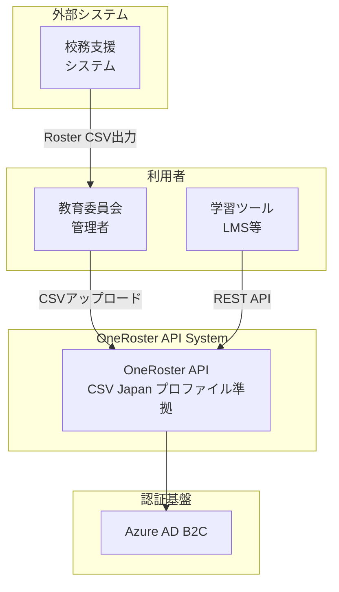

# 【MUSUBI v6.1.2】AIに自然言語で話しかけるだけ！仕様駆動開発の完全ガイド

## はじめに

**MUSUBI SDD v6.1.2** は、AIコーディングアシスタントに**自然言語で話しかけるだけ**で、仕様駆動開発（SDD）を実現するフレームワークです。

コマンドを覚える必要はありません。AIに「やりたいこと」を伝えるだけで、要件定義から設計、実装、検証まで一貫したワークフローで開発を進められます。

---

## 🆕 v6.1.2 の変更点

### テストの信頼性向上

- **WebSocketテスト修正**: `storage/archive` ディレクトリ作成を追加し、CIの安定性を向上

### v6.1.2 の変更点

- **ディレクトリ構造の統一**: `storage/specs/` にフラット化
- **対話型要件定義**: 1問1答 + MECE分析

---

## 🚀 自然言語で始めるSDD（5分で開始）

### Step 1: MUSUBI のインストール

```bash
npx musubi-sdd init --copilot
```

お使いのAIプラットフォームを選択すると、自動でセットアップされます。

### Step 2: AIに話しかけるだけで開発開始

初期化が完了したら、**AIに自然言語で話しかけるだけ**で仕様駆動開発が始まります。

---

## 💬 自然言語での作業例

### 🎯 要件定義を作成したい

AIに次のように伝えます。

> **「ユーザー認証機能の要件定義を作成して」**

AIが1問1答形式で対話を開始します。

```
AI: この機能で解決したい『本当の課題』は何ですか？

あなた: パスワードを忘れるユーザーが多くて、問い合わせが増えている

AI: この機能を最も必要としているのは誰ですか？

あなた: カスタマーサポートチームと、頻繁にログインするユーザー

AI: もしこの機能が完璧に動作したら、何が変わりますか？

あなた: 問い合わせが80%減って、ユーザーがスムーズにログインできる
...
```

対話が完了すると、AIはMECE分析で網羅的な要件を定義し、`storage/specs/user-auth-requirements.md` に保存します。

---

### 📐 設計を作成したい

> **「ユーザー認証機能の設計をC4モデルで作成して」**

AIがC4モデル（Context, Container, Component, Code）で設計図を作成します。

---

### 📋 タスクに分解したい

> **「ユーザー認証機能を実装タスクに分解して」**

AIが実装タスクをP-ラベル優先度（P0〜P3）で分解します。

---

### ⚙️ 実装を進めたい

> **「P0タスクから順に実装を開始して」**

AIが優先度順にタスクを実装します。

---

### ✅ 検証したい

> **「要件と実装の整合性を検証して」**

AIがトレーサビリティ検証を実行し、漏れや不整合を報告します。

---

### 🔄 既存コードを変更したい

> **「ログイン画面にOAuth認証を追加する変更提案を作成して」**

AIが変更影響分析を行い、差分仕様（Delta Spec）を作成します。

---

## 🤖 対応AIプラットフォーム（7種類）

| プラットフォーム | セットアップ | 使い方 |
|-----------------|-------------|--------|
| **Claude Code** | `npx musubi-sdd init --claude` | 自然言語で会話 |
| **GitHub Copilot** | `npx musubi-sdd init --copilot` | 自然言語で会話 |
| **Cursor IDE** | `npx musubi-sdd init --cursor` | 自然言語で会話 |
| **Gemini CLI** | `npx musubi-sdd init --gemini` | 自然言語で会話 |
| **Codex CLI** | `npx musubi-sdd init --codex` | 自然言語で会話 |
| **Qwen Code** | `npx musubi-sdd init --qwen` | 自然言語で会話 |
| **Windsurf** | `npx musubi-sdd init --windsurf` | 自然言語で会話 |

すべてのプラットフォームで、**自然言語での会話**で作業できます。

---

## 📋 27の専門AIエージェント

MUSUBI には27の専門エージェントが搭載されています。自然言語で依頼すると、適切なエージェントが自動で対応します。

### コアワークフロー（9個）

| できること | 伝え方の例 |
|-----------|-----------|
| プロジェクト設定 | 「プロジェクトのアーキテクチャを設定して」 |
| 要件定義 | 「〇〇機能の要件を定義して」 |
| システム設計 | 「〇〇機能の設計をC4モデルで作成して」 |
| タスク分解 | 「〇〇機能を実装タスクに分解して」 |
| 実装 | 「P0タスクを実装して」 |
| 検証 | 「要件と実装の整合性を検証して」 |
| 変更分析 | 「〇〇を追加する影響を分析して」 |
| 変更適用 | 「変更提案を適用して」 |
| アーカイブ | 「完了した変更をアーカイブして」 |

### 品質保証（6個）

| できること | 伝え方の例 |
|-----------|-----------|
| テスト設計 | 「〇〇機能のテストを設計して」 |
| コードレビュー | 「このコードをレビューして」 |
| セキュリティ監査 | 「セキュリティ脆弱性をチェックして」 |
| パフォーマンス最適化 | 「この処理を最適化して」 |
| 品質管理 | 「品質メトリクスを確認して」 |
| ガバナンス検証 | 「憲法条項への準拠を確認して」 |

### 専門領域（12個）

| できること | 伝え方の例 |
|-----------|-----------|
| API設計 | 「REST APIを設計して」 |
| データベース設計 | 「ユーザーテーブルのスキーマを設計して」 |
| データベース運用 | 「クエリを最適化して」 |
| UI/UX設計 | 「ログイン画面のUIを設計して」 |
| DevOps | 「CI/CDパイプラインを構築して」 |
| クラウド設計 | 「AWSアーキテクチャを設計して」 |
| AI/ML実装 | 「推薦システムを実装して」 |
| ドキュメント作成 | 「APIドキュメントを作成して」 |
| リリース管理 | 「リリースノートを作成して」 |
| SRE | 「アラート設定を構成して」 |
| バグ調査 | 「このエラーの原因を調査して」 |
| 課題解決 | 「このIssueを解決して」 |

---

## 🏛️ 品質を守る9つの憲法条項

MUSUBI は「憲法」で品質を保証します。AIが自動で準拠を確認するので、意識する必要はありません。

| 条項 | 原則 | 意味 |
|------|------|------|
| I | Library-First | 再利用可能なライブラリとして実装 |
| II | CLI Interface | すべての機能にCLIを提供 |
| III | Test-First | テストを先に書く |
| IV | EARS Format | 要件は標準形式で記述 |
| V | Traceability | 要件↔設計↔コード↔テストを追跡 |
| VI | Project Memory | プロジェクト設定を参照 |
| VII | Simplicity Gate | 過度な複雑化を防止 |
| VIII | Anti-Abstraction | 不要な抽象化を避ける |
| IX | Integration-First | 実環境での統合テスト |

---

## 📁 プロジェクト構造

MUSUBI で初期化されたプロジェクト：

```
your-project/
├── AGENTS.md                    # AIエージェント定義
├── steering/
│   ├── structure.md             # アーキテクチャ
│   ├── tech.md                  # 技術スタック
│   ├── product.md               # プロダクト情報
│   └── rules/
│       ├── constitution.md      # 憲法条項
│       ├── workflow.md          # ワークフロー
│       └── ears-format.md       # EARS形式
├── storage/
│   ├── specs/                   # 仕様書
│   ├── changes/                 # 変更管理
│   └── archive/                 # アーカイブ
└── [プラットフォーム別ファイル]
```

---

## 🔄 典型的な開発フロー

### 新機能開発

```
1. 「〇〇機能の要件を定義して」
   → 1問1答の対話 → MECE分析 → 要件定義完成

2. 「この要件で設計を作成して」
   → C4モデル設計 → ADR（設計決定）

3. 「タスクに分解して」
   → P-ラベル優先度でタスク化

4. 「P0から実装して」
   → 順次実装 → テスト作成

5. 「検証して」
   → トレーサビリティ確認 → 完了
```

### 既存機能の変更

```
1. 「〇〇を追加する影響を分析して」
   → 影響範囲の特定

2. 「変更提案を作成して」
   → Delta Spec作成

3. 「変更を適用して」
   → 安全な変更実行

4. 「変更をアーカイブして」
   → 履歴保存
```

---

## 📖 実践例: OneRoster API プロジェクト

実際のプロジェクトでMUSUBIを使用した要件定義の流れを紹介します。

### プロジェクト概要

**OneRoster CSV Japan プロファイル**に準拠した名簿データを API 経由で提供するシステムの構築。

### Step 1: 1問1答形式のヒアリング

AIに「OneRoster CSVをAPIでアップロードし、Roster APIを提供するプロジェクトの要件定義を作成して」と伝えると、以下のような対話が始まります。

#### Q1: 課題の特定
```
AI: この機能で解決したい『本当の課題』は何ですか？

回答: 手動でCSVをコピーしており、自動化ができていない
```

#### Q2: ステークホルダーの特定
```
AI: この機能を最も必要としているのは誰ですか？

回答: 教育委員会、校務支援システム運用者、学習ツール運用者
      APIを呼び出すのは学習ツール（LMS等）
      CSVアップロードは教育委員会の管理者か校務支援システム運用者
```

#### Q3: 成功基準の定義
```
AI: もしこの機能が完璧に動作したら、何が変わりますか？

回答: 人手を介さず自動化できる
      リアルタイムで最新の名簿連携ができる
      学習ツール（LMS等）が正しく名簿を取得できる
```

#### Q4: 制約条件の確認
```
AI: 制約条件や前提条件はありますか？

回答: Azure上に構築、Python + FastAPI使用
      OAuth 2.0（OpenAPI準拠）、個人情報保護法準拠
      稼働率99.9%
      OneRoster REST APIの提供も必要
```

### Step 2: MECE分析と要件整理

ヒアリング完了後、AIはMECE（Mutually Exclusive, Collectively Exhaustive）の原則に従い、要件を以下のカテゴリに整理します。

| カテゴリ | 要件例 |
|---------|--------|
| **CSVアップロード機能** | ファイルアップロード、検証、インポート、エラーハンドリング |
| **OneRoster REST API** | Orgs, Users, Classes, Enrollments, AcademicSessions, Courses |
| **認証・認可** | OAuth 2.0、スコープベース認可、APIキー認証 |
| **データ管理** | データ保持期間、監査ログ |
| **非機能要件** | 性能、可用性（99.9%）、セキュリティ |

### Step 3: EARS形式での要件記述

各要件はEARS（Easy Approach to Requirements Syntax）形式で記述されます。

```markdown
#### REQ-CSV-001: CSVファイルアップロード
**WHEN** 管理者がOneRoster CSV Japan プロファイル準拠のZIPファイルをアップロードする,
**the system SHALL** ファイルを受信し、検証処理を開始する。

**受入基準**:
- [ ] ZIPファイル（最大100MB）を受信できる
- [ ] manifest.csv の存在を確認する
- [ ] アップロード完了後、処理ステータスを返却する
```

### Step 4: 成果物

要件定義が完了すると、`storage/specs/roster-api-requirements.md` に以下の内容を含む仕様書が生成されます。

- 概要（背景、ビジョン、ステークホルダー）
- 機能要件（EARS形式、24項目）
- 非機能要件（性能、可用性、セキュリティ）
- 技術制約
- 用語定義
- トレーサビリティマトリクス

### ポイント

1. **1問1答形式**: 一度に大量の質問をせず、順序立てて深掘りする
2. **MECE分析**: 漏れなく、重複なく要件を整理する
3. **EARS形式**: 曖昧さのない、テスト可能な要件記述
4. **トレーサビリティ**: 要件→設計→実装→テストの追跡を準備

### Step 5: C4モデルによる設計

要件定義完了後、「OneRoster API の設計をC4モデルで作成して」と伝えると、AIが4レベルの設計図を作成します。

#### Level 1: System Context（システムコンテキスト）

システムと外部アクター（人・システム）の関係を定義します。



#### Level 2: Container（コンテナ）

システムを構成する実行可能な単位を定義します。

| コンテナ | 技術 | 責務 |
|---------|------|------|
| Web Application | FastAPI | OneRoster REST API、管理API |
| CSV Processor | Python | CSV検証、データインポート |
| PostgreSQL | Azure DB | 名簿データ永続化 |
| Redis Cache | Azure Cache | APIレスポンスキャッシュ |
| Blob Storage | Azure Blob | CSVファイル一時保存 |

#### Level 3: Component（コンポーネント）

各コンテナ内のコンポーネント構造を定義します。

| レイヤー | コンポーネント | 責務 |
|---------|---------------|------|
| API Layer | OneRoster Router | REST APIエンドポイント |
| Service Layer | Roster Service | ビジネスロジック |
| Domain Layer | Org, User, Class | ドメインモデル |
| Repository Layer | *Repository | データアクセス |

#### Level 4: Code（コード）

ドメインモデルとAPIエンドポイントを詳細設計します。

### Step 6: ADR（設計決定記録）

重要な設計決定は ADR として記録されます。

| ADR | 決定 | 理由 |
|-----|------|------|
| ADR-001 | FastAPI 採用 | OpenAPI自動生成、型安全、高性能 |
| ADR-002 | Azure Container Apps | サーバーレス、運用負荷軽減 |
| ADR-003 | PostgreSQL | ACID準拠、複雑なクエリ対応 |
| ADR-004 | OAuth 2.0 | OneRoster仕様推奨、業界標準 |
| ADR-005 | 非同期CSVインポート | 大量データ対応、UX改善 |

### 設計フェーズの成果物

設計が完了すると、`storage/specs/roster-api-design.md` に以下が生成されます。

- C4モデル（4レベルの設計図）
- データベース設計（ER図、テーブル定義）
- ADR（設計決定記録）
- 非機能設計（スケーラビリティ、可用性、セキュリティ）
- トレーサビリティ（要件→設計要素のマッピング）

### Step 7: タスク分解（P-ラベル優先度）

設計完了後、「OneRoster API を実装タスクに分解して」と伝えると、AIがP-ラベル優先度でタスクを整理します。

#### P-ラベル優先度の定義

| 優先度 | 意味 | 例 |
|--------|------|-----|
| **P0** | MVP必須 - システムの基本動作に必要 | DB設計、基本API |
| **P1** | 重要 - 主要機能の完成に必要 | 認証、CSV検証 |
| **P2** | 望ましい - 品質・運用性向上 | キャッシュ、監査ログ |
| **P3** | あれば良い - 追加機能・最適化 | 管理画面、レート制限 |

#### タスク例（OneRoster API）

**P0タスク（8件）**:
| タスクID | タスク名 | 見積もり |
|----------|---------|---------|
| P0-001 | プロジェクト初期化 | 2h |
| P0-002 | DBスキーマ設計・マイグレーション | 4h |
| P0-003 | リポジトリ層実装 | 4h |
| P0-004 | Organizations API | 4h |
| P0-005 | OAuth 2.0 認証実装 | 3h |
| P0-006 | CSV検証サービス | 4h |
| P0-007 | CSVインポートサービス | 4h |
| P0-008 | E2Eテスト | 3h |

**P1タスク（4件）**: ページネーション、フィルタリング、ソート、バッチ最適化

**P2タスク（5件）**: Redisキャッシュ、監査ログ、ヘルスチェック、Azure Bicep、CI/CD

**P3タスク（4件）**: 非同期キュー、OpenAPIドキュメント拡充、レート制限、管理API

**P4タスク（4件）**: 監視・アラート、構造化ログ、パフォーマンス設定、APIドキュメント完成

### Step 9: 実装完了の実績

OneRoster API プロジェクトでは、MUSUBIワークフローに従い以下を完了しました。

#### P0（MVP）完了

| タスク | 成果物 |
|--------|--------|
| P0-001 | プロジェクト構造、Docker Compose、pyproject.toml |
| P0-002 | SQLAlchemyモデル（Org, User, Class, Enrollment, AcademicSession, Course） |
| P0-003 | リポジトリ層（BaseRepository + 6エンティティ） |
| P0-004 | OneRoster REST API（全6エンティティ、22エンドポイント） |
| P0-005 | OAuth 2.0 Client Credentials（JWT、スコープベース認可） |
| P0-006 | CSV検証サービス（manifest.csv、14ファイル対応、~500行） |
| P0-007 | CSVインポートサービス（バッチ処理対応） |
| P0-008 | E2Eテスト（認証、API、CSV検証、アップロード） |

#### P1（品質向上）完了

| タスク | 成果物 |
|--------|--------|
| P1-001〜003 | OneRosterフィルタ/ソート（`status='active'`、`familyName asc`） |
| P1-004 | バルクインサート最適化（1000件/バッチ） |

**生成コード量**: 約5,000行（テスト含む）
**テスト**: 50件以上、全パス ✅

#### P2（運用準備）完了

| タスク | 成果物 |
|--------|--------|
| P2-001 | Redisキャッシュ（`core/cache.py`、TTL管理、キー無効化） |
| P2-002 | 監査ログ（`services/audit_service.py`、AuditLogモデル） |
| P2-003 | ヘルスチェック（`api/v1/health.py`、/health、/ready、/live、/metrics） |
| P2-004 | Azure Bicep（`infra/main.bicep`、Container Apps/PostgreSQL/Redis） |
| P2-005 | CI/CD（`.github/workflows/ci.yml`、lint→test→build→deploy） |

#### P3（拡張機能）完了

| タスク | 成果物 |
|--------|--------|
| P3-001 | 非同期タスクキュー（`core/task_queue.py`、asyncio + Redis） |
| P3-002 | OpenAPIドキュメント拡充（`api/openapi.py`、タグ/例/セキュリティ） |
| P3-003 | レート制限（`core/rate_limit.py`、トークンバケット、ミドルウェア） |
| P3-004 | 管理API（`api/v1/admin.py`拡張、clients/uploads/audit-logs/tasks/stats） |

**生成コード量**: 約8,000行（テスト含む）
**テスト**: 80件以上、全パス ✅

#### P4（本番運用準備）完了

| タスク | 成果物 |
|--------|--------|
| P4-001 | 監視・アラート（`core/monitoring.py`、メトリクス収集、アラートルール） |
| P4-002 | 構造化ログ（`core/logging.py`、JSON出力、リクエストコンテキスト） |
| P4-003 | パフォーマンス設定（`core/performance.py`、接続プール、バッチ、TTL） |
| P4-004 | APIドキュメント完成（README.md 拡充、クイックリファレンス） |

**最終コード量**: 約9,200行（テスト含む）
**完了日**: 2025-12-25

#### 実装ロードマップ

```
Phase 1 (MVP): Week 1-2
  P0-001 → P0-002 → P0-003 → P0-004 〜 P0-008 ✅

Phase 2 (品質向上): Week 3
  P1-001 → P1-002 → P1-003 → P1-004 ✅

Phase 3 (運用準備): Week 4
  P2-001 〜 P2-005 ✅

Phase 4 (拡張機能): Week 5
  P3-001 〜 P3-004 ✅

Phase 5 (本番運用): Week 6+
  P4-001 〜 P4-004 ✅ (監視・アラート、ログ集約、パフォーマンスチューニング、ドキュメント完成)
```

### 🎉 プロジェクト完了サマリー

OneRoster API プロジェクトは MUSUBI SDD ワークフローに従い、5フェーズで完成しました。

| フェーズ | タスク数 | 主な成果物 |
|---------|---------|-----------|
| P0 (MVP) | 8件 | 基本API、DB、OAuth、CSV処理 |
| P1 (品質向上) | 4件 | フィルタ/ソート、バッチ最適化 |
| P2 (運用準備) | 5件 | Redis、監査ログ、ヘルスチェック、IaC、CI/CD |
| P3 (拡張機能) | 4件 | 非同期キュー、OpenAPI、レート制限、管理API |
| P4 (本番運用) | 4件 | 監視、構造化ログ、パフォーマンス、ドキュメント |

**総タスク数**: 25件
**総コード量**: 約9,200行（テスト含む）
**従来の見積もり**: 約6週間（118時間）相当
**実際の開発時間**: 約2時間（MUSUBI + AI支援）
**効率化**: 約60倍

### タスク分解フェーズの成果物

タスク分解が完了すると、`storage/specs/roster-api-tasks.md` に以下が生成されます。

- 全タスク一覧（25件）とP-ラベル分類
- 各タスクの詳細（目的、タスク内容、成果物、見積もり、依存関係）
- 実装ロードマップ（Phase分け）
- 見積もりサマリー（合計118時間）
- トレーサビリティ（要件→タスクのマッピング）

### Step 8: 実装フェーズ

タスク分解後、「P0タスクから実装を開始して」と伝えると、AIが順序立てて実装を進めます。

#### P0-001: プロジェクト初期化

AIが以下のプロジェクト構造を自動生成します。

```
roster-api/
├── pyproject.toml          # プロジェクト設定、依存関係
├── Dockerfile              # コンテナ定義
├── docker-compose.yml      # 開発環境構成
├── .pre-commit-config.yaml # コード品質チェック
├── .env.example            # 環境変数テンプレート
├── README.md               # プロジェクト説明
├── src/
│   └── roster_api/
│       ├── __init__.py
│       ├── main.py         # FastAPIエントリーポイント
│       ├── core/
│       │   ├── config.py   # 設定管理
│       │   └── database.py # DB接続
│       ├── api/
│       │   ├── router.py   # ルーティング
│       │   └── v1/
│       │       ├── oneroster.py  # OneRoster API
│       │       ├── admin.py      # 管理API
│       │       └── auth.py       # 認証API
│       ├── schemas/
│       │   ├── oneroster.py  # Pydanticスキーマ
│       │   ├── admin.py
│       │   └── auth.py
│       ├── services/         # ビジネスロジック
│       ├── models/           # SQLAlchemyモデル
│       └── repositories/     # データアクセス層
└── tests/
    ├── conftest.py         # テスト設定
    └── test_health.py      # ヘルスチェックテスト
```

#### 生成されるコードの特徴

1. **型ヒント完備**: Python 3.11+の型ヒントを活用
2. **非同期対応**: async/await によるI/O最適化
3. **設定管理**: pydantic-settings による環境変数管理
4. **レイヤー分離**: Repository, Service, API の明確な責務分離
5. **テスト準備**: pytest-asyncio 対応のテスト雛形

#### docker-compose.yml の構成

```yaml
services:
  api:           # FastAPI アプリケーション
  postgres:      # PostgreSQL 16 (ヘルスチェック付き)
  redis:         # Redis 7 (キャッシュ)
  adminer:       # DB管理GUI
```

#### 起動方法

```bash
cd roster-api
docker compose up -d
# API: http://localhost:8000/docs
# DB管理: http://localhost:8080
```

### 実装フェーズのポイント

1. **スタブから実装**: サービス層はNotImplementedErrorでスタブ化
2. **順次実装**: P0-002でモデル、P0-003でリポジトリを実装
3. **テスト駆動**: 各タスクでテストも同時に追加
4. **依存関係遵守**: タスク間の依存関係に従って順序立てて実装

---

## 🌐 多言語対応（8言語）

```bash
# 日本語テンプレートで初期化
npx musubi-sdd init --locale ja
```

対応言語: English, 日本語, 中文, 한국어, Deutsch, Français, Español, Bahasa Indonesia

---

## 🛠️ トラブルシューティング

### Q: AIが要件定義で一度に複数の質問をしてくる

v6.1.1以降では修正されています。最新版をお使いください：

```bash
npx musubi-sdd@latest init
```

### Q: npx musubi-sdd が見つからない

```bash
npx clear-npx-cache
npx musubi-sdd@latest --version
```

### Q: 既存プロジェクトをアップグレードしたい

```bash
# 既存プロジェクトの自動分析・セットアップ
npx musubi-sdd onboard
```

---

## 📚 関連リソース

- **GitHub**: [nahisaho/musubi](https://github.com/nahisaho/MUSUBI)
- **npm**: [musubi-sdd](https://www.npmjs.com/package/musubi-sdd)
- **ドキュメント**: [docs/USER-GUIDE.ja.md](https://github.com/nahisaho/MUSUBI/blob/main/docs/USER-GUIDE.ja.md)

---

## まとめ

MUSUBI v6.1.2 では、**自然言語で話しかけるだけ**で仕様駆動開発ができます。

1. ✅ **コマンド不要**: 自然言語で依頼するだけ
2. ✅ **対話型要件定義**: 1問1答で真の目的を探る
3. ✅ **27エージェント**: 専門AIが自動で対応
4. ✅ **7プラットフォーム**: 主要AIツールすべてに対応
5. ✅ **品質保証**: 9つの憲法条項で自動検証
6. ✅ **8言語対応**: グローバルチーム向け

### 実践例での成果（OneRoster API）

本ガイドの実践例として構築した OneRoster API プロジェクトでは：

- **25タスク** を P0〜P4 の優先度で体系的に分解・実装
- **約9,200行** のプロダクションレディなコードを生成
- **実際の開発時間: わずか2時間**（従来見積もり118時間 → 約60倍の効率化）
- **運用機能完備**: 監視、ログ、キャッシュ、CI/CD、IaC

> 💡 MUSUBI SDD と AI コーディングアシスタントの組み合わせにより、
> 要件定義から本番運用準備まで、驚異的な速度で高品質なシステムを構築できました。

---

## 付録A: コマンドリファレンス

自然言語で伝えられない場合や、CLIから直接実行したい場合は以下のコマンドを使用できます。

### 初期化コマンド

```bash
npx musubi-sdd init [options]
  --claude      Claude Code用
  --copilot     GitHub Copilot用
  --cursor      Cursor IDE用
  --gemini      Gemini CLI用
  --codex       Codex CLI用
  --qwen        Qwen Code用
  --windsurf    Windsurf用
  --locale <code>  言語指定（ja, en, zh等）
```

### 仕様駆動開発コマンド

```bash
npx musubi-requirements "<機能説明>"  # 要件定義
npx musubi-design <feature-name>       # 設計
npx musubi-tasks <feature-name>        # タスク分解
npx musubi-validate [all|requirements|design|traceability]  # 検証
npx musubi-trace <feature-name>        # トレーサビリティ
npx musubi-gaps <feature-name>         # ギャップ分析
```

### 変更管理コマンド

```bash
npx musubi-change init <change-name>      # 変更提案作成
npx musubi-change apply <change-name>     # 変更適用
npx musubi-change archive <change-name>   # アーカイブ
```

### その他のコマンド

```bash
npx musubi-orchestrate <pattern> <feature>  # オーケストレーション
npx musubi-costs                            # コスト追跡
npx musubi-release [--dry-run]              # リリース
npx musubi-analyze <path>                   # 解析
npx musubi-sync                             # 同期
npx musubi-onboard                          # 既存プロジェクト分析
```

---

## 付録B: AIプラットフォーム別コマンド形式

各プラットフォームでコマンドを直接実行する場合の形式：

| プラットフォーム | コマンド形式 | 例 |
|-----------------|-------------|-----|
| Claude Code | `/sdd-*` | `/sdd-requirements 認証機能` |
| GitHub Copilot | `/sdd-*` | `/sdd-requirements 認証機能` |
| Cursor IDE | 自然言語 | 「要件定義を作成して」 |
| Gemini CLI | `/sdd-*` | `/sdd-requirements 認証機能` |
| Codex CLI | `/sdd-*` | `/sdd-requirements 認証機能` |
| Qwen Code | `/sdd-*` | `/sdd-requirements 認証機能` |
| Windsurf | 自然言語 | 「要件定義を作成して」 |

### GitHub Copilot で利用可能なコマンド一覧

| コマンド | 用途 |
|---------|------|
| `/sdd-steering` | プロジェクト設定・メモリ管理 |
| `/sdd-requirements <feature>` | 要件定義作成 |
| `/sdd-design <feature>` | C4モデル設計作成 |
| `/sdd-tasks <feature>` | タスク分解 |
| `/sdd-implement <feature>` | 実装実行 |
| `/sdd-validate` | 検証実行 |
| `/sdd-change-init <name>` | 変更提案作成 |
| `/sdd-change-apply <name>` | 変更適用 |
| `/sdd-change-archive <name>` | 変更アーカイブ |

---

**Tags**: `MUSUBI` `SDD` `仕様駆動開発` `AIコーディング` `自然言語` `GitHubCopilot` `ClaudeCode` `開発ツール`
