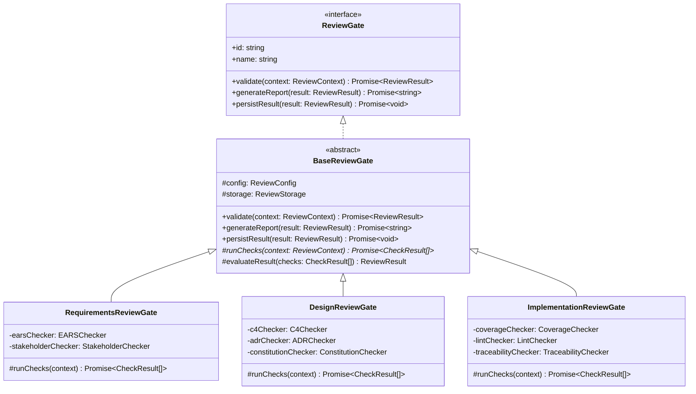
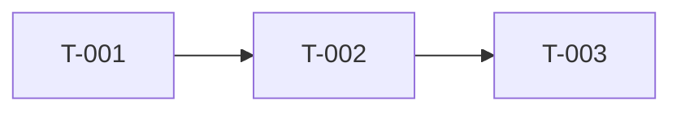
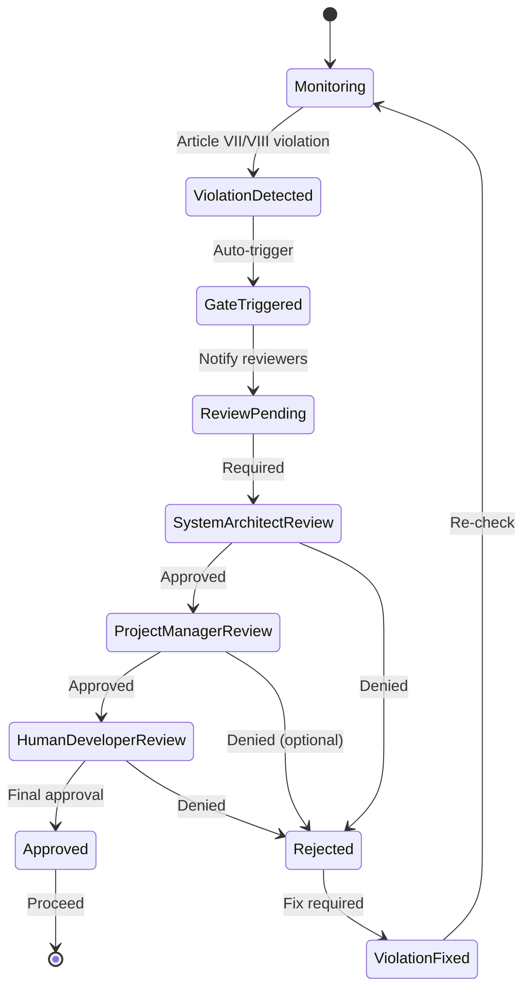
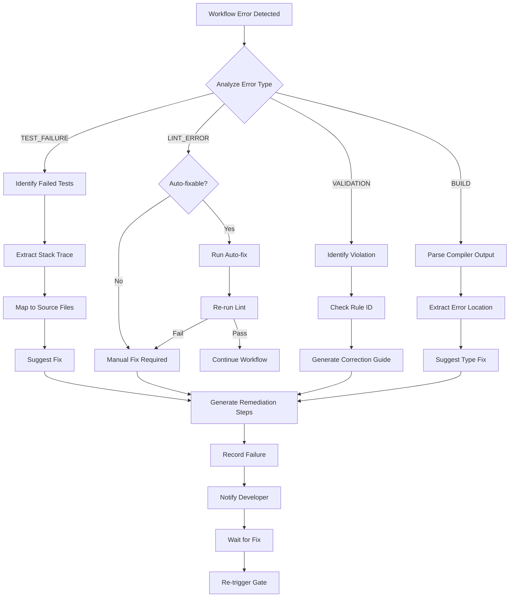

# MUSUBI v6.2 Review Workflow Technical Design Document

**Phase 6: Review Gates and Workflow Enhancement**

| Item | Content |
|------|---------|
| Document ID | MUSUBI-TDD-2025-003 |
| Version | 6.2.0 |
| Created | 2025-12-31 |
| Author | MUSUBI Team |
| Status | Draft |
| Requirements Reference | [req_v6.2.md](../requirements/req_v6.2.md) |

---

## 1. Overview

本ドキュメントは、MUSUBI v6.2 の改善要件（IMP-6.2-001〜008）に基づく技術設計を定義します。主要な改善領域は以下の通りです：

1. **レビューワークフロー統合** (IMP-6.2-001) - Critical
2. **進捗可視化** (IMP-6.2-002) - High  
3. **スプリント管理** (IMP-6.2-003) - High
4. **トレーサビリティ自動化** (IMP-6.2-004) - High
5. **Constitutional Compliance強化** (IMP-6.2-005) - Medium
6. **ドキュメント生成自動化** (IMP-6.2-006) - Medium
7. **Steering自動同期** (IMP-6.2-007) - Medium
8. **エラーハンドリング** (IMP-6.2-008) - Medium

### 1.1 Requirements Traceability Matrix

| 要件ID | 設計セクション | コンポーネント | テスト |
|--------|---------------|---------------|--------|
| IMP-6.2-001-01 | 3.1 | RequirementsReviewGate | TBD |
| IMP-6.2-001-02 | 3.2 | DesignReviewGate | TBD |
| IMP-6.2-001-03 | 3.3 | ImplementationReviewGate | TBD |
| IMP-6.2-001-04 | 3.4 | ReviewPromptRegistry | TBD |
| IMP-6.2-002-01 | 4.1 | WorkflowDashboard | TBD |
| IMP-6.2-002-02 | 4.2 | TransitionRecorder | TBD |
| IMP-6.2-003-01 | 5.1 | SprintPlanner | TBD |
| IMP-6.2-003-02 | 5.2 | SprintReporter | TBD |
| IMP-6.2-004-01 | 6.1 | TraceabilityExtractor | TBD |
| IMP-6.2-004-02 | 6.2 | GapDetector | TBD |
| IMP-6.2-005-01 | 7.1 | ConstitutionChecker | TBD |
| IMP-6.2-005-02 | 7.2 | PhaseMinusOneGate | TBD |
| IMP-6.2-006-01 | 8.1 | ExperimentReporter | TBD |
| IMP-6.2-006-02 | 8.2 | ArticleGenerator | TBD |
| IMP-6.2-007-01 | 9.1 | SteeringSyncer | TBD |
| IMP-6.2-007-02 | 9.2 | SteeringValidator | TBD |
| IMP-6.2-008-01 | 10.1 | RecoveryGuide | TBD |
| IMP-6.2-008-02 | 10.2 | RollbackManager | TBD |

---

## 2. C4 Architecture

### Level 1: System Context

```
┌─────────────────────────────────────────────────────────────────────────┐
│                           External Systems                              │
├─────────────────────────────────────────────────────────────────────────┤
│  [Developer]    [CI/CD Pipeline]    [Git Repository]    [AI Agent]     │
│       │               │                   │                  │          │
│       └───────────────┼───────────────────┼──────────────────┘          │
│                       ▼                   ▼                             │
│               ┌───────────────────────────────────────┐                 │
│               │         MUSUBI v6.2 System            │                 │
│               │                                       │                 │
│               │  ┌─────────────────────────────────┐  │                 │
│               │  │    Review Workflow Engine       │  │                 │
│               │  │    (NEW in v6.2)                │  │                 │
│               │  └─────────────────────────────────┘  │                 │
│               │                                       │                 │
│               │  ┌─────────────────────────────────┐  │                 │
│               │  │    Core SDD Engine (v5.0)       │  │                 │
│               │  └─────────────────────────────────┘  │                 │
│               └───────────────────────────────────────┘                 │
└─────────────────────────────────────────────────────────────────────────┘
```

### Level 2: Container Diagram

```
┌─────────────────────────────────────────────────────────────────────────────┐
│                              MUSUBI v6.2                                    │
├─────────────────────────────────────────────────────────────────────────────┤
│                                                                             │
│  ┌──────────────────┐  ┌──────────────────┐  ┌──────────────────────────┐  │
│  │   CLI Container  │  │  Web GUI         │  │  VS Code Extension       │  │
│  │   (Extended)     │  │  Container       │  │  Container               │  │
│  │                  │  │                  │  │                          │  │
│  │  + musubi-review │  │  + Dashboard     │  │  + Review Panel          │  │
│  │  + musubi-sprint │  │  + Sprint View   │  │  + Traceability View     │  │
│  │  + musubi-dash   │  │                  │  │                          │  │
│  └────────┬─────────┘  └────────┬─────────┘  └────────────┬─────────────┘  │
│           │                     │                         │                │
│           └─────────────────────┼─────────────────────────┘                │
│                                 ▼                                          │
│  ┌──────────────────────────────────────────────────────────────────────┐  │
│  │                    Review Workflow Container (NEW)                   │  │
│  │  ┌─────────────┐ ┌─────────────┐ ┌─────────────┐ ┌─────────────────┐ │  │
│  │  │ Review Gate │ │ Dashboard   │ │ Sprint      │ │ Traceability    │ │  │
│  │  │ Engine      │ │ Service     │ │ Manager     │ │ Analyzer        │ │  │
│  │  └─────────────┘ └─────────────┘ └─────────────┘ └─────────────────┘ │  │
│  │  ┌─────────────┐ ┌─────────────┐ ┌─────────────┐ ┌─────────────────┐ │  │
│  │  │Constitution │ │ Document    │ │ Steering    │ │ Recovery        │ │  │
│  │  │ Enforcer+   │ │ Generator   │ │ Syncer      │ │ Manager         │ │  │
│  │  └─────────────┘ └─────────────┘ └─────────────┘ └─────────────────┘ │  │
│  └──────────────────────────────────────────────────────────────────────┘  │
│                                 │                                          │
│                                 ▼                                          │
│  ┌──────────────────────────────────────────────────────────────────────┐  │
│  │                    Core Library Container (v5.0)                     │  │
│  │  Agents (25 Skills) │ Validators │ Generators │ Integrations        │  │
│  └──────────────────────────────────────────────────────────────────────┘  │
│                                 │                                          │
│                                 ▼                                          │
│  ┌──────────────────────────────────────────────────────────────────────┐  │
│  │                       Storage Container                              │  │
│  │  storage/reviews/  │  storage/sprints/  │  storage/transitions/     │  │
│  └──────────────────────────────────────────────────────────────────────┘  │
│                                                                             │
└─────────────────────────────────────────────────────────────────────────────┘
```

### Level 3: Component Diagram - Review Workflow Container

```
┌─────────────────────────────────────────────────────────────────────────────┐
│                      Review Workflow Container                              │
├─────────────────────────────────────────────────────────────────────────────┤
│                                                                             │
│  ┌─────────────────────────────────────────────────────────────────────┐   │
│  │                    Review Gate Engine                                │   │
│  │  ┌───────────────┐ ┌───────────────┐ ┌───────────────────────────┐  │   │
│  │  │ Requirements  │ │ Design        │ │ Implementation            │  │   │
│  │  │ ReviewGate    │ │ ReviewGate    │ │ ReviewGate                │  │   │
│  │  │               │ │               │ │                           │  │   │
│  │  │ - EARS Check  │ │ - C4 Check    │ │ - Coverage Check          │  │   │
│  │  │ - Stakeholder │ │ - ADR Check   │ │ - Lint Check              │  │   │
│  │  │ - Completenes │ │ - Const. Art. │ │ - Traceability            │  │   │
│  │  └───────────────┘ └───────────────┘ └───────────────────────────┘  │   │
│  │                                                                      │   │
│  │  ┌───────────────────────────────────────────────────────────────┐  │   │
│  │  │                    ReviewPromptRegistry                        │  │   │
│  │  │  #sdd-review-requirements | #sdd-review-design                 │  │   │
│  │  │  #sdd-review-implementation | #sdd-review-all                  │  │   │
│  │  └───────────────────────────────────────────────────────────────┘  │   │
│  └─────────────────────────────────────────────────────────────────────┘   │
│                                                                             │
│  ┌─────────────────────────────────────────────────────────────────────┐   │
│  │                    Dashboard Service                                 │   │
│  │  ┌───────────────────────────┐ ┌───────────────────────────────┐   │   │
│  │  │ WorkflowDashboard         │ │ TransitionRecorder            │   │   │
│  │  │                           │ │                               │   │   │
│  │  │ - Stage display           │ │ - Timestamp logging           │   │   │
│  │  │ - Completion %            │ │ - Reviewer tracking           │   │   │
│  │  │ - Blockers                │ │ - Status persistence          │   │   │
│  │  │ - Next actions            │ │                               │   │   │
│  │  └───────────────────────────┘ └───────────────────────────────┘   │   │
│  └─────────────────────────────────────────────────────────────────────┘   │
│                                                                             │
│  ┌─────────────────────────────────────────────────────────────────────┐   │
│  │                    Traceability Analyzer                             │   │
│  │  ┌───────────────────────────┐ ┌───────────────────────────────┐   │   │
│  │  │ TraceabilityExtractor     │ │ GapDetector                   │   │   │
│  │  │                           │ │                               │   │   │
│  │  │ - Code comment scan       │ │ - Missing impl detection      │   │   │
│  │  │ - Test description scan   │ │ - Missing test detection      │   │   │
│  │  │ - Commit message scan     │ │ - Gap report generation       │   │   │
│  │  │ - REQ-XXX-NNN extraction  │ │ - Action suggestion           │   │   │
│  │  └───────────────────────────┘ └───────────────────────────────┘   │   │
│  └─────────────────────────────────────────────────────────────────────┘   │
│                                                                             │
│  ┌─────────────────────────────────────────────────────────────────────┐   │
│  │                    Constitution Enforcer+ (Enhanced)                 │   │
│  │  ┌───────────────────────────┐ ┌───────────────────────────────┐   │   │
│  │  │ ConstitutionChecker       │ │ PhaseMinusOneGate             │   │   │
│  │  │                           │ │                               │   │   │
│  │  │ - All 9 Articles check    │ │ - Article VII detection       │   │   │
│  │  │ - Commit-time validation  │ │ - Article VIII detection      │   │   │
│  │  │ - PR-time validation      │ │ - Auto trigger                │   │   │
│  │  │ - Block on violation      │ │ - Reviewer notification       │   │   │
│  │  └───────────────────────────┘ └───────────────────────────────┘   │   │
│  └─────────────────────────────────────────────────────────────────────┘   │
│                                                                             │
└─────────────────────────────────────────────────────────────────────────────┘
```

---

## 3. Review Gate Engine Design

### 3.0 Article I Compliance: Library-First Architecture

**Constitutional Article I**: All new features SHALL begin as independent libraries before integration into applications.

Review Gate Engineは独立したライブラリとして設計され、MUSUBIコアから分離して使用可能です。

```
lib/
└── musubi-review-gate/              # Independent library package
    ├── package.json                  # Standalone package
    ├── src/
    │   ├── gates/
    │   │   ├── base-review-gate.ts   # Abstract base class
    │   │   ├── requirements-review-gate.ts
    │   │   ├── design-review-gate.ts
    │   │   └── implementation-review-gate.ts
    │   ├── checkers/
    │   │   ├── ears-checker.ts
    │   │   ├── c4-checker.ts
    │   │   └── coverage-checker.ts
    │   └── index.ts                  # Public API exports
    ├── bin/
    │   └── musubi-review.js          # CLI entry point (Article II)
    └── tests/
        ├── gates/
        └── checkers/
```

**Library Independence Checklist**:
- [ ] `lib/musubi-review-gate/` has own `package.json`
- [ ] No imports from `src/` application code
- [ ] Exports public API via `index.ts`
- [ ] CLI provided via `bin/musubi-review.js`
- [ ] Independent test suite in `tests/`

### 3.0.1 Base ReviewGate Class Hierarchy



**Base Class Implementation**:

```typescript
// lib/musubi-review-gate/src/gates/base-review-gate.ts

import { ReviewGate, ReviewContext, ReviewResult, CheckResult } from '../types';
import { ReviewStorage } from '../storage';

export abstract class BaseReviewGate implements ReviewGate {
  abstract readonly id: string;
  abstract readonly name: string;
  
  protected config: ReviewConfig;
  protected storage: ReviewStorage;
  
  constructor(config: ReviewConfig, storage: ReviewStorage) {
    this.config = config;
    this.storage = storage;
  }
  
  async validate(context: ReviewContext): Promise<ReviewResult> {
    const checks = await this.runChecks(context);
    const result = this.evaluateResult(checks);
    return result;
  }
  
  async generateReport(result: ReviewResult): Promise<string> {
    // Common report generation logic
    return this.formatReport(result);
  }
  
  async persistResult(result: ReviewResult): Promise<void> {
    await this.storage.save(this.id, result);
  }
  
  // Template method - must be implemented by subclasses
  protected abstract runChecks(context: ReviewContext): Promise<CheckResult[]>;
  
  protected evaluateResult(checks: CheckResult[]): ReviewResult {
    const passed = checks.every(c => c.passed);
    const blockers = checks.filter(c => !c.passed && c.blocking).map(c => c.message);
    return { passed, checks, blockers, timestamp: new Date() };
  }
  
  private formatReport(result: ReviewResult): string {
    // Markdown report formatting
    return `# ${this.name} Review Report\n...`;
  }
}
```

### 3.1 RequirementsReviewGate (IMP-6.2-001-01)

**Purpose**: 要件ドキュメント作成後のレビューゲート

```typescript
// src/review/gates/requirements-review-gate.ts

interface RequirementsReviewConfig {
  earsPatterns: string[];           // 許可されるEARSパターン
  minAcceptanceCriteria: number;    // 最低AC数
  requireStakeholders: boolean;     // ステークホルダー必須
}

interface RequirementsReviewResult {
  passed: boolean;
  checks: {
    earsCompliance: CheckResult;
    stakeholderCoverage: CheckResult;
    acceptanceCriteria: CheckResult;
  };
  blockers: string[];
  suggestions: string[];
  timestamp: Date;
  reviewer: ReviewerInfo;
}

class RequirementsReviewGate {
  async validate(requirementsPath: string): Promise<RequirementsReviewResult>;
  async generateReport(result: RequirementsReviewResult): Promise<string>;
  async persistResult(result: RequirementsReviewResult): Promise<void>;
}
```

**EARS Compliance Checker**:

```typescript
// src/review/checkers/ears-checker.ts

const EARS_PATTERNS = {
  EVENT_DRIVEN: /^WHEN\s+.+,\s+the\s+.+\s+SHALL\s+.+$/i,
  STATE_DRIVEN: /^WHILE\s+.+,\s+the\s+.+\s+SHALL\s+.+$/i,
  UNWANTED: /^IF\s+.+,\s+THEN\s+the\s+.+\s+SHALL\s+.+$/i,
  OPTIONAL: /^WHERE\s+.+,\s+the\s+.+\s+SHALL\s+.+$/i,
  UBIQUITOUS: /^The\s+.+\s+SHALL\s+.+$/i,
};

class EARSChecker {
  checkCompliance(requirement: string): EARSCheckResult;
  detectPattern(requirement: string): EARSPattern | null;
  suggestCorrection(requirement: string): string;
}
```

### 3.2 DesignReviewGate (IMP-6.2-001-02)

**Purpose**: 設計ドキュメント作成後のレビューゲート

```typescript
// src/review/gates/design-review-gate.ts

interface DesignReviewConfig {
  requireC4Levels: number[];        // 必須C4レベル [1,2,3]
  requireADR: boolean;              // ADR必須
  constitutionalArticles: number[]; // チェック対象Article
}

interface DesignReviewResult {
  passed: boolean;
  checks: {
    c4Compliance: C4CheckResult;
    adrPresence: ADRCheckResult;
    constitutionalAdherence: ConstitutionalCheckResult;
    requirementsCoverage: CoverageCheckResult;
  };
  blockers: string[];
  suggestions: string[];
}

class DesignReviewGate {
  async validate(designPath: string): Promise<DesignReviewResult>;
  async checkC4Model(designDoc: string): Promise<C4CheckResult>;
  async checkADR(designPath: string): Promise<ADRCheckResult>;
  async checkConstitution(designDoc: string): Promise<ConstitutionalCheckResult>;
}
```

**C4 Model Checker**:

```typescript
// src/review/checkers/c4-checker.ts

interface C4CheckResult {
  level1Present: boolean;  // System Context
  level2Present: boolean;  // Container
  level3Present: boolean;  // Component
  level4Present: boolean;  // Code (optional)
  diagrams: DiagramInfo[];
  missingLevels: number[];
}

class C4Checker {
  async analyze(document: string): Promise<C4CheckResult>;
  detectDiagrams(content: string): DiagramInfo[];
  validateMermaid(diagram: string): boolean;
}
```

### 3.3 ImplementationReviewGate (IMP-6.2-001-03)

**Purpose**: Sprint完了時のレビューゲート

```typescript
// src/review/gates/implementation-review-gate.ts

interface ImplementationReviewConfig {
  minTestCoverage: number;          // デフォルト: 80
  coverageType: 'line' | 'branch' | 'function';
  lintStrict: boolean;              // デフォルト: true
  requireTraceability: boolean;
}

interface ImplementationReviewResult {
  passed: boolean;
  checks: {
    testCoverage: CoverageCheckResult;
    lintResult: LintCheckResult;
    typeCheckResult: TypeCheckResult;
    traceability: TraceabilityCheckResult;
  };
  metrics: {
    coveragePercent: number;
    lintErrors: number;
    lintWarnings: number;
    typeErrors: number;
  };
  blockers: string[];
}

class ImplementationReviewGate {
  async validate(sprintId: string): Promise<ImplementationReviewResult>;
  async runCoverageCheck(): Promise<CoverageCheckResult>;
  async runLintCheck(): Promise<LintCheckResult>;
  async runTypeCheck(): Promise<TypeCheckResult>;
  async checkTraceability(): Promise<TraceabilityCheckResult>;
}
```

### 3.4 ReviewPromptRegistry (IMP-6.2-001-04)

**Purpose**: レビュープロンプトの登録と管理

```typescript
// src/review/prompts/review-prompt-registry.ts

interface ReviewPrompt {
  id: string;
  name: string;
  pattern: string;           // e.g., "#sdd-review-requirements"
  gateClass: typeof ReviewGate;
  checklistTemplate: string;
  outputPath: string;
}

const REVIEW_PROMPTS: ReviewPrompt[] = [
  {
    id: 'review-requirements',
    name: 'Requirements Review',
    pattern: '#sdd-review-requirements',
    gateClass: RequirementsReviewGate,
    checklistTemplate: 'templates/review/requirements-checklist.md',
    outputPath: 'storage/reviews/requirements/',
  },
  {
    id: 'review-design',
    name: 'Design Review',
    pattern: '#sdd-review-design',
    gateClass: DesignReviewGate,
    checklistTemplate: 'templates/review/design-checklist.md',
    outputPath: 'storage/reviews/design/',
  },
  {
    id: 'review-implementation',
    name: 'Implementation Review',
    pattern: '#sdd-review-implementation',
    gateClass: ImplementationReviewGate,
    checklistTemplate: 'templates/review/implementation-checklist.md',
    outputPath: 'storage/reviews/implementation/',
  },
  {
    id: 'review-all',
    name: 'Full Review Cycle',
    pattern: '#sdd-review-all',
    gateClass: FullReviewGate,
    checklistTemplate: 'templates/review/full-checklist.md',
    outputPath: 'storage/reviews/full/',
  },
];

class ReviewPromptRegistry {
  getPrompt(pattern: string): ReviewPrompt | null;
  executeReview(promptId: string, feature: string): Promise<ReviewResult>;
  listAvailablePrompts(): ReviewPrompt[];
}
```

---

## 4. Dashboard Service Design

### 4.1 WorkflowDashboard (IMP-6.2-002-01)

**Purpose**: ワークフローステージの可視化

```typescript
// src/dashboard/workflow-dashboard.ts

interface WorkflowStage {
  id: string;
  name: 'requirements' | 'design' | 'tasks' | 'implement' | 'validate';
  status: 'not-started' | 'in-progress' | 'review' | 'completed' | 'blocked';
  completionPercent: number;
  artifacts: string[];
  reviewResult?: ReviewResult;
}

interface FeatureWorkflow {
  featureId: string;
  featureName: string;
  stages: WorkflowStage[];
  currentStage: string;
  blockers: Blocker[];
  nextActions: Action[];
  lastUpdated: Date;
}

interface DashboardView {
  features: FeatureWorkflow[];
  summary: {
    totalFeatures: number;
    completed: number;
    inProgress: number;
    blocked: number;
  };
  recentTransitions: Transition[];
}

class WorkflowDashboard {
  async getFeatureStatus(featureId: string): Promise<FeatureWorkflow>;
  async getAllFeatures(): Promise<DashboardView>;
  async updateStage(featureId: string, stage: string, status: string): Promise<void>;
  async addBlocker(featureId: string, blocker: Blocker): Promise<void>;
  async suggestNextActions(featureId: string): Promise<Action[]>;
}
```

**Dashboard Data Structure**:

```yaml
# storage/dashboard/features/{feature-id}.yml

featureId: "IMP-6.2-001"
featureName: "Review Workflow Integration"
currentStage: "design"
stages:
  requirements:
    status: "completed"
    completionPercent: 100
    artifacts:
      - "docs/requirements/req_v6.2.md"
    reviewResult:
      passed: true
      timestamp: "2025-12-31T10:00:00Z"
      reviewer: "GitHub Copilot"
  design:
    status: "in-progress"
    completionPercent: 60
    artifacts:
      - "docs/design/IMP-6.2-review-workflow-design.md"
  tasks:
    status: "not-started"
    completionPercent: 0
  implement:
    status: "not-started"
    completionPercent: 0
  validate:
    status: "not-started"
    completionPercent: 0
blockers: []
nextActions:
  - "Complete design document"
  - "Trigger design review gate"
```

### 4.2 TransitionRecorder (IMP-6.2-002-02)

**Purpose**: ステージ遷移の記録

```typescript
// src/dashboard/transition-recorder.ts

interface Transition {
  id: string;
  featureId: string;
  fromStage: string;
  toStage: string;
  timestamp: Date;
  reviewer: ReviewerInfo;
  approvalStatus: 'approved' | 'rejected' | 'auto-approved';
  reviewResult?: ReviewResult;
  notes?: string;
}

interface ReviewerInfo {
  type: 'human' | 'ai';
  name: string;
  role?: string;
}

class TransitionRecorder {
  async record(transition: Transition): Promise<void>;
  async getTransitionHistory(featureId: string): Promise<Transition[]>;
  async getRecentTransitions(limit: number): Promise<Transition[]>;
  async exportToMarkdown(featureId: string): Promise<string>;
}
```

**Transition Log Format**:

```yaml
# storage/transitions/{feature-id}/transitions.yml

transitions:
  - id: "trans-001"
    fromStage: "requirements"
    toStage: "design"
    timestamp: "2025-12-31T10:30:00Z"
    reviewer:
      type: "ai"
      name: "GitHub Copilot"
    approvalStatus: "approved"
    reviewResult:
      passed: true
      checks:
        earsCompliance: true
        stakeholderCoverage: true
        acceptanceCriteria: true
```

---

## 5. Sprint Manager Design

### 5.1 SprintPlanner (IMP-6.2-003-01)

**Purpose**: スプリント計画テンプレートの提供

```typescript
// src/sprint/sprint-planner.ts

interface SprintPlan {
  sprintId: string;
  name: string;
  startDate: Date;
  endDate: Date;
  goals: SprintGoal[];
  tasks: SprintTask[];
  estimatedEffort: number;  // hours
  dependencies: Dependency[];
}

interface SprintGoal {
  id: string;
  description: string;
  requirementIds: string[];  // トレース先要件
  priority: 'must' | 'should' | 'could';
}

interface SprintTask {
  id: string;
  title: string;
  description: string;
  requirementId: string;     // REQ-XXX-NNN
  estimatedHours: number;
  assignee?: string;
  status: 'todo' | 'in-progress' | 'review' | 'done';
  dependencies: string[];    // 他タスクID
}

class SprintPlanner {
  async createPlan(config: SprintPlanConfig): Promise<SprintPlan>;
  async generateFromRequirements(requirementIds: string[]): Promise<SprintPlan>;
  async estimateEffort(tasks: SprintTask[]): Promise<number>;
  async mapDependencies(tasks: SprintTask[]): Promise<Dependency[]>;
  async exportTemplate(plan: SprintPlan): Promise<string>;
}
```

**Sprint Template**:

```markdown
# Sprint Plan: {sprintName}

**Sprint ID**: {sprintId}
**Duration**: {startDate} - {endDate}
**Estimated Effort**: {estimatedHours} hours

## Sprint Goals

| # | Goal | Requirements | Priority |
|---|------|--------------|----------|
| 1 | {goal1} | IMP-6.2-001 | Must |
| 2 | {goal2} | IMP-6.2-002 | Should |

## Task Breakdown

| Task ID | Title | Req ID | Est. | Status | Dependencies |
|---------|-------|--------|------|--------|--------------|
| T-001 | {task1} | IMP-6.2-001-01 | 4h | Todo | - |
| T-002 | {task2} | IMP-6.2-001-02 | 8h | Todo | T-001 |

## Dependency Graph



## Risks & Blockers

- TBD
```

### 5.2 SprintReporter (IMP-6.2-003-02)

**Purpose**: スプリント完了レポートの自動生成

```typescript
// src/sprint/sprint-reporter.ts

interface SprintReport {
  sprintId: string;
  completedAt: Date;
  summary: SprintSummary;
  deliveredFeatures: DeliveredFeature[];
  testResults: TestSummary;
  metrics: SprintMetrics;
  lessonsLearned: string[];
}

interface SprintSummary {
  plannedTasks: number;
  completedTasks: number;
  carryOverTasks: number;
  completionRate: number;
}

interface TestSummary {
  passed: number;
  failed: number;
  skipped: number;
  coverage: number;
}

interface SprintMetrics {
  actualHours: number;
  estimatedHours: number;
  velocity: number;
  defectsFound: number;
  defectsFixed: number;
}

class SprintReporter {
  async generateReport(sprintId: string): Promise<SprintReport>;
  async collectTestResults(): Promise<TestSummary>;
  async calculateMetrics(sprint: SprintPlan): Promise<SprintMetrics>;
  async exportToMarkdown(report: SprintReport): Promise<string>;
  async persistReport(report: SprintReport): Promise<void>;
}
```

---

## 6. Traceability Analyzer Design

### 6.1 TraceabilityExtractor (IMP-6.2-004-01)

**Purpose**: トレーサビリティリンクの自動抽出

```typescript
// src/traceability/extractor.ts

interface TraceabilityLink {
  requirementId: string;          // REQ-XXX-NNN or IMP-X.X-XXX-NN
  sourceType: 'code' | 'test' | 'commit' | 'design';
  sourcePath: string;
  sourceLine?: number;
  context: string;                // 周辺コンテキスト
  extractedAt: Date;
}

interface ExtractionConfig {
  patterns: RegExp[];             // カスタムパターン
  includeGlobs: string[];         // 対象ファイル
  excludeGlobs: string[];         // 除外ファイル
  scanCommits: boolean;
}

const DEFAULT_PATTERNS = [
  /REQ-[A-Z0-9]+-\d{3}/g,         // REQ-XXX-NNN
  /IMP-\d+\.\d+-\d{3}(?:-\d{2})?/g,  // IMP-6.2-001 or IMP-6.2-001-01
];

class TraceabilityExtractor {
  async scan(config: ExtractionConfig): Promise<TraceabilityLink[]>;
  async scanCodeComments(files: string[]): Promise<TraceabilityLink[]>;
  async scanTestDescriptions(testFiles: string[]): Promise<TraceabilityLink[]>;
  async scanCommitMessages(since: Date): Promise<TraceabilityLink[]>;
  async buildMatrix(links: TraceabilityLink[]): Promise<TraceabilityMatrix>;
}
```

**Traceability Matrix Output**:

```yaml
# storage/traceability/matrix.yml

requirements:
  IMP-6.2-001-01:
    design:
      - path: "docs/design/IMP-6.2-review-workflow-design.md"
        section: "3.1"
    code:
      - path: "src/review/gates/requirements-review-gate.ts"
        line: 15
      - path: "src/review/checkers/ears-checker.ts"
        line: 8
    tests:
      - path: "tests/review/requirements-review-gate.test.ts"
        line: 25
    commits:
      - sha: "abc1234"
        message: "feat(review): implement requirements review gate [IMP-6.2-001-01]"
```

### 6.2 GapDetector (IMP-6.2-004-02)

**Purpose**: トレーサビリティギャップの検出

```typescript
// src/traceability/gap-detector.ts

interface TraceabilityGap {
  requirementId: string;
  missingArtifacts: ArtifactType[];
  severity: 'critical' | 'high' | 'medium' | 'low';
  suggestedActions: Action[];
}

type ArtifactType = 'design' | 'code' | 'test' | 'commit';

interface GapReport {
  totalRequirements: number;
  fullyTracked: number;
  partiallyTracked: number;
  untracked: number;
  gaps: TraceabilityGap[];
  completionRate: number;
}

class GapDetector {
  async detect(requirementIds: string[]): Promise<GapReport>;
  async checkRequirement(reqId: string): Promise<TraceabilityGap | null>;
  async suggestActions(gap: TraceabilityGap): Promise<Action[]>;
  async generateWarnings(gaps: TraceabilityGap[]): Promise<Warning[]>;
  async exportReport(report: GapReport): Promise<string>;
}
```

---

## 7. Constitution Enforcer+ Design

### 7.1 ConstitutionChecker (IMP-6.2-005-01)

**Purpose**: Constitutional Articles遵守の自動検証

```typescript
// src/constitution/checker.ts

interface ArticleCheckResult {
  articleId: number;
  articleName: string;
  passed: boolean;
  violations: Violation[];
  checklist: ChecklistItem[];
}

interface Violation {
  file: string;
  line?: number;
  description: string;
  severity: 'error' | 'warning';
  suggestedFix: string;
}

interface ConstitutionCheckResult {
  passed: boolean;
  articles: ArticleCheckResult[];
  blockingViolations: Violation[];
  timestamp: Date;
}

class ConstitutionChecker {
  async checkAll(paths: string[]): Promise<ConstitutionCheckResult>;
  async checkArticle(articleId: number, paths: string[]): Promise<ArticleCheckResult>;
  async runOnCommit(commitSha: string): Promise<ConstitutionCheckResult>;
  async runOnPR(prNumber: number): Promise<ConstitutionCheckResult>;
  async shouldBlockMerge(result: ConstitutionCheckResult): boolean;
}
```

**Article Checkers**:

```typescript
// Article-specific checkers
class ArticleIChecker {    // Library-First
  async check(): Promise<ArticleCheckResult>;
}

class ArticleIIChecker {   // CLI Interface
  async check(): Promise<ArticleCheckResult>;
}

class ArticleIIIChecker {  // Test-First
  async check(): Promise<ArticleCheckResult>;
}

// ... Articles IV-IX
```

### 7.2 PhaseMinusOneGate (IMP-6.2-005-02)

**Purpose**: Article VII/VIII違反時の自動トリガー

```typescript
// src/constitution/phase-minus-one-gate.ts

interface PhaseMinusOneContext {
  triggeredBy: 'article-vii' | 'article-viii';
  violation: Violation;
  reviewers: RequiredReviewer[];
  status: 'pending' | 'approved' | 'rejected';
  createdAt: Date;
  resolvedAt?: Date;
}

interface RequiredReviewer {
  role: 'system-architect' | 'project-manager' | 'human-developer';
  required: boolean;
  approved: boolean;
  approvedAt?: Date;
}

class PhaseMinusOneGate {
  async detectViolation(checkResult: ConstitutionCheckResult): Promise<PhaseMinusOneContext | null>;
  async trigger(context: PhaseMinusOneContext): Promise<void>;
  async notifyReviewers(context: PhaseMinusOneContext): Promise<void>;
  async approve(context: PhaseMinusOneContext, reviewer: string): Promise<void>;
  async reject(context: PhaseMinusOneContext, reviewer: string, reason: string): Promise<void>;
  async isResolved(context: PhaseMinusOneContext): boolean;
}
```

**Phase -1 Gate Workflow**:



---

## 8. Document Generator Design

### 8.1 ExperimentReporter (IMP-6.2-006-01)

**Purpose**: テスト結果からの実験レポート自動生成

```typescript
// src/docs/experiment-reporter.ts

interface ExperimentReport {
  testSuiteId: string;
  executedAt: Date;
  summary: TestSummary;
  performanceMetrics: PerformanceMetrics;
  observations: Observation[];
  recommendations: string[];
}

interface PerformanceMetrics {
  totalDuration: number;      // ms
  avgTestDuration: number;    // ms
  memoryUsage?: number;       // MB
  cpuUsage?: number;          // %
}

interface Observation {
  category: 'success' | 'failure' | 'performance' | 'coverage';
  description: string;
  impact: 'high' | 'medium' | 'low';
  actionItem?: string;
}

class ExperimentReporter {
  async generateFromTestRun(jestResult: JestResult): Promise<ExperimentReport>;
  async collectPerformanceMetrics(): Promise<PerformanceMetrics>;
  async analyzeObservations(testResult: TestSummary): Promise<Observation[]>;
  async exportToMarkdown(report: ExperimentReport): Promise<string>;
}
```

### 8.2 ArticleGenerator (IMP-6.2-006-02)

**Purpose**: 技術記事テンプレートの生成

```typescript
// src/docs/article-generator.ts

type Platform = 'qiita' | 'zenn' | 'medium' | 'devto';

interface ArticleTemplate {
  platform: Platform;
  title: string;
  tags: string[];
  frontMatter: Record<string, unknown>;
  sections: ArticleSection[];
}

interface ArticleSection {
  heading: string;
  content: string;
  codeBlocks?: CodeBlock[];
  diagrams?: string[];
}

interface ArticleConfig {
  platform: Platform;
  topic: string;
  includeBenchmarks: boolean;
  includeCodeSamples: boolean;
  language: 'ja' | 'en';
}

class ArticleGenerator {
  async generate(config: ArticleConfig): Promise<ArticleTemplate>;
  async formatForPlatform(template: ArticleTemplate, platform: Platform): Promise<string>;
  async includeCodeSamples(template: ArticleTemplate, paths: string[]): Promise<void>;
  async includeBenchmarks(template: ArticleTemplate, results: BenchmarkResult[]): Promise<void>;
}
```

---

## 9. Steering Syncer Design

### 9.1 SteeringSyncer (IMP-6.2-007-01)

**Purpose**: バージョン更新時のSteering自動更新

```typescript
// src/steering/syncer.ts

interface SyncConfig {
  files: string[];              // 対象ファイル
  autoCommit: boolean;
  commitMessage: string;
}

interface SyncResult {
  filesUpdated: string[];
  changes: FileChange[];
  committed: boolean;
  commitSha?: string;
}

interface FileChange {
  file: string;
  field: string;
  oldValue: string;
  newValue: string;
}

class SteeringSyncer {
  async syncOnRelease(version: string): Promise<SyncResult>;
  async updateProductMd(version: string): Promise<FileChange[]>;
  async updateTechMd(features: string[]): Promise<FileChange[]>;
  async updateStructureMd(components: string[]): Promise<FileChange[]>;
  async commit(changes: FileChange[]): Promise<string>;
}
```

### 9.2 SteeringValidator (IMP-6.2-007-02)

**Purpose**: Steeringファイル間の整合性チェック

```typescript
// src/steering/validator.ts

interface ConsistencyIssue {
  file1: string;
  file2: string;
  field: string;
  value1: string;
  value2: string;
  severity: 'error' | 'warning';
  autoFixable: boolean;
}

interface ValidationResult {
  consistent: boolean;
  issues: ConsistencyIssue[];
  suggestions: FixSuggestion[];
}

class SteeringValidator {
  async validate(): Promise<ValidationResult>;
  async checkVersionConsistency(): Promise<ConsistencyIssue[]>;
  async checkFeatureListConsistency(): Promise<ConsistencyIssue[]>;
  async suggestFixes(issues: ConsistencyIssue[]): Promise<FixSuggestion[]>;
  async autoFix(issues: ConsistencyIssue[]): Promise<void>;
}
```

---

## 10. Recovery Manager Design

### 10.1 RecoveryGuide (IMP-6.2-008-01)

**Purpose**: 失敗したステージのリカバリーガイダンス

#### 10.1.1 Error Pattern Catalog

| Error Type | Category | Root Cause Pattern | Auto-Recoverable |
|------------|----------|-------------------|------------------|
| `TEST_FAILURE` | test | Test assertion failed | No |
| `COVERAGE_LOW` | test | Coverage below threshold | No |
| `LINT_ERROR` | lint | Code style violation | Yes (auto-fix) |
| `TYPE_ERROR` | build | TypeScript compilation error | No |
| `EARS_VIOLATION` | validation | Invalid EARS pattern | No |
| `C4_MISSING` | validation | Missing C4 diagram level | No |
| `ADR_MISSING` | validation | No ADR documentation | No |
| `CONSTITUTION_VIOLATION` | validation | Article violation | No |
| `TRACEABILITY_GAP` | validation | Missing trace link | No |
| `REVIEW_REJECTED` | review | Human reviewer rejection | No |

#### 10.1.2 Recovery Flow



#### 10.1.3 Remediation Templates

```yaml
# templates/recovery/test-failure.yml

failureType: TEST_FAILURE
steps:
  - order: 1
    action: "Identify failed test"
    command: "npm test -- --testNamePattern='{{testName}}'"
    expectedOutcome: "Test output with failure details"
  - order: 2
    action: "Review test assertion"
    command: null
    expectedOutcome: "Understanding of expected vs actual"
  - order: 3
    action: "Fix implementation or test"
    command: null
    expectedOutcome: "Code change committed"
  - order: 4
    action: "Re-run test suite"
    command: "npm test"
    expectedOutcome: "All tests pass"
  - order: 5
    action: "Re-trigger review gate"
    command: "musubi review implementation {{feature}}"
    expectedOutcome: "Review gate passes"
```

```typescript
// src/recovery/recovery-guide.ts

interface FailureAnalysis {
  stageId: string;
  failureType: 'test' | 'validation' | 'lint' | 'build' | 'review';
  rootCause: RootCause;
  impact: 'blocking' | 'degraded' | 'minor';
  remediationSteps: Step[];
  autoRecoverable: boolean;
  estimatedFixTime: string;  // e.g., "5min", "30min", "2h"
}

interface RootCause {
  category: string;
  description: string;
  affectedFiles: string[];
  relatedRequirements: string[];
  errorCode?: string;         // e.g., "EARS_VIOLATION", "COVERAGE_LOW"
  stackTrace?: string;
}

interface Step {
  order: number;
  action: string;
  command?: string;
  expectedOutcome: string;
  automated: boolean;         // Can be executed automatically
}

class RecoveryGuide {
  private errorPatterns: Map<string, ErrorPattern>;
  private remediationTemplates: Map<string, RemediationTemplate>;
  
  async analyzeFailure(error: WorkflowError): Promise<FailureAnalysis>;
  async identifyRootCause(error: WorkflowError): Promise<RootCause>;
  async generateRemediationSteps(analysis: FailureAnalysis): Promise<Step[]>;
  async recordFailure(analysis: FailureAnalysis): Promise<void>;
  async getFailureHistory(stageId: string): Promise<FailureAnalysis[]>;
  
  // New methods for enhanced recovery
  async attemptAutoRecovery(analysis: FailureAnalysis): Promise<RecoveryResult>;
  async estimateFixTime(analysis: FailureAnalysis): Promise<string>;
  async suggestPreventiveMeasures(history: FailureAnalysis[]): Promise<string[]>;
}
```

### 10.2 RollbackManager (IMP-6.2-008-02)

**Purpose**: ワークフローステージのロールバック

```typescript
// src/recovery/rollback-manager.ts

type RollbackGranularity = 'file' | 'commit' | 'stage' | 'sprint';

interface RollbackConfig {
  granularity: RollbackGranularity;
  target: string;                    // ファイルパス / コミットSHA / ステージ名 / スプリントID
  dryRun: boolean;
  confirmPrompt: boolean;
}

interface RollbackResult {
  success: boolean;
  granularity: RollbackGranularity;
  restoredState: string;
  cleanedUp: string[];
  timestamp: Date;
}

class RollbackManager {
  async rollback(config: RollbackConfig): Promise<RollbackResult>;
  async rollbackFile(filePath: string, toVersion: string): Promise<RollbackResult>;
  async rollbackCommit(commitSha: string): Promise<RollbackResult>;
  async rollbackStage(featureId: string, stage: string): Promise<RollbackResult>;
  async rollbackSprint(sprintId: string): Promise<RollbackResult>;
  async previewRollback(config: RollbackConfig): Promise<RollbackPreview>;
  async confirmRollback(preview: RollbackPreview): Promise<boolean>;
  async recordRollback(result: RollbackResult): Promise<void>;
}
```

---

## 11. Test Strategy (Article III Compliance)

**Constitutional Article III**: Tests SHALL be written before implementation (Red-Green-Blue cycle).

### 11.1 Test Structure

```
tests/
├── review/
│   ├── gates/
│   │   ├── base-review-gate.test.ts
│   │   ├── requirements-review-gate.test.ts
│   │   ├── design-review-gate.test.ts
│   │   └── implementation-review-gate.test.ts
│   └── checkers/
│       ├── ears-checker.test.ts
│       ├── c4-checker.test.ts
│       └── coverage-checker.test.ts
├── dashboard/
│   ├── workflow-dashboard.test.ts
│   └── transition-recorder.test.ts
├── sprint/
│   ├── sprint-planner.test.ts
│   └── sprint-reporter.test.ts
├── traceability/
│   ├── extractor.test.ts
│   └── gap-detector.test.ts
├── constitution/
│   ├── checker.test.ts
│   └── phase-minus-one-gate.test.ts
├── recovery/
│   ├── recovery-guide.test.ts
│   └── rollback-manager.test.ts
└── integration/
    ├── full-review-cycle.test.ts
    └── workflow-e2e.test.ts
```

### 11.2 Test Requirements per Component

| コンポーネント | Unit Tests | Integration Tests | Coverage Target |
|---------------|------------|-------------------|----------------|
| RequirementsReviewGate | EARS, Stakeholder, AC checks | Full requirements review | 90% |
| DesignReviewGate | C4, ADR, Constitution checks | Full design review | 90% |
| ImplementationReviewGate | Coverage, Lint, Trace checks | Sprint completion review | 90% |
| WorkflowDashboard | Stage display, Blockers | Dashboard + Transition | 85% |
| TraceabilityExtractor | Pattern extraction | Full scan + Matrix | 85% |
| GapDetector | Gap identification | Gap + Actions | 85% |
| PhaseMinusOneGate | Article VII/VIII detection | Full gate trigger | 90% |
| RecoveryGuide | Root cause analysis | Full recovery flow | 80% |
| RollbackManager | Each granularity level | Full rollback cycle | 85% |

### 11.3 Red-Green-Blue Implementation Order

**Phase 1テスト（Week 1）**: 実装前に以下のテストを作成

```typescript
// tests/review/gates/requirements-review-gate.test.ts

describe('RequirementsReviewGate', () => {
  describe('IMP-6.2-001-01: Requirements Review Gate', () => {
    it('should trigger review gate when requirements doc is created', async () => {
      // RED: Test written before implementation
      const gate = new RequirementsReviewGate(config, storage);
      const result = await gate.validate({ path: 'docs/requirements/test.md' });
      expect(result).toBeDefined();
    });
    
    it('should validate EARS format compliance', async () => {
      const gate = new RequirementsReviewGate(config, storage);
      const result = await gate.validate({ path: validEarsDoc });
      expect(result.checks.earsCompliance.passed).toBe(true);
    });
    
    it('should fail when EARS patterns are missing', async () => {
      const gate = new RequirementsReviewGate(config, storage);
      const result = await gate.validate({ path: invalidEarsDoc });
      expect(result.checks.earsCompliance.passed).toBe(false);
      expect(result.blockers).toContain('Missing EARS pattern');
    });
    
    it('should validate stakeholder coverage', async () => {
      // Test stakeholder validation
    });
    
    it('should validate acceptance criteria completeness', async () => {
      // Test AC validation
    });
    
    it('should persist review results to storage/reviews/', async () => {
      // Test persistence
    });
  });
});
```

### 11.4 Mocking Strategy

```typescript
// tests/mocks/review-storage.mock.ts

export const mockReviewStorage: ReviewStorage = {
  save: jest.fn().mockResolvedValue(undefined),
  load: jest.fn().mockResolvedValue(null),
  list: jest.fn().mockResolvedValue([]),
};

// tests/mocks/checkers.mock.ts

export const mockEARSChecker: EARSChecker = {
  checkCompliance: jest.fn().mockReturnValue({ passed: true }),
  detectPattern: jest.fn().mockReturnValue('EVENT_DRIVEN'),
  suggestCorrection: jest.fn().mockReturnValue(''),
};
```

---

## 12. File Structure

```
lib/
└── musubi-review-gate/                # Article I: Independent library
    ├── package.json
    ├── tsconfig.json
    ├── src/
    │   ├── gates/
    │   ├── checkers/
    │   └── index.ts
    ├── bin/
    │   └── musubi-review.js           # Article II: CLI interface
    └── tests/

src/
├── review/
│   ├── gates/
│   │   ├── requirements-review-gate.ts    # IMP-6.2-001-01
│   │   ├── design-review-gate.ts          # IMP-6.2-001-02
│   │   ├── implementation-review-gate.ts  # IMP-6.2-001-03
│   │   └── full-review-gate.ts            # Combined
│   ├── checkers/
│   │   ├── ears-checker.ts                # EARS pattern validation
│   │   ├── c4-checker.ts                  # C4 model validation
│   │   └── coverage-checker.ts            # Test coverage
│   ├── prompts/
│   │   └── review-prompt-registry.ts      # IMP-6.2-001-04
│   └── index.ts
├── dashboard/
│   ├── workflow-dashboard.ts              # IMP-6.2-002-01
│   ├── transition-recorder.ts             # IMP-6.2-002-02
│   └── index.ts
├── sprint/
│   ├── sprint-planner.ts                  # IMP-6.2-003-01
│   ├── sprint-reporter.ts                 # IMP-6.2-003-02
│   └── index.ts
├── traceability/
│   ├── extractor.ts                       # IMP-6.2-004-01
│   ├── gap-detector.ts                    # IMP-6.2-004-02
│   └── index.ts
├── constitution/
│   ├── checker.ts                         # IMP-6.2-005-01
│   ├── phase-minus-one-gate.ts            # IMP-6.2-005-02
│   ├── articles/                          # Article-specific checkers
│   │   ├── article-i.ts
│   │   ├── article-ii.ts
│   │   └── ...
│   └── index.ts
├── docs/
│   ├── experiment-reporter.ts             # IMP-6.2-006-01
│   ├── article-generator.ts               # IMP-6.2-006-02
│   └── index.ts
├── steering/
│   ├── syncer.ts                          # IMP-6.2-007-01
│   ├── validator.ts                       # IMP-6.2-007-02
│   └── index.ts
└── recovery/
    ├── recovery-guide.ts                  # IMP-6.2-008-01
    ├── rollback-manager.ts                # IMP-6.2-008-02
    └── index.ts

storage/
├── reviews/
│   ├── requirements/                      # Requirements review results
│   ├── design/                            # Design review results
│   ├── implementation/                    # Implementation review results
│   └── full/                              # Full cycle review results
├── dashboard/
│   └── features/                          # Feature workflow state
├── transitions/                           # Stage transition logs
├── sprints/
│   ├── plans/                             # Sprint plans
│   └── reports/                           # Sprint completion reports
├── traceability/
│   └── matrix.yml                         # Traceability matrix
└── recovery/
    ├── failures/                          # Failure analysis logs
    └── rollbacks/                         # Rollback history

templates/
├── review/
│   ├── requirements-checklist.md
│   ├── design-checklist.md
│   ├── implementation-checklist.md
│   └── full-checklist.md
├── sprint/
│   ├── plan-template.md
│   └── report-template.md
└── article/
    ├── qiita-template.md
    ├── zenn-template.md
    └── medium-template.md
```

---

## 12. CLI Extensions

### New Commands

```bash
# Review commands
musubi review requirements <feature>     # Trigger requirements review gate
musubi review design <feature>           # Trigger design review gate
musubi review implementation <feature>   # Trigger implementation review gate
musubi review all <feature>              # Full review cycle

# Dashboard commands
musubi dash                              # Show workflow dashboard
musubi dash feature <feature-id>         # Show feature status

# Sprint commands
musubi sprint plan <sprint-id>           # Create sprint plan
musubi sprint report <sprint-id>         # Generate sprint report

# Traceability commands
musubi trace scan                        # Scan for traceability links
musubi trace gaps                        # Detect traceability gaps
musubi trace matrix                      # Generate traceability matrix

# Recovery commands
musubi rollback file <path> [version]    # Rollback file
musubi rollback commit <sha>             # Rollback to commit
musubi rollback stage <feature> <stage>  # Rollback stage
```

---

## 13. Integration Points

### 13.1 GitHub Actions Integration

```yaml
# .github/workflows/musubi-review.yml

name: MUSUBI Review Gates

on:
  push:
    paths:
      - 'docs/requirements/**'
      - 'docs/design/**'
  pull_request:
    types: [opened, synchronize]

jobs:
  requirements-review:
    runs-on: ubuntu-latest
    if: contains(github.event.head_commit.modified, 'docs/requirements/')
    steps:
      - uses: actions/checkout@v4
      - run: npx musubi review requirements --ci

  design-review:
    runs-on: ubuntu-latest
    if: contains(github.event.head_commit.modified, 'docs/design/')
    steps:
      - uses: actions/checkout@v4
      - run: npx musubi review design --ci

  constitution-check:
    runs-on: ubuntu-latest
    steps:
      - uses: actions/checkout@v4
      - run: npx musubi validate constitution --strict
```

### 13.2 VS Code Extension Integration

```typescript
// packages/vscode-extension/src/review/review-panel.ts

class ReviewPanel {
  async showReviewChecklist(feature: string): Promise<void>;
  async displayDashboard(): Promise<void>;
  async showTraceabilityView(): Promise<void>;
}
```

---

## 14. Architecture Decision Records

### ADR-6.2-001: Review Gate Architecture

**Context**: 要件→設計→実装の各フェーズ間にレビューゲートを追加する必要がある。

**Decision**: 各フェーズごとに独立したReviewGateクラスを実装し、ReviewPromptRegistryで統一的に管理する。

**Consequences**:
- 各ゲートは独立してテスト可能
- 新しいゲートタイプの追加が容易
- AGENTS.mdへのプロンプト追加で拡張可能

**Status**: Proposed

**Links**: IMP-6.2-001-01, IMP-6.2-001-02, IMP-6.2-001-03, IMP-6.2-001-04

### ADR-6.2-002: Traceability Storage Format

**Context**: トレーサビリティリンクを永続化する形式を決定する必要がある。

**Decision**: YAML形式でstorage/traceability/matrix.ymlに保存する。

**Rationale**:
- 人間が読める
- Gitでのdiffが見やすい
- 既存のMUSUBI設定ファイルと一貫性がある

**Consequences**:
- 大規模プロジェクトでは性能に影響する可能性
- 必要に応じてSQLite等への移行パスを用意

**Status**: Proposed

**Links**: IMP-6.2-004-01, IMP-6.2-004-02

### ADR-6.2-003: Phase -1 Gate Notification

**Context**: Phase -1 Gate発動時にレビュアーへ通知する方法を決定する必要がある。

**Decision**: GitHub Issues/PR Commentを主要通知チャネルとし、オプションでSlack/Discord連携をサポート。

**Rationale**:
- 開発ワークフローに統合
- 通知の永続化
- 非同期レビューをサポート

**Consequences**:
- GitHub/GitLab依存
- オフライン環境では制限あり

**Status**: Proposed

**Links**: IMP-6.2-005-02

---

## 15. Non-Functional Design

### 15.1 Performance Targets

| 操作 | 目標時間 | 測定方法 |
|------|---------|---------|
| RequirementsReviewGate | < 10秒 | Jest performance test |
| DesignReviewGate | < 15秒 | Jest performance test |
| ImplementationReviewGate | < 30秒 | CI/CD logs |
| TraceabilityExtractor (1000 files) | < 60秒 | Benchmark |
| Dashboard update | < 5秒 | UI response time |

### 15.2 Scalability

- 最大要件数: 10,000件（YAMLストレージ）
- 最大トレースリンク: 100,000件
- 同時レビューセッション: 10並列

### 15.3 Compatibility

- Node.js 18.x+
- Git 2.30+
- VS Code 1.80+ (extension)
- GitHub / GitLab / Azure DevOps

---

## 16. Implementation Phases

### Phase 1: Critical (Week 1-2)

- [ ] RequirementsReviewGate (IMP-6.2-001-01)
- [ ] DesignReviewGate (IMP-6.2-001-02)
- [ ] ImplementationReviewGate (IMP-6.2-001-03)
- [ ] ReviewPromptRegistry (IMP-6.2-001-04)
- [ ] AGENTS.md update

### Phase 2: High (Week 3-4)

- [ ] TraceabilityExtractor (IMP-6.2-004-01)
- [ ] GapDetector (IMP-6.2-004-02)
- [ ] WorkflowDashboard (IMP-6.2-002-01)
- [ ] TransitionRecorder (IMP-6.2-002-02)
- [ ] SprintPlanner (IMP-6.2-003-01)
- [ ] SprintReporter (IMP-6.2-003-02)

### Phase 3: Medium (Week 5-6)

- [ ] ConstitutionChecker (IMP-6.2-005-01)
- [ ] PhaseMinusOneGate (IMP-6.2-005-02)
- [ ] SteeringSyncer (IMP-6.2-007-01)
- [ ] SteeringValidator (IMP-6.2-007-02)
- [ ] ExperimentReporter (IMP-6.2-006-01)
- [ ] ArticleGenerator (IMP-6.2-006-02)
- [ ] RecoveryGuide (IMP-6.2-008-01)
- [ ] RollbackManager (IMP-6.2-008-02)

---

**Document Status**: Reviewed (v1.1.0)
**Review Date**: 2025-12-31
**Reviewer**: GitHub Copilot (AI-assisted review)
**Review Result**: Pass with improvements applied
**Improvements Applied**:
- Article I Compliance section added (Library-First)
- Base ReviewGate class hierarchy with Mermaid diagram
- Test Strategy section added (Article III)
- RecoveryGuide design detailed with error patterns and flow
**Next Step**: Task breakdown (#sdd-tasks IMP-6.2)
**Target Version**: MUSUBI v6.2.0
