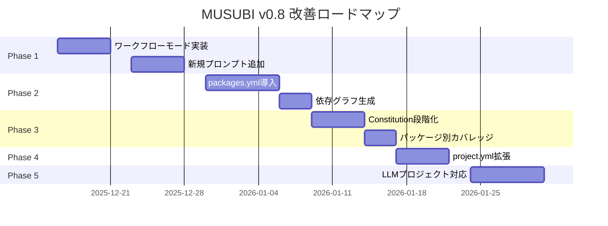

# MUSUBI 改善プラン v0.8

**作成日**: 2025-12-12
**ソース**: References/requirements/requirement-cobol2java-20251212.md
**ステータス**: ✅ Phase 1-4 実装完了

---

## 実装状況

| Phase | 内容 | ステータス | 完了日 |
|-------|------|----------|--------|
| Phase 1 | ワークフロー柔軟性 + プロンプト | ✅ 完了 | 2025-12-12 |
| Phase 2 | Monorepo対応強化 | ✅ 完了 | 2025-12-12 |
| Phase 3 | Constitution段階化 | ✅ 完了 | 2025-12-12 |
| Phase 4 | project.yml拡張 | ✅ 完了 | 2025-12-12 |
| Phase 5 | LLMプロジェクト対応 | ⏳ 未着手 | - |

### 作成されたファイル

**Phase 1: ワークフロー柔軟性**
- `steering/rules/workflow-modes.yml` - ワークフローモード定義
- `src/managers/workflow-mode-manager.js` - モード管理クラス
- `src/generators/changelog-generator.js` - CHANGELOG生成
- `bin/musubi-release.js` - リリースCLIコマンド
- `tests/workflow-modes.test.js` - テスト

**Phase 2: Monorepo対応**
- `steering/packages.yml` - パッケージ設定
- `src/managers/package-manager.js` - パッケージ管理クラス
- `tests/package-manager.test.js` - テスト

**Phase 3: Constitution段階化**
- `steering/rules/constitution-levels.yml` - レベル定義
- `src/validators/constitution-level-manager.js` - レベル管理クラス
- `tests/constitution-levels.test.js` - テスト
- `src/validators/constitutional-validator.js` (更新) - レベル対応

**Phase 4: project.yml拡張**
- `src/schemas/project-schema.json` - JSONスキーマ (v2.0)
- `src/validators/project-validator.js` - バリデーター
- `bin/musubi-config.js` - 設定CLIコマンド
- `tests/project-validator.test.js` - テスト

---

## エグゼクティブサマリー

COBOL2Javaプロジェクトでの実践を通じて発見された改善要件に基づき、MUSUBIフレームワークの次期バージョン（v0.8）の改善プランを策定します。

### 主要な改善領域

1. **ワークフローの柔軟性** - 機能規模に応じたライトウェイトモード
2. **Monorepo対応の強化** - モダンなパッケージ構成のサポート
3. **プロンプトの拡張** - リリース・ベンチマーク・セキュリティ対応
4. **Constitutional Governanceの段階化** - レベル別の適用
5. **project.yml の拡張** - 機械可読な設定の充実
6. **LLMプロジェクト対応** - AI/ML特有のニーズへの対応

---

## Phase 1: ワークフローとプロンプトの改善（優先度：高）

### 1.1 ライトウェイトワークフローモード

**課題**: 8段階ワークフローが小規模機能には過剰

**改善内容**:

```yaml
# steering/rules/workflow-modes.yml
workflow_modes:
  small:
    description: "1-2時間の作業（バグ修正、小機能）"
    stages:
      - requirements   # 簡易要件定義
      - implement      # 実装
      - validate       # 検証
    skip_artifacts:
      - design.md
      - tasks.md
    coverage_threshold: 60%
    
  medium:
    description: "1-2日の作業（中規模機能）"
    stages:
      - requirements
      - design
      - tasks
      - implement
      - validate
    coverage_threshold: 70%
    
  large:
    description: "1週間以上（大規模機能、新モジュール）"
    stages:
      - steering       # プロジェクト記憶更新
      - requirements
      - design
      - tasks
      - implement
      - validate
      - review
    coverage_threshold: 80%
```

**実装タスク**:

| タスク | ファイル | 工数 |
|--------|----------|------|
| ワークフローモード定義 | `steering/rules/workflow-modes.yml` | 2h |
| ワークフローエージェント更新 | `src/agents/workflow-navigator.js` | 4h |
| プロンプト拡張 | `packages/vscode-extension/src/prompts/` | 2h |
| ドキュメント更新 | `docs/USER-GUIDE.md` | 2h |
| テスト追加 | `tests/workflow-modes.test.js` | 3h |

### 1.2 新規プロンプトの追加

**課題**: リリース、セキュリティ、ベンチマークプロセスがない

**追加プロンプト**:

| プロンプト | 目的 | 実装優先度 |
|-----------|------|------------|
| `#sdd-release` | npm/Docker公開、CHANGELOG更新、タグ付け | 🔴 高 |
| `#sdd-implement-test` | テストのみ実装（TDD Red Phase） | 🔴 高 |
| `#sdd-implement-code` | コードのみ実装（TDD Green Phase） | 🔴 高 |
| `#sdd-security` | セキュリティ監査 | 🟡 中 |
| `#sdd-benchmark` | パフォーマンスベンチマーク | 🟡 中 |
| `#sdd-migrate` | 破壊的変更のマイグレーション | 🟢 低 |

**#sdd-release プロンプト仕様**:

```markdown
## #sdd-release

### 使用方法
#sdd-release <version-type>

### パラメータ
- version-type: patch | minor | major | <specific-version>

### 実行内容
1. バージョン番号の更新（package.json, project.yml）
2. CHANGELOG.md の自動生成
3. npm publish / Docker push の実行
4. Git タグの作成とプッシュ
5. GitHub Release の作成（オプション）

### 前提条件
- すべてのテストがパス
- カバレッジ基準を満たす
- 未コミットの変更がない
```

**実装タスク**:

| タスク | ファイル | 工数 |
|--------|----------|------|
| release プロンプト実装 | `src/agents/release-manager.js` | 6h |
| implement-test/code 分割 | `src/agents/software-developer.js` | 4h |
| CHANGELOG生成ロジック | `src/generators/changelog-generator.js` | 4h |
| テスト追加 | `tests/release.test.js` | 3h |

---

## Phase 2: Monorepo対応の強化（優先度：高）

### 2.1 packages.yml の導入

**課題**: `lib/{feature}/` 固定パスがモダンなMonorepoに合わない

**改善内容**:

```yaml
# steering/packages.yml
schema_version: "1.0"

package_manager: pnpm  # npm | yarn | pnpm
workspace_config: pnpm-workspace.yaml

packages:
  - name: "@musubi/core"
    path: packages/core
    type: library
    publishable: true
    coverage_target: 90%
    entry_points:
      main: src/index.js
      types: src/index.d.ts
    dependencies: []
    
  - name: "@musubi/cli"
    path: packages/cli
    type: cli
    publishable: true
    coverage_target: 70%
    entry_points:
      bin: bin/musubi.js
    dependencies:
      - "@musubi/core"
    
  - name: "@musubi/vscode"
    path: packages/vscode-extension
    type: extension
    publishable: true
    coverage_target: 60%
    dependencies:
      - "@musubi/core"
      
  - name: "@musubi/web"
    path: packages/webapp
    type: application
    publishable: false
    coverage_target: 50%
    dependencies:
      - "@musubi/core"

# パッケージ間依存グラフの自動生成
dependency_graph:
  enabled: true
  output: docs/architecture/dependency-graph.md
```

**実装タスク**:

| タスク | ファイル | 工数 |
|--------|----------|------|
| packages.yml スキーマ定義 | `src/schemas/packages-schema.json` | 2h |
| パッケージローダー | `src/managers/package-manager.js` | 6h |
| 依存グラフ生成 | `src/analyzers/dependency-graph.js` | 4h |
| カバレッジ集計 | `src/validators/coverage-validator.js` | 4h |
| テスト追加 | `tests/packages.test.js` | 3h |

### 2.2 パッケージタイプ別テンプレート

**新規テンプレート**:

```
steering/templates/packages/
├── library/           # ライブラリテンプレート
│   ├── package.json
│   ├── tsconfig.json
│   └── jest.config.js
├── cli/               # CLIテンプレート
│   ├── package.json
│   └── bin/
├── application/       # アプリケーションテンプレート
│   └── package.json
└── extension/         # VSCode拡張テンプレート
    └── package.json
```

---

## Phase 3: Constitutional Governance の段階化（優先度：中）

### 3.1 Constitution レベル分け

**課題**: 9条すべてを常時チェックは重い、Article IX（モック禁止）が厳しすぎる

**改善内容**:

```yaml
# steering/rules/constitution-levels.yml
constitution:
  levels:
    critical:
      description: "違反時はブロック（必須）"
      enforcement: block
      articles:
        - name: Article I - Library-First Principle
          id: CONST-001
          required: true
        - name: Article III - Test-First Imperative
          id: CONST-003
          required: true
        - name: Article V - Traceability Mandate
          id: CONST-005
          required: true
          
    advisory:
      description: "違反時は警告のみ"
      enforcement: warn
      articles:
        - name: Article II - CLI Interface Mandate
          id: CONST-002
          reason: "内部ライブラリにはCLI不要な場合がある"
        - name: Article IX - Real Service Testing
          id: CONST-009
          reason: "LLM/外部API呼び出しのモックは許容"
          
    flexible:
      description: "プロジェクト設定で上書き可能"
      enforcement: configurable
      settings:
        coverage_threshold:
          default: 80
          min: 50
          max: 100
          per_package: true  # パッケージ別設定可能
        mock_allowed:
          default: false
          exceptions:
            - llm_providers
            - external_apis
            - payment_services

# プロジェクト別オーバーライド
project_overrides:
  # steering/project.yml で上書き可能
  example:
    coverage_threshold: 70
    mock_allowed:
      - "@openai/api"
      - "@anthropic/sdk"
```

### 3.2 パッケージタイプ別カバレッジ基準

| パッケージタイプ | デフォルト基準 | 理由 |
|------------------|----------------|------|
| `library` (core) | 90% | ビジネスロジックの信頼性が最重要 |
| `cli` | 70% | I/O中心で完全テストが困難 |
| `application` (web) | 60% | UI部分のテストコストが高い |
| `infrastructure` | 50% | 外部依存が多い |
| `extension` | 60% | IDE API依存 |

**実装タスク**:

| タスク | ファイル | 工数 |
|--------|----------|------|
| レベル定義ファイル | `steering/rules/constitution-levels.yml` | 2h |
| エンフォーサー更新 | `src/validators/constitution-enforcer.js` | 6h |
| パッケージ別カバレッジ | `src/validators/coverage-validator.js` | 3h |
| テスト追加 | `tests/constitution-levels.test.js` | 3h |

---

## Phase 4: project.yml の拡張（優先度：中）

### 4.1 拡張スキーマ

**現状**:
```yaml
name: MUSUBI
description: Ultimate SDD Tool
locale: ja
version: "0.7.0"
```

**拡張版**:

```yaml
# steering/project.yml
schema_version: "2.0"

# 基本情報
name: MUSUBI
description: Ultimate SDD Tool with 27 Agents
locale: ja
version: "0.7.0"

# リポジトリ情報
repository:
  type: monorepo
  manager: pnpm
  url: https://github.com/nahisaho/musubi

# パッケージ構成（packages.ymlへの参照）
packages: ./packages.yml

# リリース設定
release:
  registry: npm
  strategy: independent  # or synchronized
  changelog:
    file: CHANGELOG.md
    format: keep-a-changelog
  versioning:
    scheme: semver
    prerelease_tags: [alpha, beta, rc]

# 統合設定
integrations:
  ci:
    provider: github-actions
    workflows:
      - ci.yml
      - release.yml
  container:
    enabled: true
    registry: ghcr.io/nahisaho/musubi
  ide:
    extensions:
      - packages/vscode-extension
  documentation:
    generator: typedoc
    output: docs/api

# ワークフロー設定
workflow:
  default_mode: medium  # small | medium | large
  constitution_level: advisory  # strict | advisory | relaxed
  
# LLMプロジェクト設定（オプション）
llm:
  enabled: false
  config: ./llm-config.yml
```

### 4.2 project.yml バリデーター

**実装タスク**:

| タスク | ファイル | 工数 |
|--------|----------|------|
| スキーマ定義 | `src/schemas/project-schema.json` | 2h |
| バリデーター実装 | `src/validators/project-validator.js` | 4h |
| マイグレーションツール | `bin/musubi-migrate-config.js` | 3h |
| テスト追加 | `tests/project-config.test.js` | 2h |

---

## Phase 5: LLMプロジェクト対応（優先度：低）

### 5.1 LLM設定テンプレート

```yaml
# steering/llm-config.yml
schema_version: "1.0"

providers:
  - name: openai
    env_var: OPENAI_API_KEY
    models:
      - id: gpt-4o
        type: chat
        default: true
      - id: gpt-4o-mini
        type: chat
    rate_limit:
      requests_per_minute: 60
      tokens_per_minute: 90000
      
  - name: anthropic
    env_var: ANTHROPIC_API_KEY
    models:
      - id: claude-3-5-sonnet-20241022
        type: chat
      - id: claude-3-5-haiku-20241022
        type: chat
        
  - name: ollama
    local: true
    base_url: http://localhost:11434
    models:
      - id: llama3.2
        type: chat
      - id: codellama
        type: code

testing:
  mock_layer:
    enabled: true
    directory: storage/llm-mocks/
    record_mode: false  # 実際のレスポンスを記録
  fixtures:
    directory: tests/fixtures/llm/
    
prompts:
  directory: steering/prompts/
  versioning: true
  
benchmarks:
  enabled: true
  directory: storage/benchmarks/
  datasets:
    - name: general
      path: tests/fixtures/benchmark/
```

### 5.2 LLMモックレイヤー

```javascript
// src/testing/llm-mock-layer.js
class LLMMockLayer {
  constructor(options = {}) {
    this.recordMode = options.recordMode || false;
    this.mockDirectory = options.mockDirectory || 'storage/llm-mocks/';
  }
  
  async call(provider, model, messages) {
    if (this.recordMode) {
      const response = await this.realCall(provider, model, messages);
      await this.saveFixture(provider, model, messages, response);
      return response;
    }
    return this.loadFixture(provider, model, messages);
  }
}
```

---

## 実装ロードマップ



---

## 工数サマリー

| Phase | 内容 | 推定工数 | 優先度 |
|-------|------|----------|--------|
| Phase 1 | ワークフロー・プロンプト改善 | 30h | 🔴 高 |
| Phase 2 | Monorepo対応 | 22h | 🔴 高 |
| Phase 3 | Constitution段階化 | 14h | 🟡 中 |
| Phase 4 | project.yml拡張 | 11h | 🟡 中 |
| Phase 5 | LLMプロジェクト対応 | 20h | 🟢 低 |
| **合計** | | **97h** | |

---

## 成功指標

| 指標 | 現状 | 目標 |
|------|------|------|
| 小規模機能の開発時間 | 4h（全ステージ必須） | 1h（ライトモード） |
| Monorepoセットアップ時間 | 手動設定 | 自動検出・設定 |
| Constitution違反の誤検出 | 頻繁 | 10%以下 |
| リリースプロセス時間 | 手動30min | 自動5min |
| LLMテストカバレッジ | 0%（モック不可） | 70%（モック許容） |

---

## 次のステップ

1. **レビュー**: このプランをステークホルダーと確認
2. **優先度確定**: Phase 1-2を最優先で実装
3. **実装開始**: `#sdd-requirements musubi-v0.8-phase1` で要件定義開始

---

## 参考資料

- [COBOL2Java 改善要件](../../References/requirements/requirement-cobol2java-20251212.md)
- [Constitutional Governance](../../steering/rules/constitution.md)
- [8-Stage SDD Workflow](../../steering/rules/workflow.md)
- [MUSUBI Documentation](../../README.md)

---

*Generated by MUSUBI Orchestrator on 2025-12-12*
