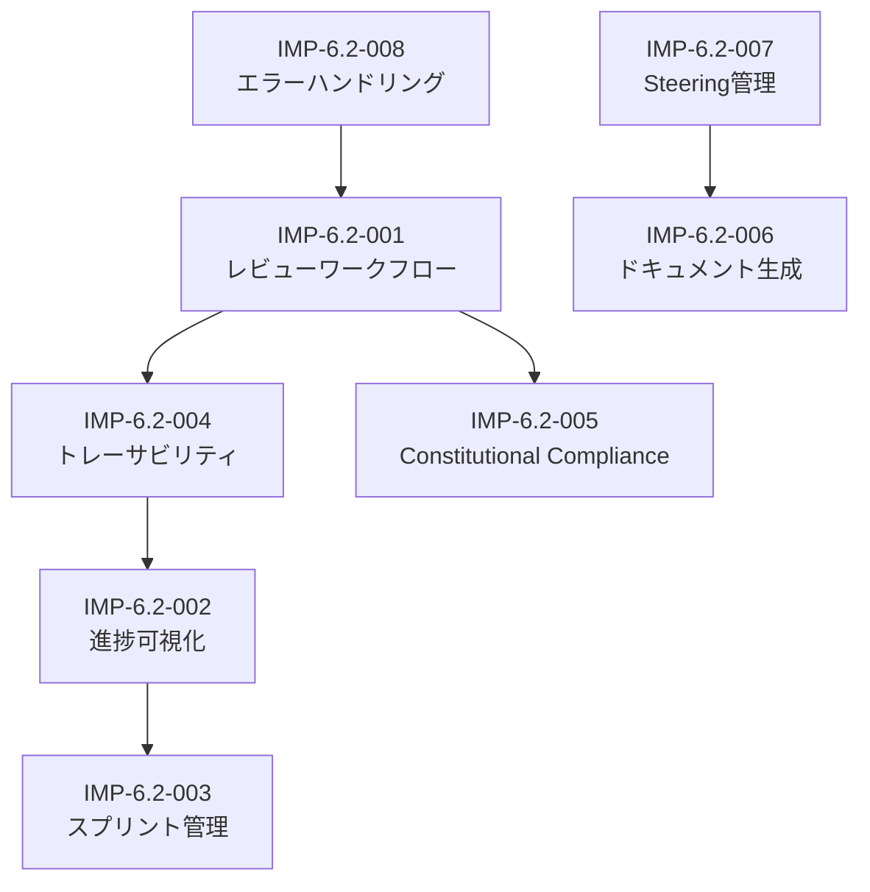

# MUSUBI SDD 改善要求

**Document Type**: 改善要求仕様書 (Improvement Requirements Specification)
**Format**: EARS (Easy Approach to Requirements Syntax)
**Version**: 1.1.0
**Created**: 2025-12-31
**Last Updated**: 2025-12-31
**Author**: YAGOKORO v5.0.0 開発経験に基づく
**Requirement ID Prefix**: IMP-6.2

---

## 用語集 (Glossary)

| 用語 | 定義 |
|------|------|
| **レビューゲート** | ワークフローの各フェーズ間に設置される品質チェックポイント。次フェーズへの進行可否を判断する |
| **Phase -1 Gate** | Article VII (Simplicity) / Article VIII (Anti-Abstraction) 違反時に発動する特別レビュー。[steering/rules/constitution.md](../../steering/rules/constitution.md) 参照 |
| **トレーサビリティマトリクス** | 要件→設計→実装→テストの対応関係を示す双方向追跡表 |
| **EARS** | Easy Approach to Requirements Syntax - 自然言語ベースの要件記述パターン |
| **Constitutional Articles** | MUSUBI SDDの9つの基本原則。[constitution.md](../../steering/rules/constitution.md) で定義 |
| **Steering Files** | プロジェクトのコンテキストを維持するメモリファイル群（tech.md, structure.md, product.md） |

---

## 概要

YAGOKOROプロジェクト（v1.0.0〜v5.0.0）の開発を通じて特定された、MUSUBI SDD（Specification Driven Development）フレームワークの改善要求を定義します。

### 背景

YAGOKOROは5つのメジャーバージョンを通じて以下を実装しました：
- v1.0.0: 基盤構築（ドメインモデル、Neo4j/Qdrant統合）
- v2.0.0: GraphRAG（LazyGraphRAG、MCP基本ツール）
- v3.0.0: 自動化（LLMレス関係抽出、論文自動取り込み）
- v4.0.0: 時系列・研究者（時系列分析、研究者ネットワーク）
- v5.0.0: 多言語（多言語NER、翻訳、クロスリンガルリンキング）

この過程で、MUSUBIワークフローに不足している機能や改善点が明らかになりました。

---

## ステークホルダー識別

| ステークホルダー | 役割 | レビュー権限 |
|------------------|------|-------------|
| **Human Developer** | 最終承認者、設計判断 | 全フェーズ |
| **AI Agent (Copilot)** | 自動検証、ドラフト生成 | 自動チェック |
| **System Architect** | アーキテクチャ決定 | Phase -1 Gate |
| **Project Manager** | 進捗管理、優先度決定 | スプリント計画 |

---

## 要件間依存関係



---

## Constitutional Articles マッピング

| 要件カテゴリ | 関連Article | 理由 |
|--------------|-------------|------|
| IMP-6.2-001 (レビュー) | II, VII, VIII | 品質保証、シンプルさ検証 |
| IMP-6.2-002 (可視化) | III | 透明性の確保 |
| IMP-6.2-003 (スプリント) | IV, V | 計画性、一貫性 |
| IMP-6.2-004 (トレーサビリティ) | I, VI | 仕様準拠、変更追跡 |
| IMP-6.2-005 (Constitutional) | VII, VIII | Simplicity, Anti-Abstraction |
| IMP-6.2-006 (ドキュメント) | III, IX | 透明性、文書化 |
| IMP-6.2-007 (Steering) | I | 仕様の整合性 |
| IMP-6.2-008 (エラー処理) | II | 品質保証 |

---

## カテゴリ1: レビューワークフローの追加

### IMP-6.2-001: レビューステージのワークフロー統合

**現状の問題**:
現在のMUSUBI SDDワークフローには明示的なレビューステージが存在せず、各フェーズ（Requirements, Design, Tasks, Implement, Validate）間でのレビューゲートが定義されていません。

#### IMP-6.2-001-01: 要件レビューゲート

**EARS Pattern**: Event-driven

```
WHEN requirements document is created,
the MUSUBI system SHALL trigger a requirements review gate
that validates EARS format compliance, stakeholder coverage, and acceptance criteria completeness
BEFORE proceeding to design phase.
```

**Acceptance Criteria**:
- [x] 要件ドキュメント作成後、自動的にレビューゲートがトリガーされる
- [x] EARS形式の構文チェックが実行される
- [x] ステークホルダーカバレッジが検証される
- [x] 受入基準の完全性がチェックされる
- [x] レビュー結果が記録される

#### IMP-6.2-001-02: 設計レビューゲート

**EARS Pattern**: Event-driven

```
WHEN design document is created,
the MUSUBI system SHALL trigger a design review gate
that validates C4 model compliance, ADR documentation, and constitutional article adherence
BEFORE proceeding to task breakdown phase.
```

**Acceptance Criteria**:
- [x] 設計ドキュメント作成後、レビューゲートがトリガーされる
- [x] C4モデル（Context, Container, Component, Code）の完全性が検証される
- [x] ADR（Architecture Decision Record）の存在と品質がチェックされる
- [x] Constitutional Articles（特にI, II, VII, VIII）への準拠が検証される

#### IMP-6.2-001-03: 実装レビューゲート

**EARS Pattern**: Event-driven

```
WHEN implementation sprint is completed,
the MUSUBI system SHALL trigger an implementation review gate
that validates test coverage, traceability, and code quality
BEFORE marking the sprint as complete.
```

**Configuration Parameters**:
| パラメータ | デフォルト値 | 説明 |
|-----------|-------------|------|
| `MIN_TEST_COVERAGE` | 80% | 最小テストカバレッジ閾値 |
| `COVERAGE_TYPE` | line | カバレッジ種別（line/branch/function） |
| `LINT_STRICT` | true | Lintエラー時にブロックするか |

**Acceptance Criteria**:
- [x] Sprint完了時に実装レビューがトリガーされる
- [x] テストカバレッジが設定閾値（デフォルト: 80%）以上であることを検証
- [x] 要件→設計→コード→テストのトレーサビリティが検証される
- [x] コード品質メトリクス（lint, type check）がパスすることを確認

#### IMP-6.2-001-04: レビュープロンプトの追加

**EARS Pattern**: Ubiquitous

```
The MUSUBI system SHALL provide dedicated review prompts:
- #sdd-review-requirements <feature> - Review requirements
- #sdd-review-design <feature> - Review design
- #sdd-review-implementation <feature> - Review implementation
- #sdd-review-all <feature> - Full review cycle
```

**Acceptance Criteria**:
- [x] 各レビュープロンプトがAGENTS.mdに定義される
- [x] プロンプト実行時に適切なレビューチェックリストが生成される
- [x] レビュー結果がstorage/reviews/ディレクトリに保存される

---

## カテゴリ2: ワークフロー可視化と進捗追跡

### IMP-6.2-002: ステージ進捗の可視化

#### IMP-6.2-002-01: ワークフローダッシュボード

**EARS Pattern**: State-driven

```
WHILE a feature is in development,
the MUSUBI system SHALL maintain a workflow dashboard
that displays current stage, completion percentage, blockers, and next actions.
```

**Acceptance Criteria**:
- [x] 各機能のワークフローステージが可視化される
- [x] 完了率（%）が計算・表示される
- [x] ブロッカーが明示的に表示される
- [x] 次のアクションが提案される

#### IMP-6.2-002-02: ステージ間トランジション記録

**EARS Pattern**: Event-driven

```
WHEN workflow transitions from one stage to another,
the MUSUBI system SHALL record the transition
with timestamp, reviewer, and approval status.
```

**Acceptance Criteria**:
- [x] ステージ遷移が自動的に記録される
- [x] タイムスタンプが付与される
- [x] 承認者（人間またはAI）が記録される
- [x] 承認ステータスが保存される

---

## カテゴリ3: スプリント管理の強化

### IMP-6.2-003: スプリント定義と追跡

#### IMP-6.2-003-01: スプリント計画テンプレート

**EARS Pattern**: Ubiquitous

```
The MUSUBI system SHALL provide a sprint planning template
that includes sprint goals, task breakdown, effort estimation, and dependency mapping.
```

**Acceptance Criteria**:
- [x] スプリント計画テンプレートが提供される
- [x] スプリントゴールが明確に定義できる
- [x] タスク分解が要件にトレースできる
- [x] 工数見積もりが記録できる
- [x] 依存関係がマッピングできる

#### IMP-6.2-003-02: スプリント完了レポート自動生成

**EARS Pattern**: Event-driven

```
WHEN a sprint is marked as complete,
the MUSUBI system SHALL automatically generate a sprint completion report
that includes delivered features, test results, metrics, and lessons learned.
```

**Acceptance Criteria**:
- [x] スプリント完了時にレポートが自動生成される
- [x] 配信された機能一覧が含まれる
- [x] テスト結果（pass/fail/skip）が含まれる
- [x] パフォーマンスメトリクスが含まれる
- [x] 振り返り（Lessons Learned）セクションがある

---

## カテゴリ4: トレーサビリティの自動化

### IMP-6.2-004: 双方向トレーサビリティマトリクス

**依存関係**: IMP-6.2-001（レビューワークフロー）が前提

#### IMP-6.2-004-01: トレーサビリティ自動抽出

**EARS Pattern**: Ubiquitous

```
The MUSUBI system SHALL automatically extract traceability links
from requirement IDs in code comments, test descriptions, and commit messages.
```

**Acceptance Criteria**:
- [x] コードコメントからREQ-XXX-NNNパターンを自動抽出
- [x] テスト記述からREQ-XXX-NNNパターンを自動抽出
- [x] コミットメッセージからREQ-XXX-NNNパターンを自動抽出
- [x] 抽出結果がトレーサビリティマトリクスに反映される

#### IMP-6.2-004-02: トレーサビリティギャップ検出

**EARS Pattern**: State-driven

```
WHILE requirements exist without implementation or tests,
the MUSUBI system SHALL flag traceability gaps
and suggest required actions to close the gaps.
```

**Acceptance Criteria**:
- [x] 実装のない要件が検出される
- [x] テストのない要件が検出される
- [x] ギャップが警告として表示される
- [x] ギャップを埋めるためのアクションが提案される

---

## カテゴリ5: Constitutional Compliance の強化

### IMP-6.2-005: 憲法遵守の自動検証

**参照**: [steering/rules/constitution.md](../../steering/rules/constitution.md)

#### IMP-6.2-005-01: Article遵守チェッカー

**EARS Pattern**: Event-driven

```
WHEN code is committed or pull request is created,
the MUSUBI system SHALL validate compliance with Constitutional Articles
and block merge if violations are detected.
```

**Acceptance Criteria**:
- [x] コミット時にArticle遵守がチェックされる
- [x] PRマージ前にArticle遵守が検証される
- [x] 違反がある場合はマージがブロックされる
- [x] 違反内容と修正方法が提示される

#### IMP-6.2-005-02: Phase -1 Gate の自動トリガー

**EARS Pattern**: Event-driven

**Phase -1 Gate 定義**: Article VII (Simplicity) または Article VIII (Anti-Abstraction) に違反する変更を検出した際に発動する特別レビュープロセス。詳細は [constitution.md Section 7-8](../../steering/rules/constitution.md) を参照。

```
WHEN Article VII (Simplicity) or Article VIII (Anti-Abstraction) violation is detected,
the MUSUBI system SHALL automatically trigger a Phase -1 Gate review process
and notify required reviewers.
```

**Required Reviewers**:
- System Architect（必須）
- Project Manager（任意）
- Human Developer（最終承認）

**Acceptance Criteria**:
- [x] Article VII/VIII違反が自動検出される
- [x] Phase -1 Gateレビューが自動的にトリガーされる
- [x] 必要なレビュアー（system-architect, project-manager等）に通知される
- [x] 承認/却下のワークフローが提供される

---

## カテゴリ6: ドキュメント生成の自動化

### IMP-6.2-006: 実験レポート自動生成

#### IMP-6.2-006-01: テスト結果からの実験レポート生成

**EARS Pattern**: Event-driven

```
WHEN test suite execution completes,
the MUSUBI system SHALL generate an experiment report
that includes test summary, performance metrics, and experimental observations.
```

**Acceptance Criteria**:
- [x] テスト実行後に実験レポートが自動生成される
- [x] テストサマリー（pass/fail/skip）が含まれる
- [x] パフォーマンスメトリクス（実行時間、メモリ等）が含まれる
- [x] 実験観察（Observations）セクションが含まれる

#### IMP-6.2-006-02: 技術記事テンプレート生成

**EARS Pattern**: Optional (WHERE) - ユーザーリクエスト起点

```
WHERE user requests technical article generation,
the MUSUBI system SHALL generate a publication-ready article
following specified format guidelines (e.g., Qiita, Zenn, Medium).
```

**Supported Platforms**:
| プラットフォーム | フォーマット | 特殊対応 |
|-----------------|-------------|----------|
| Qiita | Markdown + Qiita拡張 | タグ、組織 |
| Zenn | Markdown + Zenn拡張 | 本/スクラップ対応 |
| Medium | Rich Text変換 | コードブロック最適化 |
| Dev.to | Markdown | Front Matter |

**Acceptance Criteria**:
- [x] 技術記事テンプレートが生成される
- [x] 指定されたプラットフォーム形式（Qiita, Zenn, Medium）に対応
- [x] コードサンプル、図表、ベンチマーク結果が含まれる
- [x] 公開可能な品質のドラフトが生成される

---

## カテゴリ7: Steering ファイル管理

### IMP-6.2-007: Steering 自動同期

#### IMP-6.2-007-01: バージョン更新時のSteering自動更新

**EARS Pattern**: Event-driven

```
WHEN a new version is released,
the MUSUBI system SHALL automatically update steering files
to reflect current version, features, and status.
```

**Acceptance Criteria**:
- [x] バージョンリリース時にsteering/*.mdが自動更新される
- [x] product.md/tech.md/structure.mdが同期される
- [x] バージョン番号、機能一覧、ステータスが更新される
- [x] 更新内容がコミットされる

#### IMP-6.2-007-02: Steering 整合性チェック

**EARS Pattern**: Ubiquitous

```
The MUSUBI system SHALL validate consistency between steering files
and ensure tech.md, structure.md, and product.md are synchronized.
```

**Acceptance Criteria**:
- [x] steering/*.md間の整合性がチェックされる
- [x] 不整合が検出された場合に警告される
- [x] 自動修正の提案が行われる

---

## カテゴリ8: エラーハンドリングとリカバリー

### IMP-6.2-008: ワークフロー障害対応

**優先度再評価**: 運用上の重要性を考慮し、優先度を Medium に引き上げ

#### IMP-6.2-008-01: 失敗したステージのリカバリー

**EARS Pattern**: Unwanted behavior (IF-THEN)

```
IF a workflow stage fails (test failure, validation error, etc.),
THEN the MUSUBI system SHALL provide recovery guidance
including root cause analysis and remediation steps.
```

**Acceptance Criteria**:
- [x] ステージ失敗時に自動的に失敗分析が行われる
- [x] 根本原因が特定される
- [x] 修正手順が提案される
- [x] 失敗履歴が記録される

#### IMP-6.2-008-02: ロールバック機能

**EARS Pattern**: Optional (WHERE)

```
WHERE a workflow stage produces incorrect results,
the MUSUBI system SHALL support rollback to previous state
with cleanup of partial changes.
```

**ロールバック粒度定義**:
| 粒度レベル | 対象 | 説明 |
|-----------|------|------|
| **File-level** | 個別ファイル | 特定ファイルのみを前バージョンに戻す |
| **Commit-level** | Git コミット | 指定コミットまでリバート |
| **Stage-level** | ワークフローステージ | Requirements/Design/Tasks/Implement 単位で戻す |
| **Sprint-level** | スプリント全体 | スプリント開始時点まで戻す |

**Acceptance Criteria**:
- [x] 前のステージ状態へのロールバックが可能（粒度選択可能）
- [x] 部分的な変更がクリーンアップされる
- [x] ロールバック履歴が記録される
- [x] ロールバック前の確認プロンプトが表示される

---

## 優先度マトリクス

| カテゴリ | 要件ID | 優先度 | 影響度 | 実装難易度 | 依存関係 |
|---------|--------|--------|--------|------------|----------|
| レビューワークフロー | IMP-6.2-001-01〜04 | **Critical** | 高 | 中 | なし |
| 進捗可視化 | IMP-6.2-002-01〜02 | High | 中 | 低 | IMP-6.2-004 |
| スプリント管理 | IMP-6.2-003-01〜02 | High | 中 | 低 | IMP-6.2-002 |
| トレーサビリティ | IMP-6.2-004-01〜02 | High | 高 | 中 | IMP-6.2-001 |
| Constitutional | IMP-6.2-005-01〜02 | Medium | 高 | 高 | IMP-6.2-001 |
| ドキュメント生成 | IMP-6.2-006-01〜02 | Medium | 中 | 中 | IMP-6.2-007 |
| Steering管理 | IMP-6.2-007-01〜02 | Medium | 中 | 低 | なし |
| エラーハンドリング | IMP-6.2-008-01〜02 | **Medium** | 中 | 高 | IMP-6.2-001 |

---

## 実装提案

### Phase 1: レビューワークフロー（最優先）

1. AGENTS.mdにレビュープロンプト追加
2. steering/rules/workflow.mdにレビューステージ定義
3. レビューチェックリストテンプレート作成
4. storage/reviews/ディレクトリ構造定義

### Phase 2: トレーサビリティと進捗追跡 (IMP-6.2-002, IMP-6.2-004)

1. traceability-auditorスキル強化
2. ワークフローダッシュボード仕様定義
3. ステージ遷移記録フォーマット定義

### Phase 3: 自動化とConstitutional強化 (IMP-6.2-005, IMP-6.2-007)

1. GitHub Actions/CI統合
2. Phase -1 Gate自動トリガー実装
3. Steering自動同期実装

---

## 参考: YAGOKOROプロジェクトでの具体的課題

### 課題1: レビューなしでの実装進行

v1.0.0〜v5.0.0の開発において、要件→設計→実装の各フェーズ間で明示的なレビューゲートがなく、以下の問題が発生しました：

- 要件の曖昧さが設計段階で発覚
- 設計変更が実装後に必要になるケース
- テストカバレッジの事後確認のみ

**解決策**: IMP-6.2-001（レビューワークフロー追加）

### 課題2: Steering更新の手動作業

各バージョンリリース時に、tech.ja.md、product.ja.md、structure.ja.mdを手動で更新する必要があり、更新漏れや不整合が発生しました。

**解決策**: IMP-6.2-007（Steering自動同期）

### 課題3: トレーサビリティの手動管理

REQ-XXX-NNNとコード/テストの対応関係が手動管理であり、ギャップの検出が困難でした。

**解決策**: IMP-6.2-004（トレーサビリティ自動化）

---

## Non-Functional Requirements (NFR)

### NFR-6.2-001: パフォーマンス要件

| 項目 | 要件 | 測定方法 |
|------|------|----------|
| レビューゲート実行時間 | < 30秒 | CI/CDログ |
| トレーサビリティスキャン | < 60秒（1000ファイルまで） | 実行時間計測 |
| ダッシュボード更新 | < 5秒 | UI応答時間 |
| Steering同期 | < 10秒 | コミット時間 |

### NFR-6.2-002: スケーラビリティ要件

| 項目 | 要件 |
|------|------|
| 最大要件数 | 10,000件 |
| 最大トレースリンク数 | 100,000件 |
| 同時レビューセッション | 10並列 |
| Steering履歴保持 | 365日 |

### NFR-6.2-003: 互換性要件

- Node.js 18.x 以上
- Git 2.30 以上
- VS Code 1.80 以上（拡張機能使用時）
- GitHub / GitLab / Azure DevOps 対応

---

## 結論

MUSUBI SDDは強力な仕様駆動開発フレームワークですが、本プロジェクトの経験から、特に**レビューワークフローの統合**が最も重要な改善点として特定されました。

9つのConstitutional Articlesは優れた設計原則を提供していますが、それらを実際のワークフローに組み込むためのレビューゲートが不足しています。本改善要求の実装により、MUSUBIはより堅牢で実用的なSDDフレームワークとなることが期待されます。

---

**Document Status**: ✅ Implemented (v6.2.0)
**Review Required**: MUSUBI Core Team
**Review Date**: 2025-12-31
**Reviewer**: GitHub Copilot (AI-assisted review)
**Implementation Version**: MUSUBI v6.2.0
**Implementation Date**: 2025-01-21
**Test Coverage**: 4,827 tests passing (159 test suites)
**Next Review**: リリース後の振り返り
