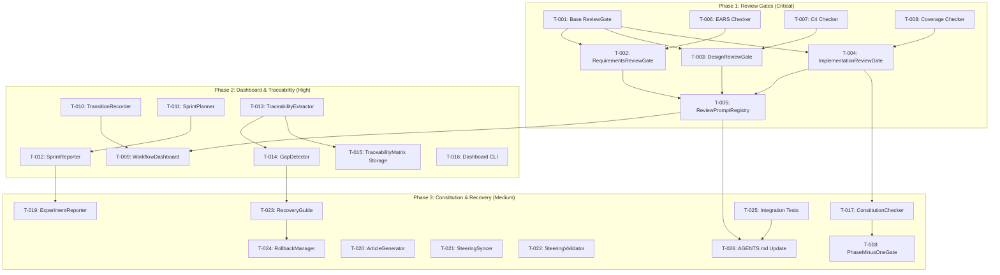

# MUSUBI v6.2 Task Breakdown

**Phase 6: Review Gates and Workflow Enhancement**

| Item | Content |
|------|---------|
| Document ID | MUSUBI-TASKS-2025-003 |
| Version | 6.2.0 |
| Created | 2025-12-31 |
| Sprint | 9-11 (6 weeks) |
| Requirements | [req_v6.2.md](../requirements/req_v6.2.md) |
| Design | [IMP-6.2-review-workflow-design.md](../design/IMP-6.2-review-workflow-design.md) |

---

## Overview

### Sprint Plan

| Sprint | Duration | Focus Area | Priority |
|--------|----------|------------|----------|
| Sprint 9 | Week 1-2 | Review Gate Engine, Review Prompts | Critical |
| Sprint 10 | Week 3-4 | Traceability, Dashboard, Sprint Manager | High |
| Sprint 11 | Week 5-6 | Constitution+, Steering, Docs, Recovery | Medium |

### Task Summary

| Phase | Tasks | Estimated Hours |
|-------|-------|-----------------|
| Phase 1 (Sprint 9) | 8 | 40h |
| Phase 2 (Sprint 10) | 8 | 44h |
| Phase 3 (Sprint 11) | 10 | 48h |
| **Total** | **26** | **132h** |

### Dependency Graph



---

## Phase 1: Review Gate Engine (Sprint 9)

### TASK-001: Implement Base ReviewGate Class

**Requirement**: IMP-6.2-001-01, IMP-6.2-001-02, IMP-6.2-001-03
**Priority**: Critical
**Estimated**: 4h
**Sprint**: 9
**Status**: ✅ Completed

**Description**: 
Article I準拠のライブラリ構造でBase ReviewGateクラスを実装。全ReviewGateの共通インターフェースと機能を提供。

**Implementation Path**: 
- `lib/musubi-review-gate/src/base/review-gate.ts`
- `lib/musubi-review-gate/src/types.ts`

**Test First (Article III)**:
```bash
# Red phase - Write failing tests first
tests/review/gates/base-review-gate.test.ts
```

**Acceptance Criteria**:
- [ ] `ReviewGate` base class implemented
- [ ] `ReviewConfig`, `ReviewResult`, `CheckResult` types defined
- [ ] `execute()`, `validatePreConditions()`, `runChecks()` methods
- [ ] Abstract `getChecks()` method for subclasses
- [ ] Unit tests passing with 90% coverage

**Constitutional Compliance**:
- Article I: Independent library in `lib/musubi-review-gate/`
- Article III: Tests written before implementation

---

### TASK-002: Implement RequirementsReviewGate

**Requirement**: IMP-6.2-001-01
**Priority**: Critical
**Estimated**: 6h
**Sprint**: 9
**Status**: ✅ Completed
**Dependencies**: T-001, T-006

**Description**: 
要件ドキュメントのレビューゲート。EARS形式検証、ステークホルダーカバレッジ、受入基準完全性をチェック。

**Implementation Path**: 
- `lib/musubi-review-gate/src/gates/requirements-review-gate.ts`

**Test First (Article III)**:
```bash
tests/review/gates/requirements-review-gate.test.ts
```

**Acceptance Criteria**:
- [ ] EARS形式の構文チェック実行
- [ ] ステークホルダーカバレッジ検証
- [ ] 受入基準完全性チェック
- [ ] レビュー結果の記録
- [ ] Unit tests passing with 90% coverage

---

### TASK-003: Implement DesignReviewGate

**Requirement**: IMP-6.2-001-02
**Priority**: Critical
**Estimated**: 6h
**Sprint**: 9
**Status**: ✅ Completed
**Dependencies**: T-001, T-007

**Description**: 
設計ドキュメントのレビューゲート。C4モデル完全性、ADR存在、Constitutional Article準拠を検証。

**Implementation Path**: 
- `lib/musubi-review-gate/src/gates/design-review-gate.ts`

**Test First (Article III)**:
```bash
tests/review/gates/design-review-gate.test.ts
```

**Acceptance Criteria**:
- [ ] C4モデル（Context, Container, Component）完全性検証
- [ ] ADR存在と品質チェック
- [ ] Constitutional Articles（I, II, VII, VIII）準拠検証
- [ ] Unit tests passing with 90% coverage

---

### TASK-004: Implement ImplementationReviewGate

**Requirement**: IMP-6.2-001-03
**Priority**: Critical
**Estimated**: 6h
**Sprint**: 9
**Status**: ✅ Completed
**Dependencies**: T-001, T-008

**Description**: 
実装完了時のレビューゲート。テストカバレッジ、コード品質、トレーサビリティを検証。

**Implementation Path**: 
- `lib/musubi-review-gate/src/gates/implementation-review-gate.ts`

**Configuration**:
```yaml
MIN_TEST_COVERAGE: 80%  # Configurable
COVERAGE_TYPE: line
LINT_STRICT: true
```

**Test First (Article III)**:
```bash
tests/review/gates/implementation-review-gate.test.ts
```

**Acceptance Criteria**:
- [ ] テストカバレッジ閾値（設定可能、デフォルト80%）検証
- [ ] Lint/Type checkパス確認
- [ ] 要件→設計→コード→テストのトレーサビリティ検証
- [ ] Unit tests passing with 90% coverage

---

### TASK-005: Implement ReviewPromptRegistry

**Requirement**: IMP-6.2-001-04
**Priority**: Critical
**Estimated**: 4h
**Sprint**: 9
**Status**: ✅ Completed
**Dependencies**: T-002, T-003, T-004

**Description**: 
レビュープロンプト（#sdd-review-*）の登録と実行を管理。

**Implementation Path**: 
- `lib/musubi-review-gate/src/registry/prompt-registry.ts`
- `src/agents/review-agent.ts` (integration)

**Prompts**:
- `#sdd-review-requirements <feature>` - Requirements review
- `#sdd-review-design <feature>` - Design review
- `#sdd-review-implementation <feature>` - Implementation review
- `#sdd-review-all <feature>` - Full review cycle

**Test First (Article III)**:
```bash
tests/review/registry/prompt-registry.test.ts
```

**Acceptance Criteria**:
- [ ] 4つのレビュープロンプトが登録される
- [ ] プロンプト実行時に適切なReviewGateがトリガー
- [ ] レビュー結果が `storage/reviews/` に保存
- [ ] Unit tests passing with 85% coverage

---

### TASK-006: Implement EARS Checker

**Requirement**: IMP-6.2-001-01
**Priority**: High
**Estimated**: 4h
**Sprint**: 9
**Status**: ✅ Completed

**Description**: 
EARS（Easy Approach to Requirements Syntax）パターンの検証ロジック。

**Implementation Path**: 
- `lib/musubi-review-gate/src/checkers/ears-checker.ts`

**EARS Patterns**:
| Pattern | Keyword | Example |
|---------|---------|---------|
| Ubiquitous | The system SHALL | The system SHALL provide... |
| Event-driven | WHEN...SHALL | WHEN x occurs, the system SHALL... |
| State-driven | WHILE...SHALL | WHILE in state X, the system SHALL... |
| Optional | WHERE...SHALL | WHERE condition, the system SHALL... |
| Unwanted | IF...THEN | IF error occurs, THEN the system SHALL... |

**Test First (Article III)**:
```bash
tests/review/checkers/ears-checker.test.ts
```

**Acceptance Criteria**:
- [ ] 5つのEARSパターンを検出
- [ ] 不正なパターンをエラーとして報告
- [ ] パターン別の使用統計を生成
- [ ] Unit tests passing with 90% coverage

---

### TASK-007: Implement C4 Checker

**Requirement**: IMP-6.2-001-02
**Priority**: High
**Estimated**: 4h
**Sprint**: 9
**Status**: ✅ Completed

**Description**: 
C4アーキテクチャモデル（Context, Container, Component）の完全性検証。

**Implementation Path**: 
- `lib/musubi-review-gate/src/checkers/c4-checker.ts`

**Required Levels**:
- Level 1: System Context (Required)
- Level 2: Container (Required)
- Level 3: Component (Required for complex features)
- Level 4: Code (Optional)

**Test First (Article III)**:
```bash
tests/review/checkers/c4-checker.test.ts
```

**Acceptance Criteria**:
- [ ] Level 1-3の存在チェック
- [ ] Mermaidダイアグラム構文検証
- [ ] 欠落レベルのエラー報告
- [ ] Unit tests passing with 85% coverage

---

### TASK-008: Implement Coverage Checker

**Requirement**: IMP-6.2-001-03
**Priority**: High
**Estimated**: 6h
**Sprint**: 9
**Status**: ✅ Completed

**Description**: 
テストカバレッジの検証ロジック。Jest/NYC出力のパース、閾値検証。

**Implementation Path**: 
- `lib/musubi-review-gate/src/checkers/coverage-checker.ts`

**Configuration**:
```typescript
interface CoverageConfig {
  minCoverage: number;      // default: 80
  coverageType: 'line' | 'branch' | 'function';
  coverageDir: string;      // default: 'coverage'
}
```

**Test First (Article III)**:
```bash
tests/review/checkers/coverage-checker.test.ts
```

**Acceptance Criteria**:
- [ ] Jest coverage JSON/LCOVのパース
- [ ] 設定可能な閾値との比較
- [ ] line/branch/function単位での検証
- [ ] Unit tests passing with 85% coverage

---

## Phase 2: Dashboard & Traceability (Sprint 10)

### TASK-009: Implement WorkflowDashboard

**Requirement**: IMP-6.2-002-01
**Priority**: High
**Estimated**: 6h
**Sprint**: 10
**Status**: ✅ Completed
**Dependencies**: T-005

**Description**: 
ワークフロー進捗の可視化ダッシュボード。ステージ表示、完了率、ブロッカー、次アクション提案。

**Implementation Path**: 
- `src/dashboard/workflow-dashboard.ts`

**Storage Format** (YAML per ADR-6.2-002):
```yaml
# storage/dashboard/{feature-id}.yml
featureId: "IMP-6.2"
currentStage: "design"
completionPercentage: 45
stages:
  requirements:
    status: completed
    completedAt: "2025-12-31T10:00:00Z"
  design:
    status: in-progress
    startedAt: "2025-12-31T11:00:00Z"
blockers:
  - id: "BLK-001"
    description: "Waiting for ADR review"
nextActions:
  - "Complete C4 Level 3 diagram"
  - "Write ADR for storage format"
```

**Test First (Article III)**:
```bash
tests/dashboard/workflow-dashboard.test.ts
```

**Acceptance Criteria**:
- [ ] 各機能のワークフローステージ可視化
- [ ] 完了率（%）計算・表示
- [ ] ブロッカー明示表示
- [ ] 次アクション提案
- [ ] Unit tests passing with 85% coverage

---

### TASK-010: Implement TransitionRecorder

**Requirement**: IMP-6.2-002-02
**Priority**: High
**Estimated**: 4h
**Sprint**: 10
**Status**: ✅ Completed

**Description**: 
ステージ間遷移の記録。タイムスタンプ、承認者、ステータス。

**Implementation Path**: 
- `src/dashboard/transition-recorder.ts`

**Storage Format**:
```yaml
# storage/transitions/{feature-id}.yml
featureId: "IMP-6.2"
transitions:
  - from: "requirements"
    to: "design"
    timestamp: "2025-12-31T10:30:00Z"
    reviewer: "AI-Agent"
    reviewType: "automated"
    status: "approved"
    gateResult:
      passed: true
      score: 95
```

**Test First (Article III)**:
```bash
tests/dashboard/transition-recorder.test.ts
```

**Acceptance Criteria**:
- [ ] ステージ遷移の自動記録
- [ ] タイムスタンプ付与
- [ ] 承認者（Human/AI）記録
- [ ] 承認ステータス保存
- [ ] Unit tests passing with 85% coverage

---

### TASK-011: Implement SprintPlanner

**Requirement**: IMP-6.2-003-01
**Priority**: High
**Estimated**: 6h
**Sprint**: 10
**Status**: ✅ Completed

**Description**: 
スプリント計画テンプレートの生成と管理。

**Implementation Path**: 
- `src/sprint/sprint-planner.ts`

**Template Output**:
```markdown
# Sprint Plan: {sprintName}

**Sprint ID**: {sprintId}
**Duration**: {startDate} - {endDate}

## Sprint Goals
| # | Goal | Requirements | Priority |
|---|------|--------------|----------|
| 1 | {goal1} | IMP-6.2-001 | Must |

## Task Breakdown
| Task ID | Title | Req ID | Est. | Status | Dependencies |
|---------|-------|--------|------|--------|--------------|
| T-001 | {task1} | IMP-6.2-001-01 | 4h | Todo | - |
```

**Test First (Article III)**:
```bash
tests/sprint/sprint-planner.test.ts
```

**Acceptance Criteria**:
- [ ] スプリント計画テンプレート生成
- [ ] スプリントゴール定義
- [ ] タスク分解と要件トレース
- [ ] 工数見積もり記録
- [ ] 依存関係マッピング
- [ ] Unit tests passing with 85% coverage

---

### TASK-012: Implement SprintReporter

**Requirement**: IMP-6.2-003-02
**Priority**: High
**Estimated**: 6h
**Sprint**: 10
**Status**: ✅ Completed
**Dependencies**: T-011

**Description**: 
スプリント完了レポートの自動生成。

**Implementation Path**: 
- `src/sprint/sprint-reporter.ts`

**Report Contents**:
- スプリントサマリー（計画/完了/キャリーオーバー）
- 配信機能一覧
- テスト結果（pass/fail/skip, coverage）
- パフォーマンスメトリクス（velocity, defects）
- Lessons Learned

**Test First (Article III)**:
```bash
tests/sprint/sprint-reporter.test.ts
```

**Acceptance Criteria**:
- [ ] スプリント完了時のレポート自動生成
- [ ] 配信機能一覧含む
- [ ] テスト結果（pass/fail/skip）含む
- [ ] パフォーマンスメトリクス含む
- [ ] Lessons Learnedセクションあり
- [ ] Unit tests passing with 85% coverage

---

### TASK-013: Implement TraceabilityExtractor

**Requirement**: IMP-6.2-004-01
**Priority**: High
**Estimated**: 6h
**Sprint**: 10
**Status**: ✅ Completed

**Description**: 
コード、テスト、コミットからの要件IDパターン自動抽出。

**Implementation Path**: 
- `src/traceability/extractor.ts`

**Extraction Patterns**:
```typescript
const PATTERNS = [
  /REQ-[A-Z0-9]+-\d{3}/g,           // REQ-XXX-NNN
  /IMP-\d+\.\d+-\d{3}(?:-\d{2})?/g, // IMP-6.2-001 or IMP-6.2-001-01
];
```

**Test First (Article III)**:
```bash
tests/traceability/extractor.test.ts
```

**Acceptance Criteria**:
- [ ] コードコメントからREQ/IMP抽出
- [ ] テスト記述からREQ/IMP抽出
- [ ] コミットメッセージからREQ/IMP抽出
- [ ] トレーサビリティマトリクスに反映
- [ ] Unit tests passing with 85% coverage

---

### TASK-014: Implement GapDetector

**Requirement**: IMP-6.2-004-02
**Priority**: High
**Estimated**: 6h
**Sprint**: 10
**Status**: ✅ Completed
**Dependencies**: T-013

**Description**: 
実装/テストのない要件（トレーサビリティギャップ）の検出。

**Implementation Path**: 
- `src/traceability/gap-detector.ts`

**Gap Types**:
| Gap Type | Severity | Description |
|----------|----------|-------------|
| Missing Design | High | 要件に設計セクションがない |
| Missing Code | Critical | 要件に実装コードがない |
| Missing Test | Critical | 要件にテストがない |
| Missing Commit | Low | 要件に関連コミットがない |

**Test First (Article III)**:
```bash
tests/traceability/gap-detector.test.ts
```

**Acceptance Criteria**:
- [ ] 実装のない要件検出
- [ ] テストのない要件検出
- [ ] ギャップ警告表示
- [ ] 修正アクション提案
- [ ] Unit tests passing with 85% coverage

---

### TASK-015: Implement Traceability Matrix Storage

**Requirement**: IMP-6.2-004-01
**Priority**: Medium
**Estimated**: 4h
**Sprint**: 10
**Status**: ✅ Completed
**Dependencies**: T-013

**Description**: 
トレーサビリティマトリクスのYAML永続化（ADR-6.2-002準拠）。

**Implementation Path**: 
- `src/traceability/matrix-storage.ts`

**Storage Format**:
```yaml
# storage/traceability/matrix.yml
requirements:
  IMP-6.2-001-01:
    design:
      - path: "docs/design/IMP-6.2-review-workflow-design.md"
        section: "3.1"
    code:
      - path: "src/review/gates/requirements-review-gate.ts"
        line: 15
    tests:
      - path: "tests/review/requirements-review-gate.test.ts"
        line: 25
```

**Test First (Article III)**:
```bash
tests/traceability/matrix-storage.test.ts
```

**Acceptance Criteria**:
- [ ] YAML形式でマトリクス保存
- [ ] 要件→成果物のマッピング
- [ ] 読み込み・更新・差分検出
- [ ] Unit tests passing with 85% coverage

---

### TASK-016: Implement Dashboard CLI

**Requirement**: IMP-6.2-002-01
**Priority**: Medium
**Estimated**: 4h
**Sprint**: 10
**Status**: ✅ Completed
**Dependencies**: T-009

**Description**: 
ダッシュボードのCLIインターフェース（Article II準拠）。

**Implementation Path**: 
- `bin/musubi-dash.js`
- CLI integration in `bin/musubi.js`

**Commands**:
```bash
musubi dash                    # Show current feature dashboard
musubi dash --feature IMP-6.2  # Show specific feature
musubi dash --all              # Show all features
musubi dash --json             # Output as JSON
```

**Test First (Article III)**:
```bash
tests/cli/musubi-dash.test.ts
```

**Acceptance Criteria**:
- [ ] `musubi dash` コマンド実装
- [ ] ターミナル表示とJSON出力
- [ ] 機能フィルタリング
- [ ] Unit tests passing with 80% coverage

---

## Phase 3: Constitution & Recovery (Sprint 11)

### TASK-017: Implement ConstitutionChecker

**Requirement**: IMP-6.2-005-01
**Priority**: Medium
**Estimated**: 8h
**Sprint**: 11
**Status**: ✅ Completed
**Dependencies**: T-004

**Description**: 
全9 Constitutional Articlesの自動検証。コミット/PR時にブロック。

**Implementation Path**: 
- `src/constitution/checker.ts`
- `src/constitution/article-checkers/` (per-article)

**Articles**:
| Article | Name | Checker |
|---------|------|---------|
| I | Library-First | Check `lib/` structure |
| II | CLI Interface | Check `bin/` existence |
| III | Test-First | Check test file dates |
| IV | Knowledge-Driven | Check steering/ files |
| V | Human Approval | Check approval records |
| VI | Reversibility | Check rollback capability |
| VII | Simplicity | Check LOC/complexity |
| VIII | Anti-Abstraction | Check inheritance depth |
| IX | Error-Driven | Check error handling |

**Test First (Article III)**:
```bash
tests/constitution/checker.test.ts
```

**Acceptance Criteria**:
- [ ] 全9 Article検証ロジック
- [ ] コミット時チェック実行
- [ ] PR/MRマージ前検証
- [ ] 違反時のブロック
- [ ] 修正方法提示
- [ ] Unit tests passing with 90% coverage

---

### TASK-018: Implement PhaseMinusOneGate

**Requirement**: IMP-6.2-005-02
**Priority**: Medium
**Estimated**: 6h
**Sprint**: 11
**Status**: ✅ Completed
**Dependencies**: T-017

**Description**: 
Article VII/VIII違反検出時の自動Phase -1 Gateトリガー。

**Implementation Path**: 
- `src/constitution/phase-minus-one-gate.ts`

**Workflow**:
1. Article VII (Simplicity) or VIII (Anti-Abstraction) violation detected
2. Auto-trigger Phase -1 Gate
3. Notify required reviewers (System Architect, Project Manager)
4. Wait for approval workflow
5. Final Human Developer approval

**Test First (Article III)**:
```bash
tests/constitution/phase-minus-one-gate.test.ts
```

**Acceptance Criteria**:
- [ ] Article VII/VIII違反自動検出
- [ ] Phase -1 Gateレビュー自動トリガー
- [ ] レビュアー通知（GitHub/GitLab連携）
- [ ] 承認/却下ワークフロー
- [ ] Unit tests passing with 90% coverage

---

### TASK-019: Implement ExperimentReporter

**Requirement**: IMP-6.2-006-01
**Priority**: Medium
**Estimated**: 4h
**Sprint**: 11
**Status**: ✅ Completed
**Dependencies**: T-012

**Description**: 
テスト結果からの実験レポート自動生成。

**Implementation Path**: 
- `src/docs/experiment-reporter.ts`

**Report Contents**:
- Test Summary (pass/fail/skip)
- Performance Metrics (duration, memory)
- Observations (categorized insights)
- Recommendations

**Test First (Article III)**:
```bash
tests/docs/experiment-reporter.test.ts
```

**Acceptance Criteria**:
- [ ] テスト実行後にレポート自動生成
- [ ] テストサマリー含む
- [ ] パフォーマンスメトリクス含む
- [ ] Observationsセクション含む
- [ ] Unit tests passing with 85% coverage

---

### TASK-020: Implement ArticleGenerator

**Requirement**: IMP-6.2-006-02
**Priority**: Low
**Estimated**: 6h
**Sprint**: 11
**Status**: ✅ Completed

**Description**: 
技術記事テンプレートの生成（Qiita, Zenn, Medium, Dev.to対応）。

**Implementation Path**: 
- `src/docs/article-generator.ts`

**Platforms**:
| Platform | Format | Special Support |
|----------|--------|-----------------|
| Qiita | Markdown + Qiita拡張 | タグ、組織 |
| Zenn | Markdown + Zenn拡張 | 本/スクラップ |
| Medium | Rich Text変換 | コードブロック最適化 |
| Dev.to | Markdown | Front Matter |

**Test First (Article III)**:
```bash
tests/docs/article-generator.test.ts
```

**Acceptance Criteria**:
- [ ] 技術記事テンプレート生成
- [ ] 4プラットフォーム対応
- [ ] コードサンプル、図表含む
- [ ] 公開可能品質のドラフト生成
- [ ] Unit tests passing with 80% coverage

---

### TASK-021: Implement SteeringSyncer

**Requirement**: IMP-6.2-007-01
**Priority**: Medium
**Estimated**: 4h
**Sprint**: 11
**Status**: ✅ Completed

**Description**: 
バージョンリリース時のsteering/*.md自動更新。

**Implementation Path**: 
- `src/steering/syncer.ts`

**Sync Targets**:
- `steering/product.md` - バージョン、機能一覧
- `steering/tech.md` - 技術スタック更新
- `steering/structure.md` - 構造更新

**Test First (Article III)**:
```bash
tests/steering/syncer.test.ts
```

**Acceptance Criteria**:
- [ ] バージョンリリース時に自動更新
- [ ] product.md/tech.md/structure.md同期
- [ ] バージョン番号、機能一覧更新
- [ ] 自動コミット（オプション）
- [ ] Unit tests passing with 85% coverage

---

### TASK-022: Implement SteeringValidator

**Requirement**: IMP-6.2-007-02
**Priority**: Medium
**Estimated**: 4h
**Sprint**: 11
**Status**: ✅ Completed

**Description**: 
steering/*.md間の整合性チェック。

**Implementation Path**: 
- `src/steering/validator.ts`

**Validation Rules**:
- バージョン番号の一致
- 機能リストの一致
- 技術スタックの整合性
- 構造記述の整合性

**Test First (Article III)**:
```bash
tests/steering/validator.test.ts
```

**Acceptance Criteria**:
- [ ] steering/*.md間の整合性チェック
- [ ] 不整合時の警告
- [ ] 自動修正提案
- [ ] Unit tests passing with 85% coverage

---

### TASK-023: Implement RecoveryGuide

**Requirement**: IMP-6.2-008-01
**Priority**: Medium
**Estimated**: 6h
**Sprint**: 11
**Status**: ✅ Completed
**Dependencies**: T-014

**Description**: 
失敗ステージのリカバリーガイダンス。根本原因分析、修正手順提案。

**Implementation Path**: 
- `src/recovery/recovery-guide.ts`
- `templates/recovery/*.yml` (remediation templates)

**Error Pattern Catalog**:
| Error Type | Auto-Recoverable | Est. Fix Time |
|------------|------------------|---------------|
| TEST_FAILURE | No | 30min-2h |
| LINT_ERROR | Yes (auto-fix) | 5min |
| TYPE_ERROR | No | 15min-1h |
| EARS_VIOLATION | No | 15min |
| COVERAGE_LOW | No | 1-4h |

**Test First (Article III)**:
```bash
tests/recovery/recovery-guide.test.ts
```

**Acceptance Criteria**:
- [ ] 失敗時の自動分析
- [ ] 根本原因特定
- [ ] 修正手順提案
- [ ] 失敗履歴記録
- [ ] Auto-recovery試行（Lint）
- [ ] Unit tests passing with 85% coverage

---

### TASK-024: Implement RollbackManager

**Requirement**: IMP-6.2-008-02
**Priority**: Medium
**Estimated**: 6h
**Sprint**: 11
**Status**: ✅ Completed
**Dependencies**: T-023

**Description**: 
ワークフローステージのロールバック機能（4粒度レベル）。

**Implementation Path**: 
- `src/recovery/rollback-manager.ts`

**Rollback Granularity**:
| Level | Target | Description |
|-------|--------|-------------|
| File | 個別ファイル | 特定ファイルを前バージョンに |
| Commit | Git コミット | 指定コミットまでリバート |
| Stage | ワークフローステージ | Req/Design/Task/Impl単位 |
| Sprint | スプリント全体 | スプリント開始時点に戻す |

**Test First (Article III)**:
```bash
tests/recovery/rollback-manager.test.ts
```

**Acceptance Criteria**:
- [ ] 4粒度レベルのロールバック
- [ ] ドライラン（プレビュー）モード
- [ ] 確認プロンプト
- [ ] 部分変更のクリーンアップ
- [ ] ロールバック履歴記録
- [ ] Unit tests passing with 85% coverage

---

### TASK-025: Implement Integration Tests

**Requirement**: All IMP-6.2-*
**Priority**: High
**Estimated**: 8h
**Sprint**: 11
**Status**: ✅ Completed
**Dependencies**: T-001 through T-024

**Description**: 
フルレビューサイクルのE2E統合テスト。

**Implementation Path**: 
- `tests/integration/full-review-cycle.test.ts`
- `tests/integration/workflow-e2e.test.ts`

**Test Scenarios**:
1. Full requirements → design → implementation review cycle
2. Phase -1 Gate trigger and resolution
3. Traceability gap detection and recovery
4. Dashboard state persistence
5. Rollback scenarios

**Acceptance Criteria**:
- [ ] 完全レビューサイクルのE2Eテスト
- [ ] Phase -1 Gate統合テスト
- [ ] トレーサビリティ統合テスト
- [ ] ダッシュボード統合テスト
- [ ] ロールバック統合テスト
- [ ] Integration tests passing

---

### TASK-026: Update AGENTS.md with Review Prompts

**Requirement**: IMP-6.2-001-04
**Priority**: High
**Estimated**: 2h
**Sprint**: 11
**Status**: ✅ Completed
**Dependencies**: T-005, T-025

**Description**: 
AGENTS.mdにレビュープロンプトを追加。

**Implementation Path**: 
- `AGENTS.md`

**New Prompts**:
```markdown
### Review Prompts
- `#sdd-review-requirements <feature>` - Review requirements document
- `#sdd-review-design <feature>` - Review design document
- `#sdd-review-implementation <feature>` - Review implementation
- `#sdd-review-all <feature>` - Full review cycle
```

**Acceptance Criteria**:
- [ ] 4つのレビュープロンプトがAGENTS.mdに追加
- [ ] 各プロンプトの説明と使用例
- [ ] 既存プロンプトとの整合性

---

## Appendix

### A. Risk Assessment

| Risk | Impact | Probability | Mitigation |
|------|--------|-------------|------------|
| EARS Checker complexity | Medium | Medium | Start with simple patterns, iterate |
| C4 validation accuracy | High | Medium | Allow manual override |
| Constitution checker false positives | High | Medium | Configurable strictness levels |
| Phase -1 Gate workflow complexity | Medium | Low | Start with GitHub only |

### B. Constitutional Compliance Checklist

| Article | Task(s) | Compliance Method |
|---------|---------|-------------------|
| I - Library-First | T-001 | `lib/musubi-review-gate/` structure |
| II - CLI Interface | T-016 | `musubi dash` command |
| III - Test-First | All | Tests written before implementation |
| VII - Simplicity | T-017, T-018 | ConstitutionChecker enforces |
| VIII - Anti-Abstraction | T-017, T-018 | Max inheritance depth check |

### C. Traceability Summary

| Requirement | Tasks |
|-------------|-------|
| IMP-6.2-001-01 | T-001, T-002, T-006 |
| IMP-6.2-001-02 | T-001, T-003, T-007 |
| IMP-6.2-001-03 | T-001, T-004, T-008 |
| IMP-6.2-001-04 | T-005, T-026 |
| IMP-6.2-002-01 | T-009, T-016 |
| IMP-6.2-002-02 | T-010 |
| IMP-6.2-003-01 | T-011 |
| IMP-6.2-003-02 | T-012 |
| IMP-6.2-004-01 | T-013, T-015 |
| IMP-6.2-004-02 | T-014 |
| IMP-6.2-005-01 | T-017 |
| IMP-6.2-005-02 | T-018 |
| IMP-6.2-006-01 | T-019 |
| IMP-6.2-006-02 | T-020 |
| IMP-6.2-007-01 | T-021 |
| IMP-6.2-007-02 | T-022 |
| IMP-6.2-008-01 | T-023 |
| IMP-6.2-008-02 | T-024 |

---

**Document Status**: ✅ Completed
**Implementation Version**: MUSUBI v6.2.0
**Completion Date**: 2025-12-31
**Test Coverage**: 4,827 tests passing (159 test suites)
