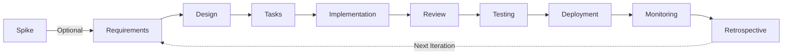

# Specification Driven Development (SDD) Workflow Guide

**Version**: 1.0
**Last Updated**: [Auto-generated by Steering Agent]

---

## Overview

This guide defines the standard workflow for Specification Driven Development using Musuhi agents. It ensures consistent, traceable development from requirements to deployment.

### SDD Principles

1. **Specification First** - Write detailed specifications before code
2. **Traceability** - Every code change links back to requirements
3. **Test-Driven** - Tests are derived from EARS requirements
4. **Documentation-Centric** - Documentation drives development

---

## Workflow Stages



---

## Stage 0: Spike / PoC (Optional)

**When to use**: 技術的な不確実性が高い場合、新技術の評価が必要な場合

**Agent**: `@software-developer`, `@system-architect`

**Output**: 
- `spike-{topic}.md` - 調査結果と結論
- PoC コード（使い捨て可）

**Purpose**:
- 技術的実現可能性の検証
- パフォーマンス特性の確認
- ライブラリ/フレームワークの評価
- リスクの早期発見

**Timeboxing**: 最大 1-2 日（超える場合は分割）

**Completion Criteria**:
- [ ] 技術的な質問に回答できた
- [ ] Go/No-Go の判断ができた
- [ ] リスクと制約が明確になった
- [ ] 次のステップが決まった

**Output Format**:
```markdown
# Spike: [Topic]

## Question
何を検証するのか？

## Approach
どのように検証したか？

## Findings
何がわかったか？

## Recommendation
推奨事項と次のステップ

## Time Spent
実際にかかった時間
```

**Next Stage**: Requirements Definition

---

## Stage 1: Research (Optional)

**When to use**: When technical decisions need investigation

**Agent**: No specific agent (manual research or general exploration)

**Output**: `research.md` (Template: `steering/templates/research.md`)

**Purpose**:
- Evaluate technology options
- Benchmark performance
- Compare alternatives
- Validate technical feasibility

**Completion Criteria**:
- [ ] Research questions answered
- [ ] Options analyzed with pros/cons
- [ ] Recommendation made
- [ ] Risks identified

**Next Stage**: Requirements Definition

---

## Stage 2: Requirements Definition

**Agent**: `@requirements-analyst`

**Input**:
- Steering context (`steering/structure.md`, `steering/tech.md`, `steering/product.md`)
- Research document (if exists)
- Stakeholder input

**Output**:
- `requirements.md` using EARS format (Template: `steering/templates/requirements.md`)
- Functional requirements
- Non-functional requirements
- User stories

**Purpose**:
- Define **WHAT** the system must do
- Establish testable acceptance criteria
- Prioritize features (MoSCoW method)
- Create traceability matrix

**Completion Criteria**:
- [ ] All requirements written in EARS format
- [ ] Requirements are testable and verifiable
- [ ] Each requirement has unique ID
- [ ] Priority assigned to each requirement
- [ ] Stakeholder review completed

**EARS Format Requirements**:
- Use WHEN, WHILE, IF...THEN, WHERE, SHALL patterns
- See `steering/rules/ears-format.md` for guidelines
- Every acceptance criterion must be testable

**Next Stage**: Technical Design

---

## Stage 3: Technical Design

**Agent**: `@system-architect`

**Input**:
- Requirements document with EARS criteria
- Steering context (`steering/structure.md`, `steering/tech.md`)
- Research document (if exists)

**Output**:
- `design.md` (Template: `steering/templates/design.md`)
- Architecture diagrams (C4 Model, sequence diagrams)
- Component specifications
- API design
- Database schema

**Purpose**:
- Define **HOW** the system will be built
- Map EARS requirements to design components
- Establish architecture patterns
- Identify technical dependencies

**Completion Criteria**:
- [ ] Architecture pattern selected and justified
- [ ] All EARS requirements mapped to components
- [ ] Sequence diagrams for major flows
- [ ] Technology stack aligned with `steering/tech.md`
- [ ] Security and performance designs included
- [ ] Technical review completed

**Design-to-Requirements Mapping**:
- Each component must reference requirements it implements
- EARS patterns guide component behavior design
- Error handling design matches IF...THEN requirements

**Next Stage**: Implementation Planning

---

## Stage 4: Implementation Planning

**Agent**: `@project-manager` or `@software-developer`

**Input**:
- Requirements document
- Design document
- Steering context

**Output**:
- `tasks.md` (Template: `steering/templates/tasks.md`)
- Task breakdown with priorities
- Timeline and resource allocation
- Requirements coverage matrix

**Purpose**:
- Break design into actionable tasks
- Ensure every requirement has implementing tasks
- Establish dependencies and critical path
- Assign ownership and estimate effort

**Completion Criteria**:
- [ ] All requirements have implementing tasks
- [ ] Tasks have clear acceptance criteria
- [ ] Dependencies identified
- [ ] Timeline estimated
- [ ] Team assignments made
- [ ] 100% requirements coverage

**Task-to-Requirements Traceability**:
- Every task references specific requirement IDs
- EARS acceptance criteria become task completion criteria
- Requirements coverage matrix shows no gaps

**Next Stage**: Implementation

---

## Stage 5: Implementation

**Agent**: `@software-developer`

**Input**:
- Tasks document
- Design document
- Steering context (`steering/structure.md`, `steering/tech.md`)

**Output**:
- Source code
- Unit tests
- Code documentation

**Purpose**:
- Implement design according to tasks
- Write code that satisfies EARS requirements
- Create unit tests for each requirement

**Completion Criteria**:
- [ ] All tasks marked as complete
- [ ] Code follows `steering/structure.md` patterns
- [ ] Uses technologies from `steering/tech.md`
- [ ] Unit test coverage ≥ 80%
- [ ] Code review approved
- [ ] No critical bugs

**Implementation Guidelines**:
- Reference requirement IDs in code comments
- Each EARS requirement maps to specific code/tests
- Follow SOLID principles
- Use design patterns from `steering/structure.md`

**Next Stage**: Code Review

---

## Stage 5.5: Code Review

**Agent**: `@code-reviewer`, `@security-auditor`

**Input**:
- Implementation code
- Unit tests
- Design document
- Requirements document

**Output**:
- レビューコメント
- 承認/修正要求
- セキュリティ指摘事項

**Purpose**:
- コード品質の確保
- 設計との整合性確認
- セキュリティ脆弱性の検出
- 知識共有とメンタリング

**Review Checklist**:
- [ ] コードが設計に準拠している
- [ ] SOLID 原則に従っている
- [ ] エラーハンドリングが適切
- [ ] セキュリティ考慮事項が実装されている
- [ ] テストが十分
- [ ] ドキュメントが更新されている
- [ ] パフォーマンス問題がない

**MCP Tools** (CodeGraph 利用時):
- `find_callers` - 変更の影響範囲確認
- `find_dependencies` - 依存関係の確認
- `query_codebase` - 類似コードの検索

**Review Types**:

| タイプ | 目的 | 時間目安 |
|--------|------|---------|
| **Quick Review** | 小さな変更、バグ修正 | 15-30分 |
| **Standard Review** | 機能追加 | 1-2時間 |
| **Deep Review** | アーキテクチャ変更、セキュリティ | 半日 |

**Next Stage**: Testing

---

## Stage 6: Testing

**Agent**: `@test-engineer`

**Input**:
- Requirements document (EARS format)
- Design document
- Implementation code
- Tasks document

**Output**:
- Test plans
- Test cases (unit, integration, E2E)
- Test results and coverage reports

**Purpose**:
- Verify all EARS requirements are met
- Convert EARS criteria to automated tests
- Achieve comprehensive test coverage

**Completion Criteria**:
- [ ] All EARS requirements have test cases
- [ ] Unit tests: 80%+ coverage
- [ ] Integration tests: All API endpoints
- [ ] E2E tests: All user flows
- [ ] All tests passing
- [ ] Performance tests meet NFRs

**EARS-to-Test Mapping**:
- `WHEN [event], System SHALL [action]` → Given-When-Then test
- `IF [error], THEN System SHALL [response]` → Error handling test
- `The System SHALL [always]` → Invariant test

**Next Stage**: Deployment

---

## Stage 7: Deployment

**Agent**: `@devops-engineer`

**Input**:
- Implementation code (all tests passing)
- Design document (deployment strategy)
- Steering context

**Output**:
- Deployed application
- CI/CD pipeline configuration
- Deployment documentation

**Purpose**:
- Deploy to staging/production
- Set up monitoring and alerting
- Establish rollback procedures

**Completion Criteria**:
- [ ] Deployed to staging
- [ ] Smoke tests passed
- [ ] Deployed to production
- [ ] Health checks passing
- [ ] Monitoring configured
- [ ] Rollback plan tested

**Next Stage**: Monitoring & Maintenance

---

## Stage 8: Monitoring & Maintenance

**Agents**: `@devops-engineer`, `@performance-optimizer`, `@security-auditor`

**Input**:
- Deployed application
- Requirements (NFRs)
- Design document

**Output**:
- Monitoring dashboards
- Incident reports
- Performance reports
- Security audit reports

**Purpose**:
- Ensure system meets NFRs in production
- Detect and respond to issues
- Continuous improvement

**Completion Criteria**:
- [ ] Metrics collected and visualized
- [ ] Alerts configured
- [ ] NFRs being met (response time, uptime, etc.)
- [ ] Security vulnerabilities addressed
- [ ] Performance optimized

**Next Stage**: Retrospective

---

## Stage 9: Retrospective

**Agent**: `@project-manager`, `@orchestrator`

**When to run**: 
- 各スプリント/イテレーション終了時
- 機能リリース後
- 重大インシデント後

**Input**:
- 完了した要件/タスク
- インシデントレポート
- チームフィードバック
- メトリクス

**Output**:
- `steering/memories/lessons_learned.md` への追記
- 改善アクションアイテム
- ワークフロー改善提案

**Purpose**:
- プロセスの継続的改善
- 知識の蓄積と共有
- チームの成長

**Retrospective Format**:

```markdown
## [YYYY-MM-DD] Sprint/Release X.X 振り返り

### 📊 Metrics
- 要件数: X
- タスク完了率: X%
- バグ発見（テスト時/本番）: X/X
- 手戻り回数: X
- リードタイム: X 日

### 👍 What Went Well
- [良かった点]

### 🔧 What Could Be Improved
- [改善点]

### 💡 Insights
- [気づき、学び]

### 📋 Action Items
- [ ] [具体的な改善アクション]
- [ ] [担当者: XXX、期限: YYYY-MM-DD]
```

**Discussion Questions**:
1. ワークフローのどこがボトルネックだったか？
2. どのステージで手戻りが発生したか？
3. 事前に防げた問題はあったか？
4. 次回改善できることは何か？

**Next Stage**: 次のイテレーションの Requirements へ

---

## Document Lifecycle

### Document Status Progression

```
Draft → In Review → Approved → Implemented → Deprecated
```

### Version Control

- All documents must be version controlled (git)
- Use semantic versioning (v1.0, v1.1, v2.0)
- Track changes in document control section
- Link related documents (requirements → design → tasks)

### Document Updates

**When to update**:
- Requirements change → Update all dependent documents
- Design changes → Update design.md and tasks.md
- Implementation deviates → Update design or create ADR

**Update Process**:
1. Identify impacted documents
2. Update primary document
3. Propagate changes to dependent documents
4. Update traceability matrices
5. Get stakeholder approval
6. Commit changes with descriptive message

---

## Traceability Matrix

Maintain bidirectional traceability:

```
Requirement ←→ Design Component ←→ Task ←→ Code ←→ Test
```

**Example**:
- `REQ-001`: WHEN user clicks submit, System SHALL validate
  - **Design**: `FormValidator` component (design.md section 4.2)
  - **Task**: Task 2.3 "Implement form validation"
  - **Code**: `src/validators/FormValidator.ts:25`
  - **Test**: `tests/FormValidator.test.ts:test_submit_validation()`

---

## Agent Handoffs

### Requirements → Design

**Handoff Artifacts**:
- `requirements.md` with EARS acceptance criteria
- Requirements prioritization (MoSCoW)

**Design Agent Responsibilities**:
- Map each EARS requirement to design components
- Validate technical feasibility
- Create architecture that supports all requirements

---

### Design → Implementation

**Handoff Artifacts**:
- `design.md` with component specifications
- `tasks.md` with implementation plan

**Developer Responsibilities**:
- Implement according to design
- Reference requirement IDs in code
- Write unit tests for each requirement

---

### Implementation → Testing

**Handoff Artifacts**:
- Source code with unit tests
- Requirements document (EARS format)

**Test Engineer Responsibilities**:
- Convert EARS criteria to test cases
- Verify all requirements are tested
- Report any requirement gaps

---

## Quality Gates

### Requirements Phase Gate

- [ ] All requirements in EARS format
- [ ] Each requirement testable
- [ ] Requirements approved by stakeholders
- [ ] Traceability matrix created

**Gate Keeper**: Product Manager / System Architect

---

### Design Phase Gate

- [ ] All requirements mapped to design
- [ ] Architecture aligned with `steering/structure.md`
- [ ] Tech stack matches `steering/tech.md`
- [ ] Security and performance considered
- [ ] Design reviewed and approved

**Gate Keeper**: System Architect / Tech Lead

---

### Implementation Phase Gate

- [ ] All tasks completed
- [ ] Code review approved
- [ ] Unit tests ≥ 80% coverage
- [ ] No critical bugs
- [ ] Documentation updated

**Gate Keeper**: Tech Lead

---

### Testing Phase Gate

- [ ] All EARS requirements tested
- [ ] All tests passing
- [ ] Performance tests meet NFRs
- [ ] Security tests passed

**Gate Keeper**: QA Lead

---

### Deployment Phase Gate

- [ ] Staging deployment successful
- [ ] Smoke tests passed
- [ ] Production deployment successful
- [ ] Monitoring configured
- [ ] Rollback tested

**Gate Keeper**: DevOps Lead

---

## Best Practices

### DO:
- ✅ Always start with requirements (EARS format)
- ✅ Reference `steering/` context in every stage
- ✅ Maintain traceability from requirements to code
- ✅ Write tests based on EARS acceptance criteria
- ✅ Update documents when changes occur
- ✅ Use templates from `steering/templates/`

### DON'T:
- ❌ Skip requirements documentation
- ❌ Write code before design
- ❌ Ignore EARS format guidelines
- ❌ Break traceability links
- ❌ Deploy without testing
- ❌ Forget to update steering context

---

## Document Templates

| Template | Location | Purpose |
|----------|----------|---------|
| Requirements | `steering/templates/requirements.md` | EARS-format requirements with acceptance criteria |
| Design | `steering/templates/design.md` | Technical architecture and component design |
| Tasks | `steering/templates/tasks.md` | Implementation plan with task breakdown |
| Research | `steering/templates/research.md` | Technical research and options analysis |

---

## References

- **EARS Format**: `steering/rules/ears-format.md` - Requirements writing standard
- **Architecture Patterns**: `steering/structure.md` - Project architecture guidelines
- **Technology Stack**: `steering/tech.md` - Approved technologies
- **Product Context**: `steering/product.md` - Business goals and user context

---

## Workflow Customization

This is the standard workflow. Projects may customize based on:
- **Project Size**: Smaller projects may combine stages
- **Team Size**: Larger teams may add more review gates
- **Methodology**: Agile teams may iterate through stages in sprints
- **Domain**: Some domains require additional stages (regulatory approval, etc.)

**When customizing**:
1. Document deviations in `steering/structure.md`
2. Maintain core SDD principles (specification-first, traceability)
3. Keep EARS format for requirements
4. Ensure all stages have clear quality gates

---

**Remember**: Good specifications save time in development and testing. Follow this workflow to ensure quality, traceability, and successful delivery.
